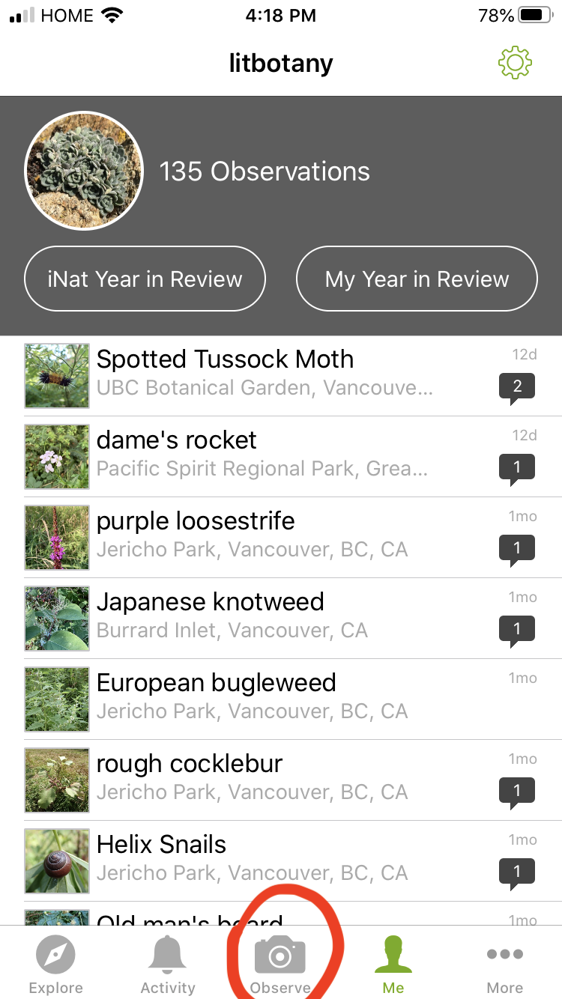
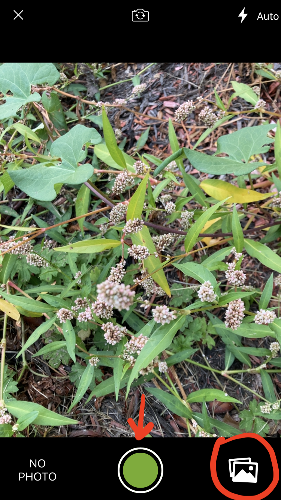
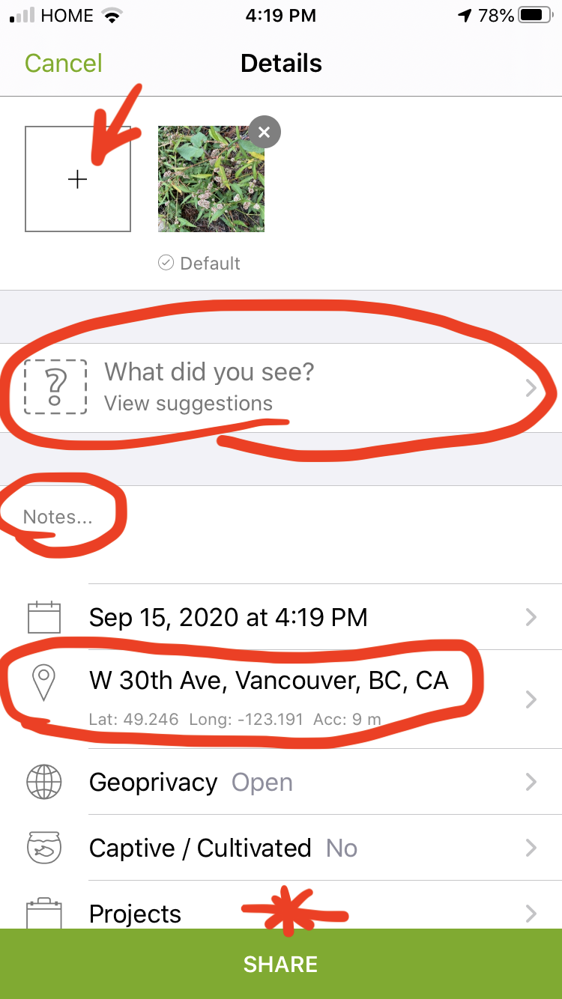

---

---

# Virtual Field Trip to the UBC Botanical Garden

Your instructors will lead the virtual field trip at the beginning of lab. You can find more information about the UBC Botanical Garden [here](https://botanicalgarden.ubc.ca). The Botanical Garden is free for UBC students, and it is currently open if you would like to visit! Just make sure that you sign up for a visitation slot on their website (this is to ensure proper contact tracing during COVID-19). 

---

---

# Introduction to Lab

Your instructors will give a brief overview of the Lab schedule and general lab structure. Please follow along with the [Syllabus](Syllabus.html) ("Lab Overview" section) as they introduce the lab.

---

---

# Introduction to iNaturalist

**iNaturalist** is an amazing tool for documenting biodiversity through citizen science (the collection and analysis of data relating to the natural world by members of the general public). While we will be using it to document plants, iNaturalist can be used to catalog pretty much any organism you can think of. It works by users making **observations** (typically in the form of pictures, but you can submit sounds if you're observing a bird). With the photographs and geographic information (GPS coordinates) provided by the user, iNaturalist uses [machine learning](https://www.inaturalist.org/pages/computer_vision_demo) to provide ID suggestions. Typically, it will suggest a genus, and then list a series of species suggestions based on visual similarity and/or the presence of nearby observations. Once an observation has been uploaded to iNaturalist, other users can confirm the ID or provide an alternate species ID if they disagree. Once an observation has been identified to species by at least two people (and there are no dissenting opinions / disagreements on the observation), the observation is upgraded from "Needs ID" to "Research Grade".

Because iNaturalist observations are amassed via citizen science (by many people who are not expert taxonomists), data quality is an important issue. The requirement for confirmation to attain "Research Grade" helps with this, but there are several things you can do as well to ensure high quality observations: 

- Take multiple photos, one of the flowers and/or fruit (both is ideal), one of the leaves, and one of the whole plant. Sometimes additional pictures are helpful for correct identification, such as the abaxial (underside) of leaves if the upper and lower surface differ. 
- Always include GPS information with your observation. This will help aid in identification and contribute to more complete species maps in the iNaturalist database.
- Put descriptive information in the "notes" field to highlight things not evident in the pictures. This can include information about the local habitat/ecology, the number of individuals found in the population, and the presence of botanical characteristics useful for navigating that group's taxonomic key.

iNaturalist can be used in a web browser or via a smartphone app (both Android and iPhone). I think the smartphone app is a little easier to use, especially if you're using your phone to take pictures (plus the gps coordinates come through automatically). We'll walk you through how to use both:

**Smartphone app**

Tap the observe button to make an observation.

{width=40%}

 

You can either take pictures directly through the app, or select photos you've already taken.

{width=40%}

 

Tap the '+' button to add another photo to your observation. Make sure to fill out all the important fields (ID, location, notes, and make sure to select the BIOL 324 project if you are turning in this observation).

{width=40%}

  

Indicate phenology information - is the plant vegetative only (no reproductive structures), in bud (flowers present but not open), flowering, or fruiting. 

{width=40%}

 

**Browser**

It is a similar process if you are using the browser. Click "upload" to make an observation.

{width=100%}

 

Drag and drop pictures into your browser window. Make sure to combine photos into a single observation. 

{width=100%}

  

You can now fill out all the important fields. You may have to manually select the location if it does not automatically take the GPS coordinates from your photos. Again, make sure to select the BIOL 324 project if you want to turn this observation in. 

{width=100%}

 

Unlike the smartphone app version, flowering phenology does not pop up automatically when selecting the project in the browser, so you'll have to go to the "Your Observations" tab at the top of the page and add the phenology after submitting your observations. 

 

Here are some links with additional helpful info:

https://www.inaturalist.org/pages/getting+started

https://www.youtube.com/results?search_query=inaturalist+app+tutorial

---

---

# Project 1 (iNaturalist)

Before you can make any observations, you need to make an iNaturalist account. Go to the [iNaturalist website](https://www.inaturalist.org) to create an account (it's free). Once you've made an account, [enter your name and iNaturalist id into this Google sheet](https://docs.google.com/spreadsheets/d/1lUajuGPwVc29feAesxS9DYLhfNqYxRrawvofaE6bYjA/edit?usp=sharing). **This is required before you can start working on Project 1 (iNaturalist)**, because I need your username to invite you to the BIOL 324 iNaturalist project. 

You can find the [information for Project 1 (iNaturalist) here](BIOL_324_Project_1.html).

---

---

# Introduction to Flowers

Much of plant taxonomy is concerned with the structure and characteristics of **flowers**. A typical flower contains 4 whorls: **sepals**, **petals**, **stamens**, and **carpels (pistils)** (in that order from the outside to the inside of the flower). The sepals are often green (but are often petaloid as well as you will see), and serve to protect the flower as it is developing in bud. The petals are the primary attractive feature of the flower, and function to attract pollinators (that is why wind-pollinated plants do not usually have showy flowers). The stamens are the male reproductive structures of the flower, producing pollen inside the anthers. The carpels/pistils are the female reproductive structures, and house the ovules inside of the ovary (we will go more into the difference between carpels and pistils in Lab 2). 

Flowers are only produced during certain times of year (differing from species to species). Pollinators will visit the flower (often in search of nectar), get covered in pollen during their visit, and deposit pollen onto the stigma (receptive surface of the pistil) upon visiting the next flower. The pollen grains will germinate on the stigma and grow pollen tubes down the style, delivering sperm to the ovules inside the ovary. Once the ovules have been fertilized, they will develop into seeds, and the ovary will develop into a fruit (often swelling to a much larger size and in some cases changing shape). After fertilization, the outer 3 whorls often whither away.  

---

---

**-KNOWLEDGE CHECK-**

Using the terms in the above diagram and your **imagination**, make a drawing of a flower completely new to science. It is OK if it is inspired by a real flower, and it is OK to make it as wild looking as you want, *as long as it follows the morphological rules described above* (i.e., it should have all 4 whorls in the proper order). In addition, make a second drawing depicting the flower once the fruit has formed (hint: what organ transforms into the fruit after fertilization occurs, and what happens to the other whorls?). Make sure to include these terms: receptacle, pedicel, petal, corolla, sepal, calyx, stigma, style, ovary, pistil, anther, filament, stamen, fruit. 

