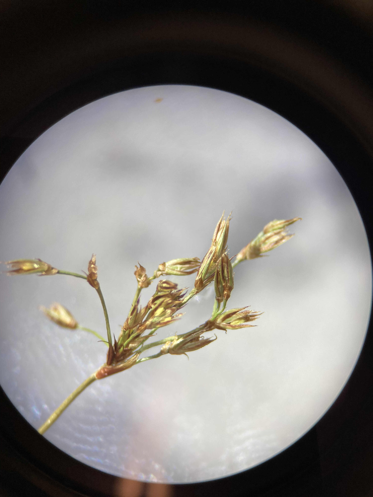
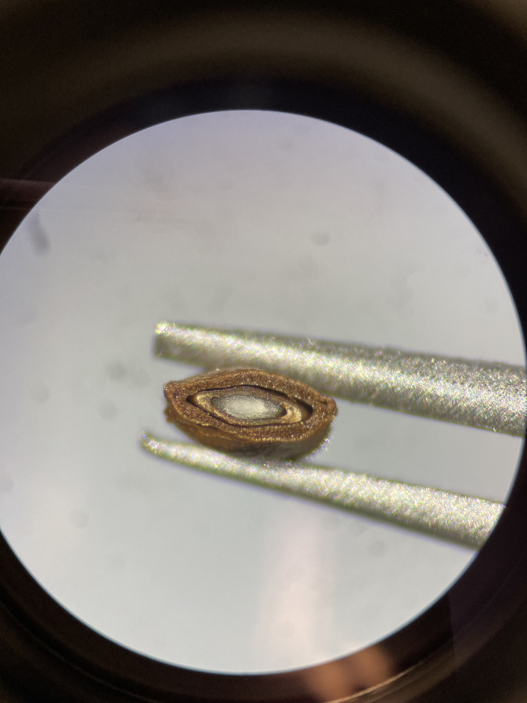

# Juncaceae

**Rush Family**

---

**1.  Herbs.**  
**2.  Stems usually round and solid (or pithy).  Leaves alternate or basal, 3 ranked with closed or open sheath.**  
**3.  Flowers perfect, actinomorphic, small.  Tepals in 2 series of 3 each, free.  Stamens 3 or 6, anthers basifixed.  Pistil compound, ovary superior, carpels 3, placentation parietal or axile.**  
**4.  Fruit a capsule.**  
**5.  About 9 genera and 400 species, mostly in temperate regions.**  

The Juncaceae is the 15th largest family in B.C., with 59 taxa.  They are most often found in wet places.

---

## Diagrams


<br>


---

## Vegetative characteristics

There is a rhyme that kind of (but not really) works for differentiating the three "grass-like" families you'll be learning this week: "Sedges have edges, rushes are round, grasses have nodes from the top to the ground." While this rhyme doesn't always work (and for this reason most hardcore taxonomists don't really like it...), it can be a good starting place to tell apart these groups that look quite similar to each other at first glance.

Rushes have round stems *without obvious nodes* (compare to Poaceae family below). In many cases, the leaves are inconspicuous in comparison to the stems, but can be either basal or alternate. The genus *Juncus* is the most common rush species, and has tall, round, green stems. Most members of *Juncus* have inflorescences that appear to emerge laterally from the stem, but are actually terminal - the part of the stem (tapering to a point above the infloresence) is actually an involucral bract. Here are some examples of this typical *Juncus* growth form:

<p align="center">
{width=49%} {width=49%}
</p>

<br>

Zooming in a bit, you can see the thin parallel grooves and round stems typical of *Juncus* species. 

<p align="center">
{width=49%} {width=49%}
</p>

<br>

Those of you that took BIOL 210 may remember the cross-sections you did of *Juncus* stems, showing the "aerenchyma" in the center. This is a spongy tissue that forms air channels which provide a low-resistance internal pathway for the exchange of gases (e.g., oxygen and ethylene) between the above- and below-ground parts of plants in wet environments. Here is what aerenchyma looks like after staining the tissue with toluidine blue (a common stain used in plant anatomy to highlight lignified tissues). Pretty cool, eh!?

<p align="center">
{width=80%}
</p>

<br>

Not all rushes look like the genus *Juncus*, however. See the below picture of *Luzula parviflora* which has large, conspicuous leaves and can easily be mistaken for a member of the Poaceae family.

<p align="center">
{width=80%}
</p>

<br>

---

## Flowers

As mentioned above, a good character for the genus *Juncus* is deceptively terminal inflorescences with an involucral bract extending above. 

<p align="center">
{width=49%} {width=49%}
</p>

<br>

The flowers themselves are rather small, drab, and typical monocot-style flower. They have two sets of 3 tepals that are usually greenish or brownish, 3 or 6 stamens, and a superior ovary with 3 carpels. The flowers are quite difficult to see, even with a dissecting microscope.

<p align="center">
{width=49%} {width=49%}
</p>

<br>

Here is a much better photo from Wikipedia of *J. squarrosus* which clearly shows all of the flower parts. Take note of the 3-branched feathery styles.

<p align="center">
{width=100%}
</p>

<br>

---

## Fruit

Similar to the flowers, Juncaceae fruit are small and brownish. They produce capsules, which dehisce when mature and release tiny brown seeds.

<p align="center">
{width=49%} {width=49%}
</p>

<br>

---

## KNOWLEDGE CHECK 10.1

Draw a typical member of the genus *Juncus*, and make sure to draw/label characters that differentiate Juncaceae from Poaceae and Cyperaceae.

---

---

# Cyperaceae

**Sedge Family**

---

**1.  Herbs, often grasslike.**  
**2.   Stems often triangular, sometimes round, and either hollow or solid.  Leaves 3 ranked, leaf sheaths closed, ligule usually absent except in Carex.**  
**3.  Flowers perfect or imperfect, covered by subtending bract.  perianth absent, or represented by scales or bristles.  Stamens usually 3, sometimes 1 or 2, anthers basifixed.  Pistil compound, superior, carpels 2 3, ovary 1 celled, placentation basal.**  
**4.  Fruit an achene.**  
**5.  About 90 genera and 4000 species, widely distributed but primarily in subarctic and temperate regions.**  

The Cyperaceae is the 3rd largest family in B.C. with 208 taxa.  *Carex* is by far the largest genus in B.C. with 136 species.  The family is a significant source of food for range livestock, a few are cultivated as ornamentals, and Chinese water chestnuts are the tubers of *Cyperus*.  *Cyperus papyrus* stems were the source of Egyptian papyrus.

---

## Diagrams


---

## Vegetative Characteristics

Following the rhyme, one of the best characters to differentiate sedges from grasses and rushes is that their stems are triangular, giving them "edges" when you roll the stem between your fingers. You can see that they are triangular in cross-section.

<p align="center">
{width=49%} {width=49%}
</p>

<br>

Sedges also often have leaves that are "3-ranked", meaning that they come out in three different directions when viewing the plants from above. Compare this to Poaceae, which has leaves that are 2-ranked.

<p align="center">
{width=100%}
</p>
Photo credit: Jamie Fenneman from E-Flora BC - *Dulichium arundinaceum*  (three-way sedge)

<br>


Otherwise, sedges look quite "grass-like" and are difficult to identify at first sight without the proper knowledge.

<p align="center">
{width=80%}
</p>

<br>

<p align="center">
{width=80%}
</p>

<br>

<p align="center">
{width=80%}
</p>

<br>

---

## Flowers and Fruits

*Carex* is by far the largest genus in Cyperaceae, so we will focus on learning its flower/fruit structure. *Carex* flowers are highly modified, reduced down to a bract and ovary or stamens without any petals or sepals to speak of. *Carex* species are quite often monoecious (with separate male and female flowers on the same plant) or dioecious (male and female flowers on separate plants). The pistillate flowers have a small bract and an ovary surrounded by a hardened "perigynium", which is modified leaf tissue that encapsulates the achene that will form. The staminate flowers consist of simply a bract and three stamens. 

Here you can see part of a pistillate spike. The photo on the right shows a removed perigynium and its associated bract.

<p align="center">
{width=49%} {width=49%}
</p>

<br>

Sometimes the perigynia are brown, and have an extended "beak" with two teeth at the tip (photo on the right).

<p align="center">
{width=49%} {width=49%}
</p>

<br>

Chopping through the perigynia reveals the achenes housed inside.

<p align="center">
{width=49%} {width=49%}
</p>

<br>

Staminate flowers on the other hand are just bracts and some stamens (which often fall apart rapidly and are difficult to image).

<p align="center">
{width=49%} {width=49%}
</p>

<br>

*Carex* inflorescences often consist of multiple "spikes" (dense clusters of flowers) that can be made up of all staminate flowers, all pistillate flowers, or both (though typically arranged with all staminate flowers clustered on one end of the spike and all pistillate flowers on the other). Quite often there is a subtending bract that reaches above the inflorescences. The arrangement of the spikes within an inflorescence is an important character to differentiate between *Carex* species in the key (which is infamously nightmarish). Here are some examples...take note of the diversity of those beautiful spikes and inflorescences! Can you tell which spikes are pistillate and which spikes are staminate (or both)?

<p align="center">
{width=100%}
</p>

<br>

<p align="center">
{width=100%}
</p>

<br>

<p align="center">
{width=100%}
</p>

<br>

<p align="center">
{width=49%} {width=49%}
</p>

<br>

<p align="center">
{width=100%}
</p>

<br>

<p align="center">
{width=100%}
</p>

<br>

We won't be going into their floral morphology, but here are some examples of other genera in the Cyperaceae.

*Scirpus*
<p align="center">
{width=100%}
</p>

<br>

*Trichophorum*
<p align="center">
{width=100%}
</p>

<br>

*Eriophorum*
<p align="center">
{width=100%}
</p>

<br>

---

## KNOWLEDGE CHECK 10.2

Draw a typical member of the genus *Carex*, and make sure to draw/label characters that differentiate Cyperaceae from Poaceae and Juncaceae.

---

---

# Poaceae

**Grass Family**

The grass family is the 2nd largest in B.C., with 334 taxa.  The grass family is probably the most important of all economically, providing hay and forage for domestic animals, bamboo, *Saccharum* (sugar), and grains:  *Zea* (maize or corn), *Triticum* (wheat), *Hordeum* (barley), *Avena* (oats), *Secale* (rye), etc.  In addition, millions of hectares of grass are cultivated for lawns and golf courses…and some of the worst weeds are grasses.

---

**1.  Herbs (except bamboos, which can be woody shrubs or trees).**  
**2.  Stems typically round and hollow.  Leaves 2 ranked, leaf sheaths open or closed, ligule usually present.**  
**3.  Flowers (florets) perfect or imperfect, consisting of two bracts (the lemma and palea), usually 3 stamens, a single pistil, and lodicules.  Pistil compound, ovary superior, carpels 2 or 3, ovary with 1 locule, placentation basal.**  
**4.  Fruit a caryopsis (grain).**  
**5.  About 500 genera and 9,000 species, worldwide.**

---

## Diagrams


<br>


---

## Vegetative Characteristics

Grass leaves are 2-ranked and alternate on the stem. Each leaf has three distinct regions: A sheath encircling the stem, an expanded blade (what you typically think of as the leaf), and a small membranous structure at the junction of the sheath and blade called a "ligule". Can you identify each in the photos below?


<p align="center">
{width=100%}
</p>

<br>

<p align="center">
{width=100%}
</p>

<br>

<p align="center">
{width=100%}
</p>

<br>

<p align="center">
{width=100%}
</p>

<br>

The stems in grasses (called "culms") are typically hollow, except at their nodes which are typically swollen (remember the rhyme?).

<p align="center">
{width=100%}
</p>

<br>

<p align="center">
{width=100%}
</p>

<br>

<p align="center">
{width=100%}
</p>

<br>

---

## Flowers

The flower and inflorescence structure in Poaceae is unique among angiosperms. Individual flowers are quite small (and typically referred to as florets), consisting of 2 bracts (the lemma and palea), 3 stamens, and a single pistil. One or more florets are arranged into mini-inflorescences called "spikelets", and each spikelet has two bracts at the base called "glumes". 

Here you can see a spikelet of *Dactylis glomerata*. Can you identify the glumes and florets?

<p align="center">
{width=49%} {width=49%}
</p>

<br>

Here you can see a spikelet of *Poa* sp. Can you identify the glumes, florets, lemma and palea? The lemma is the outer bract of the floret, and is often larger than the palea. 

<p align="center">
{width=100%}
</p>

<br>

Most of the time, the stamens and the stigmas are either buried inside of the florets or have already fallen off. If you catch them at the right time however, you can see both hanging out of the florets (remember that grasses are wind-dispersed!). Check out the bright yellow anthers and vibrant pink stigmas of *Sorghastrum nutans* found at the UBC Botanical Garden!

<p align="center">
{width=49%} {width=49%}
</p>

<br>

<p align="center">
{width=49%} {width=49%}
</p>

<br>

Here you can see corn (*Zea mays*) with dangling anthers.

<p align="center">
{width=100%}
</p>

<br>

<p align="center">
{width=100%}
</p>

<br>

Another important feature associated with the florets are awns, which are long bristles (most of you should be familiar with these) that typically extend from the tips of the lemmas. Here are some examples:

<p align="center">
{width=100%}
</p>

<br>

<p align="center">
{width=100%}
</p>

<br>

---

Grass inflorescences vary widely, and getting familiar with the arrangement of spikelets (in combination with vegetative characters) is probably the best way to identify grass species and genera without having to resort to a microscope (though a microscope is often required for tough species). 

Some species form a spike, with densely clustered spikelets that are sessile on the flower stalk, like these two species of *Phluem* (Timothy).

<p align="center">
{width=100%}
</p>

<br>

<p align="center">
{width=100%}
</p>

<br>

Others are unbranched and sessile, with florets alternately arranged (these are still considered "spikes", but with fewer spikelets that are less densely crowded).

*Lolium perenne* (perennial ryegrass)
<p align="center">
{width=100%}
</p>

<br>

*Agopyron cristatum* (crested wheatgrass)
<p align="center">
{width=100%}
</p>

<br>

Most are panicles, a branched inflorescence with a main axis bearing pedicellate spikelets on the branches.

<p align="center">
{width=100%}
</p>

<br>

<p align="center">
{width=100%}
</p>

<br>

<p align="center">
{width=100%}
</p>

<br>

---

## Fruit

Members of the Poaceae family form a caryopsis as their fruit type. A caryopsis is a dry, indehiscent fruit formed from a simple pistil that resembles an achene, except the seed coat is fused to the ovary wall. The caryopsis is often referred to as a grain, which as you likely know makes up a huge proportion of the food eaten by humans. Keep in mind that not all seeds/fruit referred to as "grains" (aka "cereal grains") belong to the Poaceae family. 

Here, you can see a swollen caryopsis forming between the lemma and palea of wheat (*Triticum* sp.).

<p align="center">
{width=49%} {width=49%}
</p>

<br>

---

## KNOWLEDGE CHECK 10.3

Draw a typical member of the Poaceae, and make sure to draw/label characters that differentiate this family from Juncaceae and Cyperaceae.

---

---

# Ultimate R exercise: Making phylogeographic maps

---

## Motivation

In Labs 7 and 9 we learned how to map species distributions using GBIF data, and how to create phylogenies from DNA sequence data from GenBank. In this final R assignment, we'll combine these methods to create a phylogeographic map of five _Opuntia_ species. By overlaying a phylogeny onto a species distribution map, we can not only better test taxonomic and evolutionary relationships, but also infer migration and colonization histories. You'll be modifying this code to create phylogeographic maps of the 5 iNaturalist species you've been working in the second half of term.

&nbsp;
&nbsp;

<!-- --- -->


<!-- #### Prerequisites  -->

<!-- Before starting this week's tutorial you will have:  -->

<!-- 1. completed R Assignment 2 (Mapping) and Assignment 4 (Phylogenetics),  -->

<!-- 2. completed some pre-assignment reading on the use of phylogeography in plant taxonomy,  -->

<!-- 3. more... -->

<!-- &nbsp; -->
<!-- &nbsp; -->

<!-- --- -->


<!-- #### Outcomes -->

<!-- By the end of this tutorial you will have: <br> -->

<!-- 1. the ability to combine distribution data from GBIF with sequence data from Genbank to create phylogeographic maps of species distributions, -->

<!-- 2. more... -->

<!-- &nbsp; -->
<!-- &nbsp; -->

<!-- --- -->


## Creating a Phylogeographic Map from GBIF and Genbank Data

In previous Assignments we mapped species distributions and constructed phylogenetic trees. In this Assignment, we'll combine both lines of research to simultaneously visualize the phylogenetic and geographic relationships of five _Opuntia_ species.

In this lab, we'll further explore the genus _Opuntia_: 

_Opuntia basilaris_ (Mojave, Colorado, Utah)

_Opuntia fragilis_  (Northwestern) 

_Opuntia humifusa_  (Eastern) 

_Opuntia polyacantha_ (Great Plains, foothills of Rocky Mtns) 

_Opuntia stricta_ (Gulf Coast and Caribbean)

Let's start by installing the necessary packages. `mapdata` is an slightly more sophisticated package than `mapr` (which we used in Lab 7) &mdash; this will allow us to overlay a phylogeny onto a biogeographic plot. `phytools` is a similar phylogenetics package to `ape` (Lab 9), but contains functions for overlaying phylogenies onto maps. `viridis` is a package for creating custom colour schemes &mdash; our maps gotta look fresh! 

```{r, eval = FALSE}
install.packages('mapdata')
install.packages('phytools')
install.packages('viridis')
```

Attach the packages:

```{r, results = 'hide', warning = FALSE, message = FALSE }
# attach packages once they are installed 
library(mapdata)
library(phytools)
library(tidyverse)
library(viridis)
```

Let's import our species distribution data (from GBIF, Lab 7) and phylogenetic tree (Assignment 4). If you haven't already, we recommend re-creating your GBIF dataset using the option `geometry =` within `occ()` (see revised Lab 7). Don't forget to save your GBIF data as an .rds file using `saveRDS()`! 

When you're ready to import your own _rbcL_ and GBIF data for your iNaturalist species, we recommend using `readRDS(file = file.choose())` (see Lab 8). 

```{r}
# import Opuntia rbcL tree from last tutorial
rbcL_tree <- readRDS(file = 'rbcL_tree.rds')

# adds a root to our tree, make sure you do this or your trees won't display properly!
rbcL_tree <- midpoint.root(rbcL_tree)

# import filtered GBIF data from last tutorial
opuntia_fil <- readRDS(file = 'filtered_gbif_dataset.rds') 
```

Do some quick data checks to make sure your data loaded correctly:

```{r}
# check that your map data looks ok...
head(opuntia_fil)

# double-check how they are named in GBIF dataset...
unique(opuntia_fil$name)
```

Then, we'll simplify the species names in the GBIF dataset (this is required to use `phytools`). We can change the names of variables using the `mutate()` function:

```{r}
opuntia_fil <-
 opuntia_fil %>% 
 mutate(short_names = case_when(
   name == "Opuntia basilaris Engelm. & J.M.Bigelow" ~ "O._basilaris",
   name == "Opuntia fragilis (Nutt.) Haw." ~ "O._fragilis",
   name == "Opuntia humifusa Raf." ~ "O._humifusa",
   name == "Opuntia stricta (Haw.) Haw." ~ "O._stricta",
   name == "Opuntia polyacantha Haw." ~ "O._polyacantha"
 ))
```

Some more data organizing is needed.. we'll reverse the order of the latitude and longitude columns in our GBIF dataset, and convert the `tibble` into a `matrix` (for `phytools`):

```{r}
latlong <- 
  opuntia_fil %>% 
  select(c(3,2)) %>% # reverse long-lat to lat-long
  as.matrix()
```

We'll need to give each row (i.e. GBIF observation) a species name in order to overlay a phylogeny. Entries with missing information (`NA`s) also need to be removed:

```{r}
# assign species names to rows
rownames(latlong) <- opuntia_fil$short_names

# removes rows with NAs
latlong <- na.omit(latlong)
```

The species names need to match the exact spelling and format as in the phylogeny:

```{r}
rbcL_tree$tip.label <- 
  c("O._basilaris", "O._stricta", "O._humifusa", "O._fragilis", "O._polyacantha")
```

Double check that this worked by opening the `tip.label` element within your `rbcL_tree` object
```{r}
rbcL_tree$tip.label
```

And each species needs a unique colour:

```{r}
colours <- 
  setNames(c('#999999', '#E69F00', '#56B4E9', '#009E73', '#F0E442'),
           rbcL_tree$tip.label)
```

```{r, message=FALSE}

obj <- 
  phylo.to.map(
    rbcL_tree, 
    latlong, 
    rotate = FALSE,
    regions = c("Canada", "USA", "Mexico"),
    database = "worldHires",
    xlim = c(-135, -55 ),  
    ylim = c(10, 45),
    asp = 4,
    lwd = 1,
    plot = FALSE)

plot(
  obj, 
  direction = "rightwards", 
  colors = sapply(colours, make.transparent, 0.4),
  pts = TRUE,
  cex.points = c(0,1),
  lwd = c(3,1),
  asp = 1.3,
  ftype ="i")


```


Optional: If you'd like to replace occurrence points with a polygon that summarizes a species' distribution, you can try:

```{r}
# To plot polygons, re-run plot() with pts = FALSE and cex.point = c(0,0) along with 
{plot(
  obj, 
  direction = "rightwards", 
  colors = sapply(colours, make.transparent, 0.4),
  pts = FALSE,
  cex.points = c(0,0),
  lwd = c(3,1),
  asp = 1.3,
  ftype ="i")

# compute polygon boundaries from lat-long data
for(i in 1:Ntip(rbcL_tree)){
  spr<-latlong[which(rownames(latlong)==rbcL_tree$tip.label[i]),]
  mcp<-if(i==1) spr[chull(spr),] else rbind(mcp,spr[chull(spr),])
}

# plot polygons 
for(i in 1:Ntip(rbcL_tree)){
  ii<-which(rownames(mcp)==rbcL_tree$tip.label[i])
  polygon(mcp[ii,2:1],col=make.transparent(colours[rbcL_tree$tip.label[i]],0.8),
          border="darkgrey")
}}
```

---

## KNOWLEDGE CHECK 10.4

After making sure that the above code runs on your computer, modify it to make a phylogeographic map of your 5 iNaturalist species! **This is the map you will include as a figure for [Project 2](BIOL_324_Project_2.html)**.

- Tips for your maps
  - Make sure that each species is abbreviated and spelled correctly in your phylogeny, and that each species shows up on your map and is represented by a different colour. 
  - You can include either the "dot" version or the "polygon" version (or both)! Choose the one that you feel makes it more intuitive to interpret the ranges of your 5 species. For those of you with several widespread species, the polygon version of the map may not be very readable! In that case, stick with the dots version. If you still have too much going on in the dots version (too many dots/lines obscuring the map), remake your maps and set `limit = 500` (or lower) to reduce the clutter.
  - Focus your interpretations on the degree of range overlap between species, and whether this correlates with growth form, life history, or habitat requirements. 
  