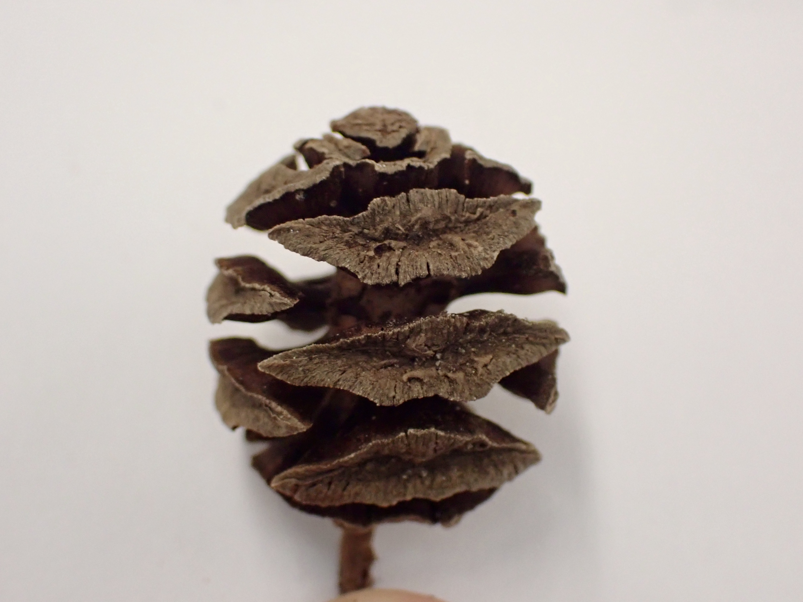

**Gymnosperms** (meaning "naked seeds") are non-flowering plants with ovules that are not borne in ovaries but are naked on the surface of cone scales or at the ends of branches.  While the seed plants form a monophyletic group, the relationship between the various groups of gymnosperms remains elusive. We will focus on the morphology of conifers (in the order **Coniferales**) for the purposes of this lab, but also show you some examples of other gymnosperm groups for fun! **For your last Family ID quiz, you will be responsible for knowing the Pinaceae and Cupressaceae families.**

---

**Coniferales** (conifers)
(Includes families Pinaceae, Cupressaceae, Podocarpaceae, Araucariaceae, and Taxaceae.)

**1. Conifers are for the most part large trees.**  
**2. Their stems come in the form of large, woody trunks and thinner (but still quite robust) branches. Leaves are tough and green, and come in the form of long, thin, spirally arranged needles (Pinaceae) or smaller, decussate scale-like needles (Cupressaceae)**  
**3. Conifers do not have flowers. Instead, their reproductive structures are separately housed in male and female cones (monoecious). Male (pollen) cones are small and short-lived, releasing large amounts of pollen from small sacs (microsporangia) within the cone. Female (seed) cones are much larger and may remain on the tree for multiple years as they develop. Ovules are borne on woody scales (i.e., ovuliferous scales - modified branches) within the female cones and catch wind-dispersed pollen via a small droplet, which then enter the ovule via a small hole called the micropile. Cones tend to have imbricate scales in Pinaceae and peltate scales in Cupessaceae.**  
**4. Conifers do not produce fruit (as there is no flower or ovary). Naked ovules develop into seeds within seed cones after fertilization, and the seeds are quite often winged to aid dispersal. Once the ovules have fully matured into seeds (which can take up to two years after pollination like in *Pinus*), the seed cones open up to release the seeds.**

---

Conifers are the most important plants in B. C., economically, since most of our industry is based on killing them.  The yews (Taxaceae) resemble conifers but have berry like arillate seeds rather than cones.  There are 3 families of conifers (including yews) native to North America: Pinaceae, Cupressaceae (now includes Taxodiaceae), and Taxaceae. 

The following species are native to the UBC campus and Pacific Spirit Park:

*Abies grandis* GRAND FIR (common near trail 6 to Wreck Beach)
*Picea sitchensis* SITKA SPRUCE (a few along S.W. Marine Drive)
*Pinus contorta*  LODGEPOLE PINE (Camosun Bog)
*Pseudotsuga menziesii*  DOUGLAS-FIR (everywhere)
*Taxus brevifolia*  PACIFIC YEW (scattered, a few used to be near the top of the trail to Tower Beach)
*Thuja plicata*  WESTERN RED CEDAR (everywhere)
*Tsuga heterophylla*  WESTERN HEMLOCK (everywhere)

Many other genera are planted as ornamentals on campus, including all the genera native to North America except *Torreya*, plus the Old World genera *Cedrus* (Pinaceae), *Platycladus*, *Thujopsis* (Cupressaceae), *Cryptomeria*, *Cunninghamia*, *Metasequoia*, *Sciadopitys* (Taxodiaceae), and the Southern Hemisphere *Araucaria* (Araucariaceae). 
In addition, *Podocarpus* (Podocarpaceae) and *Cephalotaxus*  (Cephalotaxaceae) are planted in the UBC Botanical Garden.

---

# Pinaceae

**Pine Family**

---

*Pinus ponderosa* in front of the Ponderosa residence at UBC.

{width=80%}

---

## Diagrams

{width=100%}

 

{width=100%}

---

## Vegetative characters

As mentioned above, members of the Pinaceae family have long, thin needles for leaves. The needles have different size, shape, and arrangement depending on the genus. 

In the genus *Picea* (spruce), their needles are flattened, pointed, and tend to be more stiff than other genera (hurting a bit when you grab a leafy branch with your hand). After the needles fall off, they leave behind persistent, woody leaf bases called sterigmata or pulvinus. 

You can see a close-up of the leaves and woody stem bases in Norway spruce (*Picea abies*). If you look closely, you can see two whitish lines of dots. These are stomata, which structures in the epidermis of leaves that allow gas exchange.

{width=100%}

Source: Wikipedia

 

The leaves of *Abies* (fir) are actually spirally attached to the stem, but twist so that they lie flat in one plane. They thus appear to be coming off the stem in two directions, making them 2-ranked. Unlike *Piceae*,  there are no sterigmata present in *Abies*, so all that remains after the needles fall off are leaf scars along the stem.

{width=80%}

Source: Wikipedia

 

In the genus *Pinus* (pines), needles are very long and thin, and typically round in cross-section. The needles occur in bundles or "fascicles". Each bundle consists of a short branch at the base (called a "short shoot"), with 2-5 needles emerging from the short shoot. The number of needles in each fascicle can be a good start to narrowing down which pine species you are looking at. 

{width=80%}

 

{width=100%}

 

{width=100%}

 

Here you can see a close-up of the short shoot at the bottom of the fascicle.

{width=100%}

 

---

## Reproductive characters

Conifers do not have flowers. Instead, their reproductive structures are separately housed in male and female cones (monoecious). Male (pollen) cones are small and short-lived, releasing large amounts of pollen from small sacs (microsporangia) within the cone. Female (seed) cones are much larger and may remain on the tree for multiple years as they develop. Ovules are borne on woody bracts within the female cones and catch wind-dispersed pollen via a small droplet, which then enter the ovule via a small hole called the micropile.

---

The seed cone of *Pseudotsuga menziesii* (Douglas fir) provides a good illustration of the different parts that make up the cone. Most of what you see are the "imbricate" (arranged spirally and overlapping) ovuliferous cone scales (a modified branch system), with prominent 3-pronged bracts (modified leaves) emerging from underneath each scale. True to their name (remember, Gymnosperm means "naked seed"!), two winged seeds sit naked upon each cone scale. Can you identify the cone scales, bracts, and seeds in the below pictures?

{width=100%}

 

{width=100%}

 

Here are some close-ups of a *Pinus* seed cone and winged seed:

{width=100%}

 

{width=100%}

 

Most of you are familiar with the visual of a big, woody, mature "pine cone" that you might find on the ground in the forest, but they only look like this at the end of their life! When seed cones are in early stages of development, they are quite inconspicuous:

{width=100%}

 

Much later (up to a year later as we see in *Pinus*), the cones have grown in size but are still maturing. You can see that the cone is closed, with the ovuliferous cone scales still pressed tightly together.

{width=100%}

 

It isn't until much later, when they are fully mature and ready to release their seeds (this process can take 2 years in *Pinus*!!!) that we see what we typically think of as a "pine cone". Of course, now that you know better, you should at the very least refer to these as "seed cones" to differentiate them from pollen cones, which look quite a bit different.

In the genus *Abies* (firs), you are unlikely to find a complete seed cone at all! The cones are borne upright on the stem (as opposed to "pendant" or hanging downwards), and the ovuliferous scales fall off individually, leaving only a spire (the central axis of the cone) behind.

{width=100%}

 

{width=100%}

 

---

In comparison to seed cones, pollen cones are a lot smaller, more ephemeral, and tend not to be woody. Here you can see immature pollen cones of *Pinus ponderosa* (ponderosa pine):

{width=100%}

Source: Wikipedia

 

As the pollen cones mature, they open up and hang in the wind, dispersing huge amounts of pollen that give some people quite bad allergies! Here you can see some mature pollen cones:

{width=100%}

 

{width=100%}

 

---

# Cupressaceae

**The Cypress Family**

---

## Diagrams

{width=100%}

 

{width=100%}

---

## Vegetative characteristics

Members of the Cupressaceae has an overall similar growth form and life history as those of the Pinaceae, but there are some notable differences in their leaves and cones. Cupressaceae needles tend to be smaller and more scale-like than in Pinaceae, and are arranged in a decussate (oppositely arranged but rotating 90&deg; at each node) fashion.

Here you can see the decussate scale-like leaves of *Thuja plicata* (Western Red Cedar):

{width=100%}

 

{width=100%}

 

*Juniperus* (juniper) leaves have a similar morphology.

{width=100%}

 

{width=100%}

 

The leaves of *Sequoiadendron giganteum* (Giant sequoia) are also decussate, but are "awl-shaped" (tapering to a sharp point) with wide, "decurrent" leaf bases (merging into the branch).

{width=100%}

 

{width=100%}

 

---

## Reproductive characters

Seed cones in Cupressaceae tend to have "peltate" (shield or umbrella shaped and non-overlapping) ovuliferous scales that are oppositely arranged, and are often smaller than their counterparts in Pinaceae. Here are examples of various Cupressaceae cones with peltate scales:

{width=100%}

 

{width=100%}

 

{width=100%}

 

{width=100%}

 

*Juniperus* seed cones have unusually fleshy and fused ovuliferous scales. The seed cones of *Juniperus communis* are used frequently in European cuisine, and give gin its distinctive flavour. 

{width=100%}

 

The seed cones of *Thuja plicata* (Western Red Cedar) are imbricate like those in Pinaceae, but maintain an opposite (not spirally arranged) arrangement and generally small size indicative of Cupressaceae. 

{width=80%}

 

{width=80%}

 

*Sequoia sempervirens* (coast redwood) has leaves similar to Pinaceae, but small peltate cones that help confirm its place in Cupressaceae. Interesting fact: *Sequoiadendron* and *Sequoia* used to be placed in the family Taxodiaceae, but recent molecular evidence has placed all of Taxodiaceae in Cupressaceae aside from *Sciadopitys* (Japanese umbrella pine), which is now in its own family (Sciadopityaceae).

{width=80%}

 

---

# Other Gymnosperm families

---

## Taxaceae

**Yew Family**

---

Yews are have vegetative characters that are similar to other conifers, and grow as trees or shrubs. *Taxus* species have needles similar to those of Pinaceae, being somewhat flattened, spirally arranged, and with a sharp point at the tip:

{width=49%} {width=49%}

 

One thing that sets them apart, however, is their cones. Their females cones are highly reduced to a single seed, which is enveloped by a fleshy "aril" as it matures. The developmental origin of the aril is unclear, but may represent a fused pair of swollen leaves. What do you think the primary mode of dispersal is for *Taxus* seeds?

{width=100%}

 

{width=100%}

 

---

**Cycadales**
Cycadaceae and Zamiaceae (Cycad families)

At first glance these plants seem fern-like (the leaves are pinnately compound).  However cycads are dioecious seed plants.  The ovules and pollen sacs are borne on leaves (megasporophylls and microsporophylls respectively) that are grouped into strobili (see demonstration).  Pollination may be accomplished with insect vectors.  Once a pollen grain has been delivered to an ovule it produces a pollen tube, which grows through the ovule, the tip bursts when in close proximity to an archegonium (each archegonium contains one egg), releasing two sperms which will swim to the egg.  One sperm will fertilize the egg, the other will die!

*Cycas revoluta* (Cycadaceae)

{width=80%}

 

*Dioon* sp. (Zamiaceae)

{width=100%}

 

**Ginkgoales**
Ginkgoaceae (Maidenhair Tree family)

*Ginkgo biloba* is the only extant member of this order. The ovules are borne in pairs on short branches.  The outer part of the seed coat is fleshy and very unpleasant smelling.   While a common ornamental plant, it is usually only male trees that are planted; no surprise there!  Pollen cones are long and pendulous and not smelly.  Like cycads, *Ginkgo* relies on motile sperm to accomplish fertilization.

{width=100%}

Source: Wikipedia

 

{width=100%}

 

**Gnetales**
The Gnetales is made up of three dissimilar families that are of particular evolutionary interest because they have features apparently intermediate between the rest of the gymnosperms (naked seeds) and the angiosperms (double fertilization of sorts, wood with vessels, and flower-like reproductive structures).  Like most of the gymnosperms and angiosperms, sperm nuclei are delivered to the egg through a pollen tube (sperm is not motile).

*Gnetum africanum* - Cameroon

{width=100%}

Source: Wikipedia

 

*Gnetum macrostachyum* - Thailand

{width=100%}

Source: Wikipedia

 