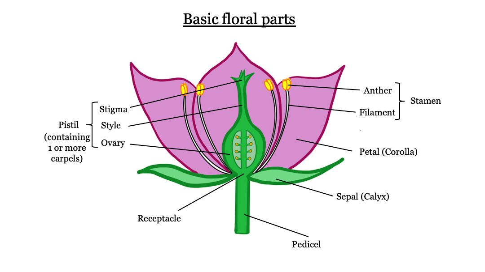

---

## Botany Basics: Flower and fruit parts

---

&nbsp;

&nbsp;

&nbsp;

&nbsp;

&nbsp;

&nbsp;

The purpose of this lab exercise is to familiarize you with basic flower parts, fruit characteristics, and inflorescence structure. Make labeled drawings of the flowers and fruits and answer the questions about them (indicated by **Knowledge Check**.  YOUR DRAWINGS DO NOT NEED TO BE ARTISTIC.  They may be diagrammatic, but should be accurate as to numbers and positions of parts, because accuracy in these details is necessary for plant identification and learning family-specific patterns.  For example, if the flower you are to draw has 8 stamens, draw 8 stamens, not an ill defined bunch of stamens.

NOTE that there is an illustrated glossary of plant parts in another tab on this lab site (**Still building - insert link here**).  There is also a wiki glossary of common botanical terminology [here](https://en.wikipedia.org/wiki/Glossary_of_botanical_terms). It is good practice to refer to these resources when you come across new terms (it will happen a lot), and make sure to utilize your TA's / Lab instructor as well!

**INSERT PHOTOS FOR BASIC FLORAL PARTS LAB**

&nbsp;

---

## Ranunculaceae  

---

&nbsp;

&nbsp;

&nbsp;

**INSERT RANUNCULACEAE PHOTOS AND EXERCISE**

&nbsp;

---

## Keying

---

&nbsp;

**INSERT KEYING MOTIVATION, INTRODUCTION, AND EXERCISE**

&nbsp;

&nbsp;

&nbsp;

