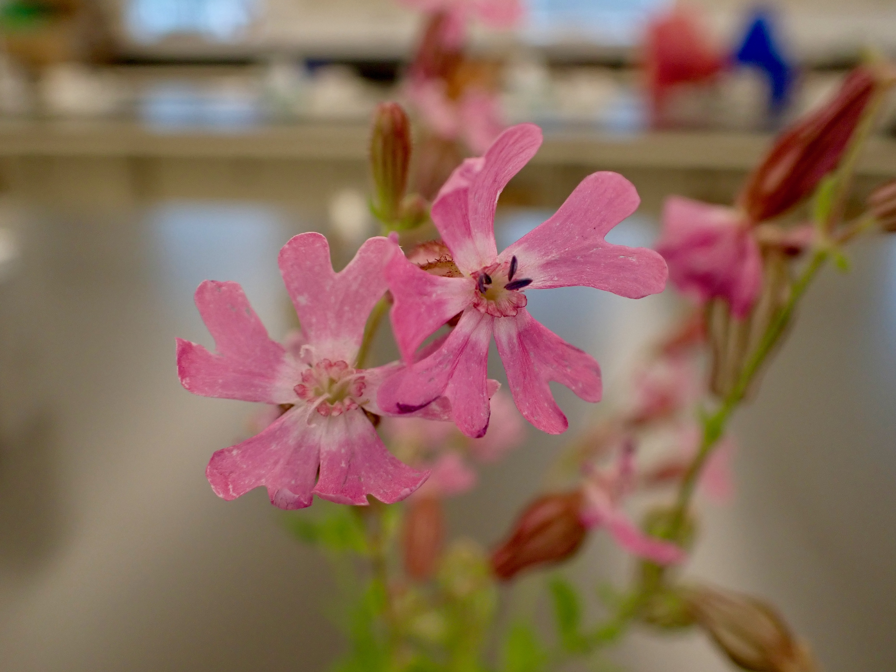
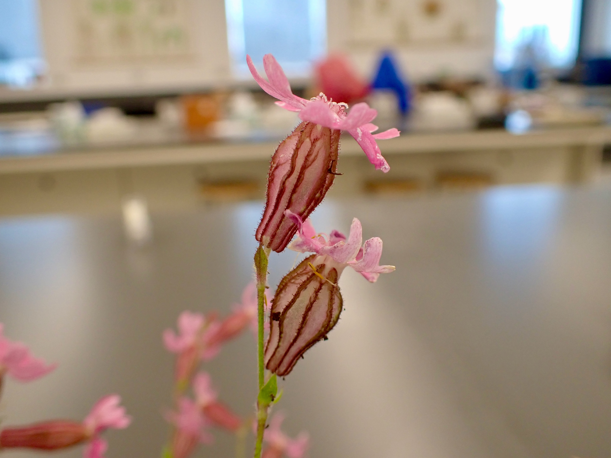
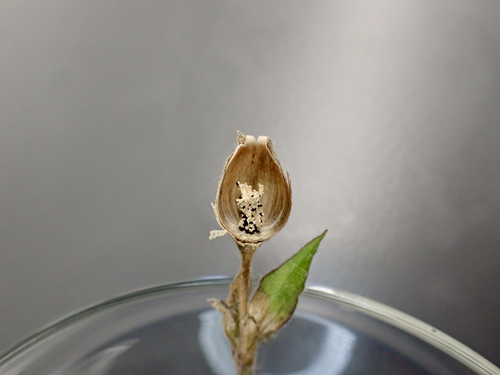
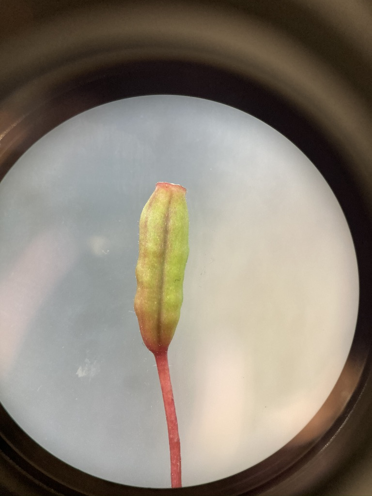

---

# Caryophyllaceae - Pink family

---

**1.	Herbs.**  
**2.	Leaves simple, mostly opposite, mostly entire, usually without stipules, nodes often swollen.**  
**3.	Inflorescence a cyme.  Flowers perfect (rarely imperfect), actinomorphic.  Sepals 5, free or fused.  Petals 5, free. Stamens 5 or 10.  Pistil compound, ovary superior, carpels 2-5, free central placentation.**  
**4.	Fruit usually a capsule.**  
**5.	About 80 genera and 2,000 species, mainly in north temperate regions.**  

---

## Diagrams

 

 

---

Caryophyllaceae is the 9th largest family in B.C., with 93 species and varieties.  The family is economically important for a few ornamentals, including *Dianthus* (carnations, pinks, sweet williams), and *Gypsophila* (baby's breath).  The color name pink comes from some species of *Dianthus* (pinks) which are pink.  For those of you with experience in sewing you may have used pinking shears, which are a type of scissor that cut in a zig-zag pattern like the edges of petals of many members of the “pink” family.

&nbsp;

---

## Flowers

Below you can examine the flowers of *Silene dioica*, a species native to Europe that can also be found as a garden escape in North America. You can see its notched petals and inflated calyx, which are common characters in this family. 

{width=40%} {width=40%}
{width=40%} {width=40%}

&nbsp;

Here is a dissected flower. Can you identify all of the floral parts?

{width=80%}

&nbsp;

---

Here's a similar example of *Dianthus* sp. (carnations). *Dianthus* species are mainly native to Europe and Asia, but the genus is full of beautiful ornamentals that are planted worldwide. 

{width=40%} {width=40%}
{width=40%}

&nbsp;

Here are some photos of a single petal from *Dianthus* sp. Can you identify the 'claw' and 'blade'?

{width=40%} {width=40%}

&nbsp;

---

## Leaves

Here you can see swollen nodes and opposite leaves, which are very common vegetative features in the Caryophyllaceae.

{width=80%}

{width=80%}

&nbsp;

---

## Fruit

Here is an unripe *Dianthus* fruit. You can see the fruit split open on the right. Can you tell the fruit type and placentation?

{width=40%} {width=40%}

&nbsp;

Here is a more mature example from *Silene dioica*.

{width=40%} {width=40%}
{width=40%}

---

## Inflorescence

Another diagnostic character for the Caryophyllaceae is its inflorescence, which is typically a cyme. Pictured below is an inflorescence of *Stellaria media*, a common weed around the Vancouver area. Is this an example of a simple or a compound cyme?

{width=80%} 

 

*Silene dioica* also exhibits a cymose inflorescence structure.

{width=80%} 

---

## -KNOWLEDGE CHECK 3.1-

Draw a member of the Caryophyllaceae and include the following in your drawing: 

* Fused calyx  
* Notched petals
* Swollen nodes with opposite leaves
* Typical fruit and placentation 
* Cymose inflorescence structure  
* Make sure to label using the following terms: corolla, calyx, stamens, pistil, fruit (indicate fruit and placentation type)

&nbsp;

---

# Polygonaceae - Buckwheat family

---

**1.  Herbs, shrubs, or rarely vines or trees.**  
**2.  Leaves simple, alternate, often with a stipular sheath at the petiole base.  Stems often with swollen nodes.**  
**3.  Flowers usually perfect, actinomorphic, perianth in one series or of 2 series of 3 tepals each.  Tepals 3-6, usually not fused.  Stamens 6-9.  Pistil compound, ovary superior, carpels 2-4 but ovary with only 1 ovule, placentation basal.**  
**4.  Fruit an achene.**  
**5.  About 37 genera and 800 species, mainly in North Temperate regions.**  

---

## Diagrams

 

 

---

Polygonaceae is the 10th largest family in B.C., with 66 species, however this number includes several introduced weedy species.  Agricultural crops in the Polygonaceae include *Fagopyrum* (buckwheat) and *Rheum* (rhubarb).  A large number of *Polygonum* species have been reclassified to *Persicaria* and *Fallopia*.  When you use FNA and iNaturalist to identify members of this family make sure to check that you have the most current name.

---

## Flowers

Polygonaceae species typically have small white or pink flowers with parts in threes. Below you can see pictures of *Persicaria hydropiperoides*, a species that can be found around Vancouver in wet areas. Notice the crowded inflorescence with tiny pinkish flowers.

{width=40%} {width=40%}

&nbsp;

Another example is *Aconogonum campanulatum*, a species from the Himalayas that can be found at the UBC Botanical Garden. Take a look at those tiny flowers - can you identify the tepals, stamens, and styles?

{width=40%} {width=40%}
{width=40%} {width=40%}

&nbsp;

---

## Nodes

An important diagnostic character for Polygonaceae is associated with their nodes, which are often swollen and have a stipular sheath (called an 'ocrea'). Can you see these characters in *P. hydropiperoides*?

{width=40%} {width=40%}

&nbsp;

Here are the nodes of *A. campanulatum*. In this species, the ocrea wraps around both the stem and the petiole - these different ocrea characters are often used in the Polygonaceae key to differentiate between species. In the photo on the right, you can see that ocrea has torn, but remains at the node as withered papery bits.

{width=40%} {width=40%}

---

## Heterostyly

The species *Fagopyrum esculentum* (buckwheat - not to be mistaken for *Eriogonum* sp. which are also called buckwheat...that's the problem with common names y'all!!!) is cultivated for its achenes (see below) and as a cover crop. *F. esculentum* is a great example of 'heterostyly', a condition that promotes outcrossing where flowers take two forms: 'pin' flowers that have long styles and short stamens, and 'thrum' flowers that have long stamens and short styles. Within an individual, every flower is either pin or thrum, and can only be pollinated by an insect that has visited the opposing form first. Can you differentiate between pin and thrum flowers in the pictures below?

{width=40%} {width=40%}
{width=40%} {width=40%}

&nbsp;

---

## Fruit

Polygonaceae fruit are classified as achenes, despite the fact that they develop from a compound pistil. Even though they can have 2-4 carpels, only one ovule is formed within the ovary. Here you can see the three-sided achene of *F. esculentum*.

{width=40%} {width=40%}

&nbsp;

Achenes in the genus *Rumex* (docks and sorrels) are unique within the Polygonaceae. The inner three tepals are closely accrescent to the achene inside, forming a three-sided structure that is often adorned with wings or barbs on the margins. In addition, these inner tepals often have a round tubercule or 'callosity' on one or all three sides. See examples of *Rumex* achenes below. They often change to a reddish-brownish colour as they age. Can you spot the barbs and callosity? If you see anything like this out and about you can be pretty sure you've found *Rumex* sp....

{width=40%} {width=40%}
{width=40%} {width=40%}

---

## -KNOWLEDGE CHECK 3.2-

Draw a Polygonaceae plant and include the following in your drawing:

* Small flowers with tepals 
* Swollen nodes and ocrea
* Simple leaves
* An achene (pretend your plant has achenes that resemble those found in the genus *Rumex*)
* Use the following terms to label your drawing: tepals, styles, stamens, node, achene, callosity, petiole, leaf blade, ocrea.  

&nbsp;

---

# Onagraceae - Evening-primrose family

--- 

**1.  Mainly herbs**  
**2. Leaves simple to pinnatifid, opposite or alternate, mostly without stipules**  
**3. Flowers perfect, mostly actinomorphic, hypanthium often conspicuous.  Sepals 4 (rarely 2 or 5), free or fused.  Petals 4 (rarely 2-6), free.  Stamens 2, 4 or 8.  Pistil compound, ovary inferior, carpels 4, placentation axile.**  
**4.  Fruit a capsule, or rarely a berry or nutlike.**  
**5. About 25 genera and 500 species, mainly New World, especially western North America.**  

---

## Diagrams

 

---

Members of the Onagraceae are easily recognized by their usually 4-merous polypetalous flowers with an inferior ovary.  It is the 18th largest family in B. C., with 46 taxa.  Several genera, especially *Fuchsia*, are grown as ornamentals, and oil from *Oenothera* seeds is used medicinally. 

---

## Flowers

You've seen *Fuschia* already in Lab 2. Take another look at the below photos, noting the long hypanthium, petaloid sepals, and inferior ovary. A conspicuous hypanthium, inferior ovary, and parts in 4's are good characters to help you narrow down to this family.

{width=40%} {width=40%}
{width=40%} {width=40%}

{width=80%}

&nbsp;

Here is a local weedy example, *Epilobium ciliatum*. It has small flowers with a long, slender ovary that is often mistaken as part of the pedicel. Can you identify all of the whorls?

{width=40%} 
{width=40%}
{width=40%}
{width=40%}

&nbsp;

---

## Fruit

Most Onagraceae species form capsules from compound ovaries (though *Fuchsia* forms a berry). Here is a developing ovary from a *Fuchsia* flower. Can you tell how many carpels there are, and the type of placentation?

{width=40%} 
{width=40%}

&nbsp;

*Epilobium* capsules dehisce along four sutures, and release hundreds of hairy seeds that disperse in the wind. 

{width=40%} 
{width=40%}
{width=40%}
{width=40%}

&nbsp;

---

Some showy local examples come from the genus *Chamaenerion*. The top two photos show *C. angustifolium* (fireweed), which is a widespread weed that is often seen on roadsides and disturbed lots. The bottom two photos show *C. latifolium*, which has flowers that look quite similar to fireweed's but is much shorter and only found along subalpine streams. Can you see the parts in 4's?

{width=40%} 
{width=40%}

{width=40%}
{width=40%}

&nbsp;

---

## -KNOWLEDGE CHECK 3.3- 

Using the above photos, draw *Epilobium ciliatum* and include the following: 

* A drawing of a flower including long slender ovary
* A drawing of a mature, dehiscing capsule with hairy seeds  
* Label your drawings with the following terms: sepals, petals, stamens, style, stigma, ovary, capsule, seeds. 

---

# Exploring GBIF

---

## Motivation

As taxonomists it is useful to know where species occur and co-occur on continental scales to help inform species delimitations. For example, two sister species separated by a major geographic barrier (such as a mountain range) are not likely to interbreed. This type of information is one piece of the puzzle of delimiting species. To make preliminary estimates of a species' distribution, we can harness the data resources organized by the [Global Biodiversity Information Facility](https://www.gbif.org/what-is-gbif). GBIF is an open-access database housing information about where and when species have been observed or collected. To the modern plant taxonomist, it is indispensable: one can search GBIF for any plant taxon of interest, and immediately have access to all global records of where and when their plant has been observed.

<!-- To scratch the surface of GBIF reveals a massive database spanning the entire tree of life. How does one go about efficiently collecting, organizing, validating, and analyzing so much information? The solution is made tractable by employing data analysis tools like those found in R. By combining the biodiversity resources of GBIF with the analytical tools in R, we can collect, process, and visualize species distribution data on any laptop or tablet. In this week's lab we'll first gather the required tools (R and GBIF) and develop some basic skills using them. In the following lab we'll use our new skills to create research-grade distribution maps. -->

 

---

## Activity: Look up the occurrence of a local species

---

Let's jump into GBIF! First go to the [GBIF website](https://www.gbif.org). For this exercise, we'll focus on looking up species occurrence data. Click the "Get Data" tab at the top and select "Species" from the drop-down menu. Then type in your species of interest.

{width=100%}

 

You can see the first name in the list is the "main" species page, and then it lists a series of hybrids (indicated by an 'x' between the two specific epithets). Clicking on the main entry will bring up an overview of the database for that species.

{width=100%}

 

Just above the map on the top-left, it lists the total number of records in the database worldwide. Scrolling down a bit will show you a list of countries in which that species is considered "introduced" in, as well as the number of names for that species that occur in the database. *Epilobium ciliatum* is the only name used for this species in the GBIF database.

{width=100%}

 

The map has tons of useful features for filtering data, including filters by year (slider at bottom-left) and by observation type (button in bottom-right). For example, we can zoom in on Europe (just like you would in Google Maps), and filter observations to only include human observations that were made after the year 1900. If we then click the "Explore area" button, we can view the data that matches our filtering criteria.

{width=100%}

 

The "Metrics" tab will show us some great summary statistics of our filtered observations. At the top we see that our filters resulted in 82,617 occurrences (out of 123,331 total), so it appears that the majority of the observations of *E. ciliatum* come from Europe! Scrolling down a bit, we can see metrics on number of occurrences by month and year. This species is observed primarily between May and October (but a lot in January too), and the number of observations really takes off around 1975.

{width=100%}

 

We can also adjust our filters using the pane on the left. Let's say we want to restrict our results to only those found on iNaturalist. Click "Dataset" tab and type in "iNaturalist" and select "iNaturalist Research-grade Observations". Now, we only have 230 observations! Why do you think there are so few? What happens if you do the same thing but in North America? What databases do the majority of *E. ciliatum* observations occur in in Europe?

---

## -KNOWLEDGE CHECK 3.4-

Using GBIF, look up one of the species you've observed for your iNaturalist project (or look up a nearby observation made by someone else). Restrict your observations to only those found within your continent after the year 1900, and answer the following questions:

* How many occurrences of this species are there in all databases? 
* How many names are used for this species?
* How many countries has this species been introduced to?
* In which month and year is this species observed the most?
* What database has the most occurrences?
* How many occurrences does iNaturalist have?
* How would you describe this species' geographic range?

---

# For next week (Lab 4)

* Please download and install ImageJ (https://imagej.nih.gov/ij/download.html), as we will be using it next week for Lab 4. 
* Also, if you haven't already, please put your info into the class google sheet (https://docs.google.com/spreadsheets/d/1lUajuGPwVc29feAesxS9DYLhfNqYxRrawvofaE6bYjA/edit#gid=0) so that I can invite you to our BIOL 324 iNaturalist project space. You will be using this sheet to fill in your herbarium specimen measurements for lab next week.
  + If you go to the second tab in the google sheet, you can put in your super-duper-cool custom team name ;-)

