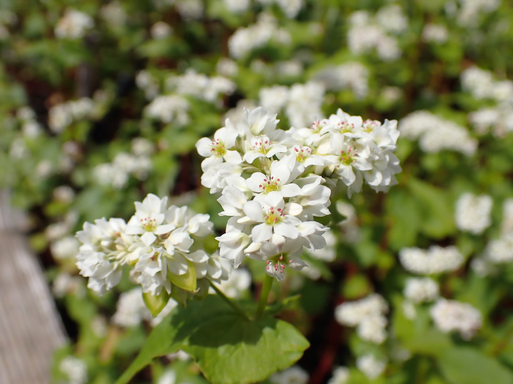
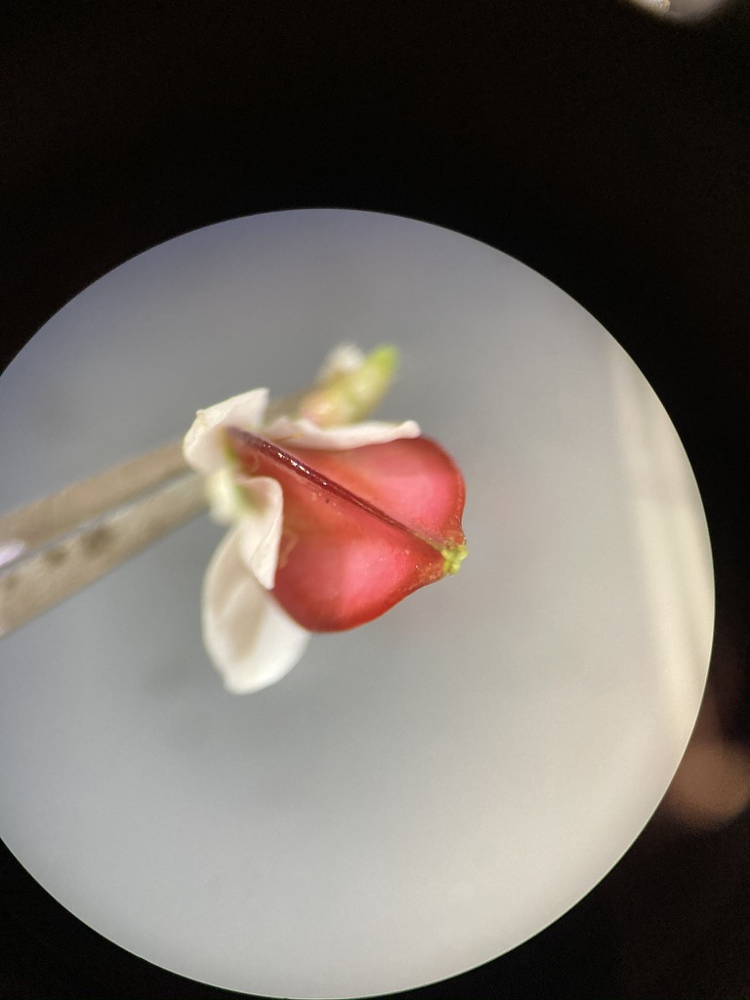

## Caryophyllaceae - Pink family

**1.	Herbs.**  
**2.	Leaves simple, mostly opposite, mostly entire, usually without stipules, nodes often swollen.**  
**3.	Inflorescence a cyme.  Flowers perfect (rarely imperfect), actinomorphic.  Sepals 5, free or fused.  Petals 5, free. Stamens 5 or 10.  Pistil compound, ovary superior, carpels 2 5, free central placentation.**  
**4.	Fruit usually a capsule.**  
**5.	About 80 genera and 2,000 species, mainly in north temperate regions.**  

Caryophyllaceae is the 9th largest family in B.C., with 93 species and varieties.  The family is economically important for a few ornamentals, including *Dianthus* (carnations, pinks, sweet williams), and *Gypsophila* (baby's breath).  The color name pink comes from some species of *Dianthus* (pinks) which are pink.  For those of you with experience in sewing you may have used pinking shears, which are a type of scissor that cut in a zig-zag pattern like the edges of petals of many members of the “pink” family.

&nbsp;

---

Below you can examine the flowers of *Silene dioica*, a species native to Europe that can also be found as a garden escape in North America. You can see its notched petals and inflated calyx, which are common characters in this family. 

{width=40%} {width=40%}
{width=40%} {width=40%}

&nbsp;

Here is a dissected flower. Can you identify most of the perianth whorls?

{width=80%}

&nbsp;

Here you can see the characteristic swollen nodes and opposite leaves.

{width=80%}

&nbsp;

---

Here's a similar example of *Dianthus* sp.

{width=40%} {width=40%}
{width=40%} {width=40%}

&nbsp;

Here are some photos of a single petal. Can you identify the 'claw' and 'blade'?

{width=40%} {width=40%}

&nbsp;

Here is an unripe *Dianthus* fruit. You can see the fruit split open on the right. Can you tell the type of placentation?

{width=40%} {width=40%}

&nbsp;

---

Another diagnostic character for the Caryophyllaceae is its inflorescence, which is typically a cyme. Pictured below is an inflorescence of *Stellaria media*, a common weed around the Vancouver area. Is this an example of a simple or a compound cyme?

{width=80%} 

---

**-KNOWLEDGE CHECK-**  

Using the above photos, indicate the following:  
- *Silene* or *Dianthus* flower longitudinal section  
- Swollen nodes with opposite leaves  
- What is the fruit type? What type of placentation does it have?  
- Cymose inflorescence structure  
- Label with the following terms if present: petals, sepals, stamens, pistils, fruit, claw, blade.

&nbsp;

---

## Polygonaceae - Buckwheat family

---

**1.  Herbs, shrubs, or rarely vines or trees.**  
**2.  Leaves simple, alternate, often with a stipular sheath at the petiole base.  Stems often with swollen nodes.**  
**3.  Flowers usually perfect, actinomorphic, perianth in one series or of 2 series of 3 tepals each.  Tepals 3 6, usually not fused.  Stamens 6 9.  Pistil compound, ovary superior, carpels 2 4 but ovary with only 1 ovule, placentation basal.**  
**4.  Fruit an achene.**  
**5.  About 37 genera and 800 species, mainly in North Temperate regions.**  

Polygonaceae is the 10th largest family in B.C., with 66 species, however this number includes several introduced weedy species.  Agricultural crops in the Polygonaceae include *Fagopyrum* (buckwheat) and *Rheum* (rhubarb).  A large number of *Polygonum* species have been reclassified to *Persicaria* and *Fallopia*.  When you use FNA and iNaturalist to identify members of this family make sure to check that you have the most current name.

---

Polygonaceae species typically have small white or pink flowers with parts in threes. Below you can see pictures of *Persicaria hydropiperoides*, a species that can be found around Vancouver in wet areas. Notice the crowded inflorescence with tiny pinkish flowers.

{width=40%} {width=40%}

&nbsp;

Another example is *Aconogonum campanulatum*, a species from the Himalayas that can be found at the UBC Botanical Garden. Take a look at those tiny flowers - can you identify the tepals, stamens, and styles?

{width=40%} {width=40%}
{width=40%} {width=40%}

&nbsp;

---

An important diagnostic character for Polygonaceae is associated with their nodes, which are often swollen and have a stipular sheath (called an 'ocrea'). Can you see these characters in *P. hydropiperoides*?

{width=40%} {width=40%}

&nbsp;

Here are the nodes of *A. campanulatum*. In this species, the ocrea wraps around both the stem and the petiole - these different ocrea characters are often used in the Polygonaceae key to differentiate between species. In the photo on the right, you can see that ocrea has torn, but remains at the node as withered papery bits.

{width=40%} {width=40%}

---

The species *Fagopyrum esculentum* (buckwheat - not to be mistaken for *Eriogonum* sp. which are also called buckwheat...that's the problem with common names y'all!!!) is cultivated for its achenes (see below) and as a cover crop. *F. esculentum* is a great example of 'heterostyly', a condition that promotes outcrossing where flowers take two forms: 'pin' flowers that have long styles and short stamens, and 'thrum' flowers that have long stamens and short styles. Within an individual, every flower is either pin or thrum, and can only be pollinated by an insect that has visited the opposing form first. Can you differentiate between pin and thrum flowers in the pictures below?

{width=40%} {width=40%}
{width=40%} {width=40%}

&nbsp;

---

Polygonaceae fruit are classified as achenes, despite the fact that they develop from a compound pistil. Even though they can have 2-4 carpels, only one ovule is formed within the ovary. Here you can see the three-sided achene of *F. esculentum*.

{width=40%} {width=40%}

&nbsp;

Achenes in the genus *Rumex* (docks and sorrels) are unique within the Polygonaceae. They have achenes with three sides that are often adorned with wings or barbs, in addition to a round tubercule or 'callosity' on one or all three sides. See examples of *Rumex* achenes below. They often change to a reddish-brownish colour as they age. Can you spot the barbs and callosity? If you see anything like this out and about you can be pretty sure you've found *Rumex* sp....

{width=40%} {width=40%}
{width=40%} {width=40%}

---

**-KNOWLEDGE CHECK-**  

Using the photos above, make drawings and indicate the following:  
- Small flowers  
- Swollen nodes and stipular sheath  
- Pin and thrum flowers  
- *Fagopyrum* and *Rumex* achenes  
- Use the following terms to label your drawings: tepals, styles, stamens, ocrea, node, pin flower, thrum flower, achene, callosity.  

&nbsp;

---

## Onagraceae - Evening-primrose family

--- 

**1.  Mainly herbs**  
**2. Leaves simple to pinnatifid, opposite or alternate, mostly without stipules**  
**3. Flowers perfect, mostly actinomorphic, hypanthium often conspicuous.  Sepals 4 (rarely 2 or 5), free or fused.  Petals 4 (rarely 2 6), free.  Stamens 2, 4 or 8.  Pistil compound, ovary inferior, carpels 4, placentation axile.**  
**4.  Fruit a capsule, or rarely a berry or nutlike.**  
**5. About 25 genera and 500 species, mainly New World, especially western North America.**  

Members of the Onagraceae are easily recognized by their usually 4 merous polypetalous flowers with an inferior ovary.  It is the 18th largest family in B. C., with 46 taxa.  Several genera, especially Fuchsia, are grown as ornamentals, and oil from Oenothera seeds is used medicinally. 

---

You've see *Fuschia* already in Lab 2. Take another look at the below photos, noting the long hypanthium and inferior ovary. 

{width=40%} {width=40%}
{width=40%} {width=40%}

{width=80%}

---

## Exploring GBIF

---

### Motivation

As taxonomists it is useful to know where species occur and co-occur on continental scales to help inform species delimitations. For example, two sister species separated by a major geographic barrier (such as a mountain range) are not likely to interbreed. This type of information is one piece of the puzzle of delimiting species. To make preliminary estimates of a species' distribution, we can harness the data resources organized by the [Global Biodiversity Information Facility](https://www.gbif.org/what-is-gbif). GBIF is an open-access database housing information about where and when species have been observed or collected. To the modern plant taxonomist, it is indispensable: one can search GBIF for any plant taxon of interest, and immediately have access to all global records of where and when their plant has been observed.

To scratch the surface of GBIF reveals a massive database spanning the entire tree of life. How does one go about efficiently collecting, organizing, validating, and analysing so much information? The solution is made tractable by employing data analysis tools like those found in R (Note: For an introduction to R, see this week's [pre-lab reading in the section below](#prelab)).  By combining the biodiversity resources of GBIF with the analytical tools in R, we can collect, process, and visualize species distribution data on any laptop or tablet. In this week's lab we'll first gather the required tools (R and GBIF) and develop some basic skills using them. In the following lab we'll use our new skills to create research-grade distribution maps.

#### Activity 1: Exploring the GBIF website {#A1}

Let's jump into GBIF! First go to the [GBIF website](https://www.gbif.org). In another tab/window follow along with [this video tutorial](https://www.youtube.com/watch?v=40yPnJdeM_A&t=3s) to learn how to navigate through the GBIF website (NOTE: creating an account and downloading the data onto your computer, as suggested in the video, is **NOT necessary**).

By following the video tutorial, you'll learn how to search for GBIF data, what types of data your search will return, and how that data is structured. Notice that GBIF is a biodiversity database aggregator, pulling data from other databases such as eBird and iNaturalist. That means that you can choose to share your BIOL324 iNaturalist observations so that they appear on GBIF!

**Make an activity getting them to make maps of two close relatives using GBIF website**
