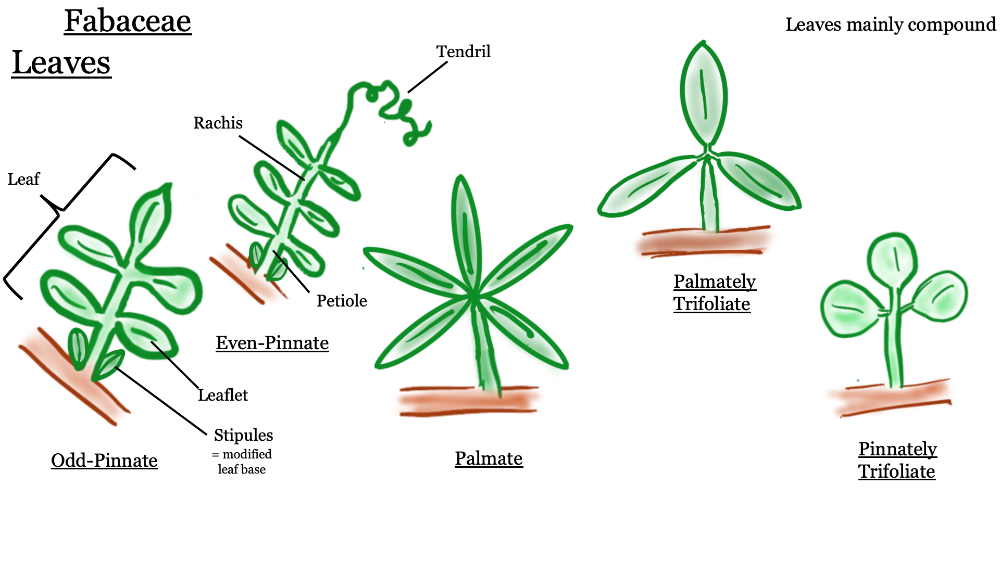

---

# Fabaceae - Legume or Pea family

---

**1.	Herbs, vines, shrubs, or trees.**  
**2.	Leaves usually compound, alternate, stipulate.  Leaflets often entire-margined.  Petioles and petiolules with a pulvinus.**  
**3.	Flowers perfect, zygomorphic or actinomorphic.  Sepals usually  5, more or less connate.  Petals  5.  Stamens 10 or numerous, often diadelphous.  Pistil simple, ovary superior, carpel 1, placentation parietal.**  
**4.	Fruit a legume or loment.**  
**5.	About 600 genera, 13,000 species, cosmopolitan.**  

---

## Diagrams

---

---

---

---

The Fabaceae in the broad sense is composed of 3 rather distinct subfamilies.  They are often recognized as separate families.  The Mimosoideae and Faboideae are specialized monophyletic groups that evolved from Caesalpinoideae.

Mimosoideae, or, as a family, Mimosaceae. Flowers actinomorphic, stamens numerous, petals free or connate below.  *Acacia* (acacia), *Mimosa* (sensitive plant).  

Caesalpinoideae, or, as a family, Caesalpinaceae. Flowers zygomorphic, stamens 10, petals free.  *Cercis* (redbud).

Faboideae (also called Papilionoideae or Lotoideae), or, as a family, Fabaceae. Flowers zygomorphic and papilionaceous, lower 2 petals fused to form a keel, the other 3 free, stamens 10, usually diadelphous.  Ornamentals include *Lathyrus* (sweet pea), *Laburnum* (golden chain tree), *Wisteria*, *Cytisus* (broom).  Important crops include *Arachis* (peanut), *Glycine* (soybean), *Lens* (lentils), *Medicago* (alfalfa), *Phaseolus* (beans), *Pisum* (peas), *Trifolium* (clover).

The Mimosoideae and Caesalpinoideae are primarily tropical to warm temperate, and none are native to B. C.  The Fabaceae is probably the third largest family of flowering plants in the world, after the Asteraceae and Orchidaceae. The Fabaceae is the 5th largest in B.C., with 168 species and subspecies in the province.

&nbsp;

---

## Flowers

Members of the Fabaceae have several unique characteristics that make them possible to identify by sight. We'll begin with the flowers, which (in BC at least) are all 'papilionaceous' (flowers that resemble a butterfly). Papilionaceous flowers have a unique look and are made up of 3 parts: at the top there is a prominent petal called the 'banner' (aka 'standard'); below the banner are two lateral petals called 'wings'; and at the bottom (often nestled below and/or between the wings) 2 petals are fused to form the 'keel'. The keel can be pulled down to reveal the stamens and pistil hidden inside. Once you cement the 'banner, wing, and keel' visual pattern in your memory, it will rather unmistakably lead you to the Fabaceae. 

&nbsp;

Let's examine some of these flowers from *Spartium junceum* (Spanish broom), a shrubby species native to the Mediterranean with an intoxicating fragrance. It has a classic papilionaceous look with the banner, wing, and keel being quite obvious. Can you identify them in the photos below?

{width=40%} {width=40%}
{width=40%} {width=40%}

&nbsp;

Here are some more examples of papilionaceous flowers. While they all have banner, wing, and keel morphology, you can see that there is still quite a bit of variation amongst Fabaceae species. As you can see, the keel is quite often hidden from sight in between the wings.

{width=40%} {width=40%}
{width=40%} {width=40%}

&nbsp;

Sometimes, like in *Trifolium pratense* below, the flowers are quite small and require careful inspection (and probably some magnification) to see their papilionaceous nature. 

{width=80%}

&nbsp;

To get into some more nitty-gritty detail, an important character in the Fabaceae key is to differentiate between 'monodelphous' and 'diadelphous' stamens. Monodelphous stamens are fused into a tube that surrounds the style, and diadelphous stamens are the same except one lonely stamen hangs free from the staminal tube. Can you determine which is which?

{width=40%} {width=40%}

&nbsp;

---

## Leaves

Fabaceae species tend to have compound leaves (made up of several leaflets). They can be either pinnately compound (with leaflets arranged oppositely along the rachis) or palmately compound (leaflets emerging from a central point). Many species have three leaflets and are referred to as "trifoliate" (hence the genus *Trifolium*). Can you tell which one is which from the pictures below?

{width=40%} {width=40%}

&nbsp;

Many Fabaceae have their terminal leaflets replaced with tendrils, which help the plants climb (usually upon other plants) in competition for sunlight.

{width=40%} {width=40%}
{width=40%} {width=40%}

&nbsp;

---

## Fruit

The characteristic fruit type of the Fabaceae is the legume, which you got a sneak-peak of in lab 2. Do you remember the characteristics of a legume (e.g., how many carpels, the type of placentation, and type of dehiscence)? Here are some examples.

{width=40%} {width=40%}
{width=40%} {width=40%}

&nbsp;

Not all legumes look pea-like, however. For example, some take a coiled shape like in *Medicago sativa* (alfalfa) on the left or a crescent shape like in *Astragalus nutzotinensis* (a wonderful plant that can only be found in Northwestern BC / Yukon territory) on the right.

{width=40%} {width=40%}

&nbsp;

---

## -KNOWLEDGE CHECK 4.1-

Using the above pictures, draw a Fabaceae flower and fruit. Make sure to include the following:  

- Papilionaceous flower  
- Compound leaves - indicate the type (i.e., palmate or pinnate, tendrils present or not)  
- Monodelphous or diadelphous stamens (label the type drawn) 
- Legume (include a longitudinal section showing parts inside the fruit)
- Label your drawings with the following terms: banner, wing, keel, leaf, leaflet, petiole, rachis, tendrils (if present), ovary wall, seed, placenta, locule.

&nbsp;

---

# Rosaceae - Rose family

---

**1.  Herbs, shrubs or trees.**  
**2.  Leaves simple or compound, usually toothed, alternate, stipulate.**  
**3.  Flowers usually perfect, actinomorphic.  Sepals 5, free.  Petals 5, free.  Stamens many, free.  Hypanthium present, either flat or cup shaped or fused with the ovary to produce an inferior ovary.  Pistils simple or compound, ovary superior or inferior, flowers hypogynous, perigynous, or epigynous.  Carpels 1, several (fused or separate) or many (separate).  Placentation axile, parietal (marginal), or basal.**  
**4.  Fruit an achene, follicle, pome, drupe, or aggregation of drupelets.**  
**5.  About 100 genera and 3,000 species, cosmopolitan but commonly in temperate regions.**  

---

## Diagrams

---

---

---

---

Rosaceae is an important family in the B.C. flora, being 6th largest with 142 taxa.  The family is a rather heterogeneous group of plants, but most have a Rosaceous look about them, with 5 sepals and petals,  a hypanthium, and stipulate leaves. Rosaceae is divided into 4 subfamilies, largely on the basis of fruit type.  The Maloideae and Prunoideae are rarely recognized as separate families.

Rosoideae - carpels usually numerous, free, fruit an achene or aggregation of drupelets.  *Rosa* (rose), *Fragaria* (strawberry), *Rubus* (blackberry, raspberry) *Potentilla*.

Spiraeoideae - carpels 5 or fewer, free, fruit a follicle. *Spiraea* (spiraea, bridal wreath).

Maloideae - carpels 2-5, fused, ovary inferior (hypanthium fused to ovary wall), fruit a pome.  *Pyrus* (apple and pear), *Sorbus* (mountain ash), *Amelanchier* (saskatoon berry), *Crataegus* (hawthorn).

Prunoideae (sometimes called Amygdaloideae) - carpels 1-5, separate, fruit a drupe.  *Prunus* (peach, nectarine, cherry, sloeberry - used to flavor sloe gin, plum, almond), *Oemleria* (Indian plum or osoberry).

&nbsp;

---

## Flowers

Roseaceae flowers typically have 5 sepals, 5 petals, numerous stamens, and a (often short/shallow) hypanthium. Here are some examples:

{width=40%} {width=40%}
{width=40%} {width=40%}

&nbsp;

Below you can see a section of *Potentilla* sp., which has a classic Rosaceae flower with a shallow, bowl-shaped hypanthium. It is a bit hard to make out in the photo, but can you see why this is considered a hypanthium? 

{width=80%}

 

A local example is *Geum macrophyllum*. Notice the 5 yellow petals, numerous stamens, and numerous simple pistils that develop into achenes. Does this visual remind you of another family that we've seen? 

{width=40%} {width=40%}

&nbsp;

While many flowers look like the ones above, some are a lot less obviously Rosaceous...See *Spirea douglasii* (left) and *Prunus laurocerasus* (right).

{width=40%} {width=40%}

&nbsp;

---

## Leaves

Rosaceae leaves can be either simple or compound, but are quite often toothed, alternate, and stipulate. Can you identify the stipules in the bottom-two photos?

{width=40%} {width=40%}
{width=40%} {width=40%}

&nbsp;

Herbs, shrubs, and trees can all be found in the Rosaceae. Here is an example of *Prunus* sp (cherry), which has toothed, evergreen leaves. At the base of the leaf blade you can often find 1-3 glands (an example of extra-floral nectaries), which is a good character to identify this genus.

{width=40%} {width=40%}

&nbsp;

Some additional vegetative characters include the presence of "spines", "prickles", or "thorns". If you took BIOL 210, you should already be familiar with the fact that prickles are modified epidermis, spines are modified leaves, and thorns are modified stems. Some spiky examples from the Rosaceae include *Rosa* (rose - top) and *Rubus* (blackberry, raspberry - bottom). For each case, would these be considered prickles, spines, or thorns?

{width=40%} {width=40%}
{width=40%} {width=40%}

&nbsp;

---

## Fruit

Rosaceae features several different fruit types, including achenes, drupes (and aggregates of 'drupelets'), follicles, and pomes. These tend to be conserved within the above-mentioned subfamilies. 

At first one might think that a rose "hip" is the fruit of the rose (with in inferior ovary), but in actuality the hip is a fleshy hypanthium and the achenes (the true fruit) are found inside (so it is in fact a superior ovary!). Can you identify the hypanthium, achenes, and residual sepals and stamens?

{width=40%} {width=40%}
{width=40%} {width=40%}

&nbsp;

---

Many members of the Rosaceae have drupes, defined as fruit where the fruit wall is made up of three layers: The outer skin (exocarp), middle fleshy bit (mesocarp), and the inner hard/woody shell (endocarp) that surrounds the seed. Some members of the family, like in the genus *Rubus* (blackberry), produce berries made up of dozens of tiny drupes, AKA an "aggregate of drupelets". 

{width=100%}

&nbsp;

---

A pome is a unique fruit type to the Rosaceae. A pome develops from a compound, inferior ovary and has seeds encased within a cartilaginous wall (known as the endocarp of the ovary), with most of the surrounding fleshy part of the fruit derived from the hypanthium, which is fused to the ovary. So when you chomp into a delicious apple, most of the tasty bits are actually hypanthium tissue instead of ovary wall like your typical fruit! Below you can see the pomes of *Pyrus* (apple and pear - top) and *Sorbus* (mountain ash - bottom).

{width=40%} {width=40%}
{width=40%} {width=40%}

&nbsp;

---

## -KNOWLEDGE CHECK 4.2-

Using the above photos, make drawings of a Roseaceae flower and fruit. Make sure to include the following:

- Flower with shallow hypanthium 
- Toothed leaves with stipules  
- "Spiky" bits.  Make sure to indicate whether they are prickles, spines, or thorns...  
- A drawing of a developed fruit. Indicate the fruit type. 
- Label your drawings with the following (if present): sepals, petals, stamens, hypanthium, leaf, leaflet, petiole, rachis, stipules, spines, prickles, thorns, achene, pome, follicle, drupe.  

---

# Taking Morphometric Measurements from digital Herbarium Specimens using ImageJ

---

## Motivation

Throughout this course we've seen how morphology plays a central role in plant taxonomy. The shapes of stems, leaves, and flowers are often the first traits listed in a dichotomous key. When a trait (like corolla width) is measured and quantified, we are able to use statistical tests to decide how to group or split individuals. The science of measuring and analyzing shape is called _morphometrics_. In this lab, you'll be performing the first step in any morphometrics project: collecting morphological data (in this case from digital herbarium specimens). Herbarium specimens are used in many other ways besides morphometrics, including taxonomic species delimitation and studying how phenology changes over time in response to climate change. We will collect data as a class this week, and then we will analyze the class dataset using machine learning techniques in R for your informatics activity in Lab 8. 

We will be measuring two species of *Antennaria*, a diverse genus in the Asteraceae family with complicated taxonomy. The genus has dozens of species amongst which apomixis (asexual reproducation through seed), polyploidy, and hybridization are rampant. These processes can lead to difficult taxonomy, as they tend to create an array of "microspecies" that blur the boundaries between taxa. The taxonomy of *Antennaria* is so complicated in fact that our very own [Jamie Fenneman](https://www.grad.ubc.ca/campus-community/meet-our-students/fenneman-jamie) (prior BIOL 324 TA and epic BC plant expert) [devoted a large chunk of his PhD thesis towards untangling it](https://open.library.ubc.ca/cIRcle/collections/ubctheses/24/items/1.0378325). He used a floristic approach to his thesis work on *Antennaria*, relying largely on comparing range/morphological differences to evaluate the way species had been classified in the past, but without using genetic or in-depth morphological analyses. We will be using a more quantitative/statistical approach to check the distinctness between two species, *A. anaphaloides* (left) and *A. pulcherrima* (right).

{width=40%} {width=40%}

 

---

## Activity 1: Find and download digital herbarium specimen

The UBC Herbarium is the largest herbarium in Canada west of Ottowa, and includes over 500,000 plant specimens from across the world. The UBC Herbarium has five major collections: vascular plants, bryophytes, algae, lichens, and fungi. Along with having the world's largest collection of BC plants, the UBC Herbarium also has an internationally recognized byrophyte collection that is the largest in Canada. You can go to the herbarium and visit it in person (if you are interested in doing research or volunteering, please contact Linda Jennings), but you can also access their detailed online database. You will be using this database to access and download the digital specimens you'll be measuring today.

First, go to [our BIOL 324 Google sheet](https://docs.google.com/spreadsheets/d/1lUajuGPwVc29feAesxS9DYLhfNqYxRrawvofaE6bYjA/edit#gid=950598973) and make sure you are on the "Morphometrics" tab on the bottom. Find your name, and copy the **Accession #** you've been assigned. This is the specimen you will be measuring.

{width=100%}

 

Next, visit the [UBC Herbarium website](https://beatymuseum.ubc.ca/research-2/collections/herbarium/), and then "Click to search the Herbarium online database!". Select "Vascular" collection at the bottom of the page, and paste in your accession number in the "Accession Number" field, then click "Submit" (note that you can search based on a ton of different criteria, just like GBIF). The resulting page will give you a list of accessions...make sure you click on the right accession/species.

{width=100%}

 

You should now be on the main page for your specimen. It provides lots of relevant information, including GPS coordinates, date of collection, who collected it, and any field notes provided by the collector. In the bottom right, you can see an image of the pressed specimen. Click on it and it will open up a new tab with the full size image. Right click on the image and download the image to your computer. Open up the image file on your computer to make sure it looks alright (you may need to rotate it) before moving on to ImageJ.

 

---

## Activity 2: Measure traits using ImageJ

ImageJ is an image processing software that was developed by the U.S. National Institutes of Health (NIH). It is used to analyze different types of images but this tutorial will cover how to measure certain morphological features from photographs of herbarium specimens. [Please download and install ImageJ](https://imagej.nih.gov/ij/download.html) if you haven't already.

To use ImageJ you have to import the photographs you want to work with. 

1. Drag the file to the lower grey bar. As you are doing this the words "drag and drop" should appear. Once the image has been dropped it will open and now it is ready to analyze in ImageJ. 

There are many measurements that can be taken with ImageJ. It might be helpful to click through the different buttons at the top of the bar to explore all of the different ways ImageJ can make measurements. This tutorial will use the line button for all of the measurements. 

2. Zoom in on the ruler (Mac: Command shift =, Windows: CTRL + ). Most digitized herbarium specimens will have a ruler in the photograph. This is to help standardized it and is useful for measuring features in ImageJ. You can use the "hand" icon to drag yourself around the image once you've zoomed in.

3. Use the line button (5th button from the left) and draw a line by clicking and dragging along the bottom of the ruler so that the line goes from the 0 tick to the 5 cm tick. This needs to be very accurate because we are going to use this length to calibrate the rest of the measurements taken in ImageJ. 

4.  Go to the top bar and hit “analyze”. Then go to “set scale…”. Enter 5 into the Known distance box and enter cm into the Unit of Length box. Hit the box “Global”. By checking “Global” you are ensuring that this is applied to all photos in the current session of ImageJ. Then hit OK. ImageJ is now calibrated using the ruler from your herbarium photo.  

{width=100%}

 

Now you can go on to take measurements. 

5. Use the line or the segmented line (you can change between them by right clicking on the line button) draw lines across what you want to measure. Once you have the right length hit (Mac: Command M, Windows: CTRL M) and ImageJ will measure and record the length in a convenient table for you. This table should pop up once you take your first measurement. When you have all of the measurements you need you can either download that table that ImageJ made or just copy and input the data in your own table. You will have to eventually input your data in a group spreadsheet (on Canvas) so keep that in mind as you are recording data.  

6. Once you have taken and recorded all of the measurements necessary put your findings into the [class spreadsheet](https://docs.google.com/spreadsheets/d/1lUajuGPwVc29feAesxS9DYLhfNqYxRrawvofaE6bYjA/edit#gid=950598973).

Note: [Here is a link](https://imagej.nih.gov/ij/docs/guide/user-guide.pdf) to the ImageJ user guide. All the information you will need is in this document, but if you are interested in the program and the other features available, the user guide can provide more information. 

---

## KNOWLEDGE CHECK 4.3

Using the above instructions, download your assigned digital herbarium specimen, import it into ImageJ, and measure the following characteristics:

* Plant height
  + Measure only "above-ground" plant height, so not including the roots
* Length of the longest basal leaf
  + Make sure it is one of the basal rosette leaves, not one of the cauline (stem) leaves.
* Count the number of cauline (stem) leaves.
  + Look closely to make sure the leaves are emerging from the stem and are not from the basal rosette. If there are multiple stems/plants, count leaves on the stem of the tallest plant.
* Width of a middle cauline leaf
  + Find a cauline leaf that is around halfway up the stem, and measure its width at its widest point.
* Width of capitulescence (head)
  + We haven't gone over Asteraceae yet, but (spoiler alert) your typical Asteraceae flower is actually an inflorescence (capitulum) made up of tiny flowers (florets). In *Antennaria*, the capitula are often arranged in a dense "capitulescence" (an inflorescence of inflorescences, if you will, though Asteraceae experts typically just call these "heads"). 
* Height of capitulescence (head)

Make sure to record your measurements in the [BIOL 324 Google sheet](https://docs.google.com/spreadsheets/d/1lUajuGPwVc29feAesxS9DYLhfNqYxRrawvofaE6bYjA/edit#gid=950598973). Ensure that you input your data in the correct row and that the measurements are in the right column. 

Tips:

* All of your measurements will be in centimeters except for "number.cauline.leaves", which should be an integer (whole numbers). Include all the decimals when you enter your measurements in cm. 
* If there are multiple plants, take all of your measurements from the biggest/tallest plant only. If there are multiple stems, measure the tallest stem. If there are multiple heads on a stem, measure the largest one.
* Use the segmented line tool to measure things that aren't in a straight line.

