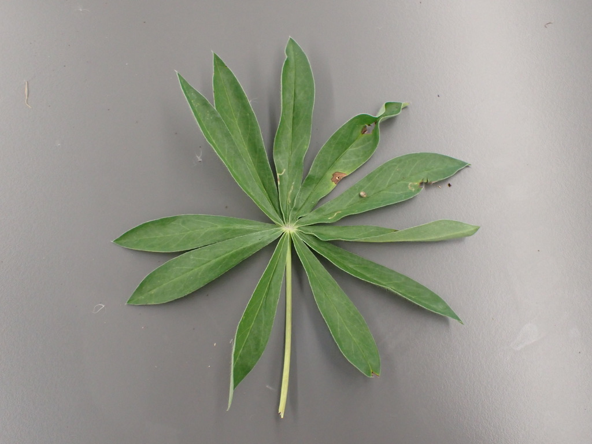

## Fabaceae - Legume or Pea family

**1.	Herbs, vines, shrubs, or trees.**
**2.	Leaves usually compound, alternate, stipulate.  Leaflets often entire margined.  Petioles and petiolules with a pulvinus.**
**3.	Flowers perfect, zygomorphic or actinomorphic.  Sepals usually  5, more or less connate.  Petals  5.  Stamens 10 or numerous, often diadelphous.  Pistil simple, ovary superior, carpel 1, placentation parietal.**
**4.	Fruit a legume or loment.**
**5.	About 600 genera, 13,000 species, cosmopolitan.**

The Fabaceae in the broad sense is composed of 3 rather distinct subfamilies.  They are often recognized as separate families.  The Mimosoideae and Faboideae are specialized monophyletic groups that evolved from Caesalpinoideae.

Mimosoideae, or, as a family, Mimosaceae   flowers actinomorphic, stamens numerous, petals free or connate below.  Acacia (acacia), Mimosa (sensitive plant).  

Caesalpinoideae, or, as a family, Caesalpinaceae   flowers zygomorphic, stamens 10, petals free.  Cercis (redbud).

Faboideae (also called Papilionoideae or Lotoideae), or, as a family, Fabaceae   flowers zygomorphic and papilionaceous, lower 2 petals fused to form a keel, the other 3 free, stamens 10, usually diadelphous.  Ornamentals include Lathyrus (sweet pea), Laburnum (golden chain tree), Wisteria, Cytisus (broom).  Important crops include Arachis (peanut), Glycine (soybean), Lens (lentils), Medicago (alfalfa), Phaseolus (beans), Pisum (peas), Trifolium (clover).

The Mimosoideae and Caesalpinoideae are primarily tropical to warm  temperate, and none are native to B. C.  The Fabaceae is probably the third largest family of flowering plants in the world, after the Asteraceae and Orchidaceae. The Fabaceae is the 5th largest in B.C., with 168 species and subspecies in the province.

&nbsp;

---

Fabaceae have several unique characteristics that make them possible to identify by sight. We'll begin with the flowers, which (in BC at least) are all 'papilionaceous' (flowers that resemble a butterfly). Papilionaceous flowers have a unique look and are made up of 3 parts: at the top there is a prominent petal called the 'banner' (aka 'standard'); below the banner are two lateral petals called 'wings'; and at the bottom (often nestled below and/or between the wings) 2 petals are fused to form the 'keel'. The keel can be pulled down to reveal the stamens and pistil hidden inside. Once you cement the 'banner, wing, and keel' visual pattern in your memory, it will rather unmistakably lead you to the Fabaceae. 

&nbsp;

Let's examine some of these flowers from *Spartium junceum* (Spanish broom), a shrubby species native to the Mediterranean with an intoxicating fragrance. It has a classic papilionaceous look with the banner, wing, and keel being quite obvious. Can you identify them in the photos below?

{width=40%} {width=40%}
{width=40%} {width=40%}

&nbsp;

Here are some more examples of papilionaceous flowers. While they all have banner, wing, and keel morphology, you can see that there is still quite a bit of variation amongst Fabaceae species. As you can see, the keel is quite often hidden from sight in between the wings.

{width=40%} {width=40%}
{width=40%} {width=40%}

&nbsp;

Sometimes, like in *Trifolium pratense* below, the flowers are quite small and require careful inspection (and probably some magnification) to see their papilionaceous nature. 

{width=80%}

&nbsp;

To get into some more nitty-gritty detail, an important character in the Fabaceae key is to differentiate between 'monodelphous' and 'diadelphous' stamens. Monodelphous stamens are fused into a tube that surrounds the style, and diadelphous stamens are the same except one lonely stamen hangs free from the staminal tube. Can you determine which is which?

{width=40%} {width=40%}

&nbsp;

---

Fabaceae species tend to have compound leaves (made up of several leaflets). They can be either pinnately compound (with leaflets arranged oppositely along the rachis) or palmately compound (leaflets emerging from a central point). Many species have three leaflets and are referred to as "trifoliate" (hence the genus *Trifolium*). Can you tell which one is which from the pictures below?

{width=40%} {width=40%}

&nbsp;

Many Fabaceae have their terminal leaflets replaced with tendrils, which help the plants climb (usually upon other plants) in competition for sunlight.

{width=40%} {width=40%}
{width=40%} {width=40%}

&nbsp;

---

The characteristic fruit type of the Fabaceae is the legume, which you got a sneak-peak of in lab 2. Do you remember the characteristics of a legume (e.g., how many carpels, the type of placentation, and type of dehiscence)? Here are examples of actual peas.

{width=40%} {width=40%}
{width=40%} {width=40%}

&nbsp;

Not all legumes look pea-like, however. For example, some take a coiled shape like in *Medicago sativa* (alfalfa) on the left or a crescent shape like in *Astragalus nutzotinensis* (a wonderful plant that can only be found in Northwestern BC / Yukon territory) on the right.

{width=40%} {width=40%}

&nbsp;

---

**-KNOWLEDGE CHECK-**

Using the above pictures, make drawings of the following:  

- Papilionaceous flower  
- Pinnately and palmately compound leaves  
- Monodelphous and diadelphous stamens  
- Legume  
- Label your drawings with the following terms: banner, wing, keel, leaf, leaflet, petiole, rachis, tendril, ovary wall, seed, placenta,

---

#### Activity 1: Taking Morphometric Measurements from Herbarium Specimens using ImageJ

ImageJ is an image processing software that was developed by the U.S. National Institutes of Health (NIH). It is used to analyze different types of images but this tutorial will cover how to measure certain morphological features from photographs of herbarium specimens. 

To use ImageJ you have to import the photographs you want to work with. 

1. Drag the file to the lower grey bar. As you are doing this the words <<drag and drop>> should appear. Once the image has been dropped it will open and now it is ready to analyze in ImageJ. 

There are many measurements that can be taken with ImageJ. It might be helpful to click through the different buttons at the top of the bar to explore all of the different ways ImageJ can make measurements. This tutorial will use the line button for all of the measurements. 

2. Zoom in on the ruler (Mac: Command shift =, Windows: CTRL + ). Most digitized herbarium specimens will have a ruler in the photograph. This is to help standardized it and is useful for measuring features in ImageJ. 

3. Use the line button (5th button from the left) and draw a line by clicking and dragging along the bottom of the ruler so that the line goes from the 0 tick to the 5 cm tick. This needs to be very accurate because we are going to use this length to calibrate the rest of the measurements taken in ImageJ. 

4.  Go to the top bar and hit “analyze”. Then go to “set scale…”. Enter 5 into the Known distance box and enter cm into the Unit of Length box. Hit the box “Global”. By checking “Global” you are ensuring that this is applied to all photos in the current session of ImageJ. Then hit OK. ImageJ is now calibrated using the ruler from your herbarium photo.  

Now you can go on to take measurements. 

5. Use the line or the segmented line (you can change between them by right clicking on the line button) draw lines across what you want to measure. Once you have the right length hit (Mac: Command M, Windows: CTRL M) and ImageJ will measure and record the length in a convenient table for you. This table should pop up once you take your first measurement. When you have all of the measurements you need you can either download that table that ImageJ made or just copy and input the data in your own table. You will have to eventually input your data in a group spreadsheet (on Canvas) so keep that in mind as you are recording data.  

6. Once you have taken and recorded all of the measurements necessary put your findings into the class spreadsheet (Canvas) so that other people will be able to access, download, and use your data for the next step.  

Note: [Here is a link](https://imagej.nih.gov/ij/docs/guide/user-guide.pdf) to the ImageJ user guide. All the information you will need is in this document, but if you are interested in the program and the other features available, the user guide can provide more information. 

