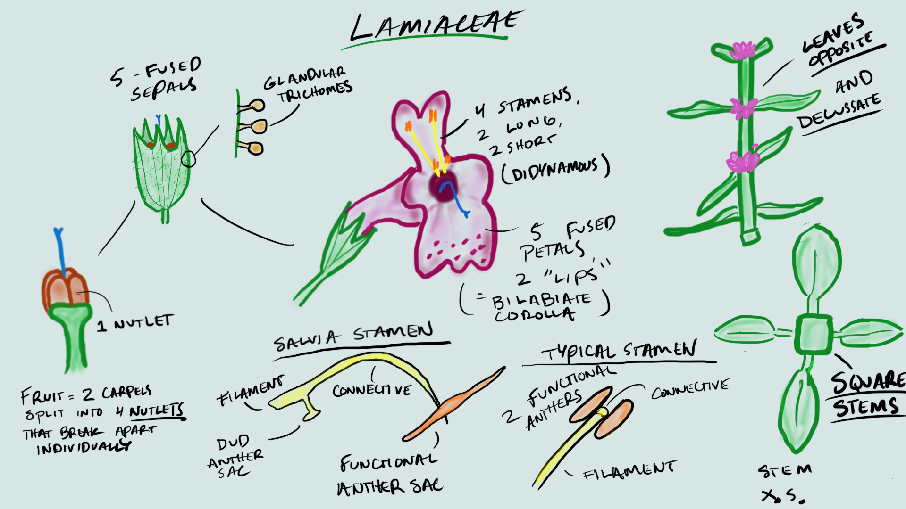
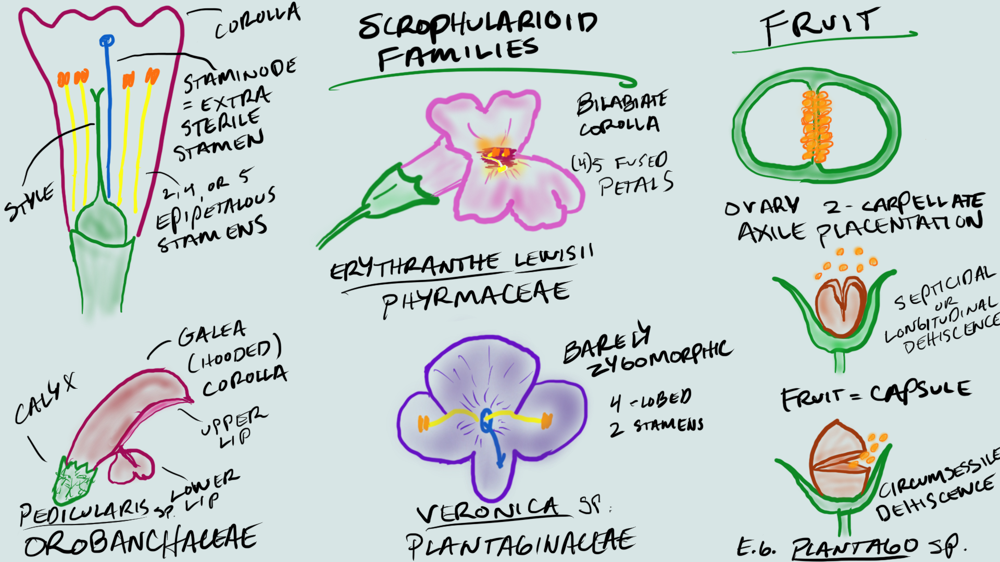

<!-- use this code to build the github site: -->
<!-- rmarkdown::render_site() -->

&nbsp;
&nbsp;

---

## Lamiaceae (Mint family)

---

**1.  Herbs with square stems, usually aromatic.**  
**2.  Leaves simple, opposite or whorled, without stipules.**  
**3.  Flowers perfect, zygomorphic.  Sepals 5, fused.  Petals 5, fused, bilabiate.  Stamens 2 or 4, epipetalous, often didynamous.  Pistil compound, ovary superior, carpels 2, but deeply lobed, appearing as 4, placentation basal.**  
**4.  Fruit 4 nutlets.**  
**5.  About 200 genera, 3200 species, cosmopolitan**  

&nbsp;
   
Most Lamiaceae contain fragrant oils, and many are used as herbs or flavorings, including *Mentha* (mint), Salvia (sage), *Rosmarinus* (rosemary), *Thymus* (thyme), *Marrubium* (horehound), *Nepeta* (catnip), *Satureja* (savoury), *Origanum* (oregano), *Majorana* (sweet marjoram), *Ocimum* (sweet basil).

&nbsp;



&nbsp;

**Insert photos**

&nbsp;

---

**-KNOWLEDGE CHECK-** 
- Draw the above flowers, and label with the following structures: stamens, style, stigma, calyx, corolla, anther, dud anther, connective, nutlets.

- What word describes the shape of the corollas in this family?

- The calyx is synsepalous.  How many lobes are there? 

- The corolla is sympetalous.  How many lobes are there?

- How many stigma lobes are there? 

---

&nbsp;

## Scrophularioid families

---


**1.  Mostly herbs**  
**2.  Leaves simple, alternate, or opposite, without stipules.**  
**3.  Flowers perfect, zygomorphic.  Sepals 5, free or fused.  Petals 5, fused, often bilabiate.  Stamens 2, 4, or 5, epipetalous, often didynamous, staminode often present.  Pistil compound, ovary superior, carpels 2, placentation axile.**  
**4.  Fruit a capsule.**  
**5.  About 210 genera and 3000 species, cosmopolitan.**  

&nbsp;

The traditionally large and heterogeneous family Scrophulariaceae *sensu latissimo* has recently been divided into a number of separate families on the basis of molecular phylogenetic studies. *Paulownia*, always of uncertain placement but often included in the Scrophulariaceae s.l., now is placed in a separate family. For further details see:

Olmsted, R. M., dePamphilis,  C. W., Wolfe, A. D., Young, N. D., Elisens, W. J., & Reeves, P. A. 2001. Disintegration of the Scrophulariaceae. American J. Bot. 88: 348-361.

PLANTAGINACEAE Jussieu, nom. cons.  (Snapdragon family)
Ca 90 genera, 1700 species.
Examples: *Veronica* (ca 450, inc. *Hebe*, *Parahebe*,  *Synthyris*, etc.), *Penstemon* (275), *Plantago* (275), *Litorella*, *Linaria* (150), *Bacopa* (55), *Antirrhinum* - snapdragon, *Sibthorpia*, *Collinsia*, *Digitalis*, *Hippuris* - marestail, *Callitriche* - water starwort. 

PHRYMACEAE Schauer, nom. cons. (Monkeyflower family)
Ca 19 genera, 234 species
Examples: *Erythranthe* (formerly *Mimulus*) (150-170) - monkeyflower, *Mazus* (30), *Phryma*, *Rehmannia*

SCROPHULARIACEAE Jussieu, nom. cons. (Figwort family)
65 genera, 1700 species.
Examples: *Verbascum* (360) - mulleins, *Eremophila* (210), *Scrophularia* (200) - figworts, *Selago* (190), *Buddleja* (125), *Jamesbrittenia* (85), *Manulea* (75), *Diascia* (70), *Nemesia* (65)

OROBANCHACEAE Ventenat, nom. cons. (Lousewort family)
99 genera, 2061 species. Parasites or hemiparasites.
Examples: *Pedicularis* (600-800), *Castilleja* (200), *Euphrasia* (170-350), *Orobanche* (150),  *Buchnera* (100), *Bartsia* (50), *Agalinis* (45), *Rhinanthus* (45).

PAULOWNIACEAE Nakai 
1 genus, 6 species. 
Example: *Paulownia* (foxglove tree).

&nbsp;



&nbsp;

**Insert photos**

&nbsp;

---

**-KNOWLEDGE CHECK-** Draw the above flowers, and label with the following structures: spur, style, stigma, stamen, ovary, corolla, calyx

- Draw the dissected fruit. How many carpels are there, and what type of placentation does it have?

- Draw the *Plantago* capsule. How does the capsule dehisce?

---

&nbsp;

## R activity 1: Intro to R, Rstudio, Data Wrangling, and Plotting

&nbsp;

#### Motivation {#motivation}

The use of statistics and the analysis/management of data is becoming increasingly common in many fields, and this is particularly true in the biological sciences. It may not seem obvious at first, but even taxonomists use data these days, whether it be for mapping occurrence records of their species of interest, or using morphometrics to empirically investigate the morphological differences between taxa. In the past, biologists used a combination of spreadsheets (e.g., MS Excel) and statistical software such as JMP or SPSS to conduct their statistical analyses. In recent years, many fields have transitioned to using the R programming language for their statistical needs. 

R provides many advantages to traditional programs: R is open-source (free to use, all code is shared freely for users to modify how they wish), flexible, and powerful. Its open-source nature has led to the creation of thousands of custom packages, providing unprecedented access to advanced statistical analyses for anyone willing to learn. For example, you can now use R to crunch sophisticated genomic data and make highly detailed geographic maps (which you'll be getting a taste of later!), both of which required proprietary software (e.g., CLC workbench and ArcGIS) that cost thousands of dollars to use. 

R's main disadvantage is that it has a steep learning curve. Because R is a programming language, you do most of the heavy lifting by writing code instead of clicking around like with a traditional program with a GUI (graphical user interface). This is quite scary for a lot of folks, your intrepid teaching team included! If you told Mikko, Mannfred, or I at the beginning of our R journeys that we'd be actually *teaching* R in the future, we would have taken a break from our frustrated crying to laugh in your face! Like with anything challenging and worthwhile in life, the only way to make progress is to push past your fear and start grinding ;-).

One more note re: fear before we jump in...*this is not a programming class*. Our main goal is to provide some valuable exposure to what can be done with R, and for you to learn and become more comfortable with programming if/when you end up using these tools in the future. We'll provide the resources needed to learn the basics, and there will be plenty of lab time to work together so that we're all tackling the learning curve together. Aside from some participation marks (and maybe a few canvas quiz questions), we will not be evaluating you based on your ability to write your own fully functioning R script. Instead, you will be assessed based on your ability to understand taxonomic concepts and interpret data. And the payoff is worth it! Knowing R can help you land summer research jobs (put it on your CV!), and is increasingly used for teaching in UBC BIOL classes (e.g. BIOL300, BIOL406, BIOL413, BIOL416). 

<!-- MOVE THIS TO LAB 3 -->
<!-- As taxonomists it is useful to know where species occur and co-occur on continental scales to help inform species delimitations. For example, two sister species separated by a major geographic barrier (such as a mountain range) are not likely to interbreed. This type of information is one piece of the puzzle of delimiting species. To make preliminary estimates of a species' distribution, we can harness the data resources organized by the [Global Biodiversity Information Facility](https://www.gbif.org/what-is-gbif). GBIF is an open-access database housing information about where and when species have been observed or collected. To the modern plant taxonomist, it is indispensable: one can search GBIF for any plant taxon of interest, and immediately have access to all global records of where and when their plant has been observed.  -->

<!-- To scratch the surface of GBIF reveals a massive database spanning the entire tree of life. How does one go about efficiently collecting, organizing, validating, and analysing so much information? The solution is made tractable by employing data analysis tools like those found in R (Note: For an introduction to R, see this week's [pre-lab reading in the section below](#prelab)).  By combining the biodiversity resources of GBIF with the analytical tools in R, we can collect, process, and visualize species distribution data on any laptop or tablet. In this week's lab we'll first gather the required tools (R and GBIF) and develop some basic skills using them. In the following lab we'll use our new skills to create research-grade distribution maps.  -->

--- 

<br>
<br>

#### Pre-lab {#prelab}

Before starting this week's lab you will have: &nbsp;

<!-- 1. completed pre-lab [Activity 1: Exploring the GBIF website](#A1) &nbsp; -->

1. completed the pre-lab reading: [Introduction for Students](https://moderndive.com/preface.html#introduction-for-students) and [Chapters 1.1&ndash;1.3](https://moderndive.com/1-getting-started.html) from ModernDive&mdash;a textbook for learning data science using R. We will work through Chapters 1&ndash;4 of this textbook over the semester, and we encourage you to read ahead (through Ch.4) on your own time! &nbsp;

2. R and RStudio downloaded onto your computer. [Chapter 1.1 in ModernDive](https://moderndive.netlify.app/1-getting-started.html) provides instructions for downloading R and RStudio. If you have trouble with installation, contact the TAs as soon as possible for assistance, &nbsp;

3. [OPTIONAL] created an RStudio Cloud account. Although ModernDive provides an excellent introduction to R, RStudio Cloud has some [useful interactive primers](https://rstudio.cloud/learn/primers/) that make sense of the R language by getting you to write some simple code. **This pre-lab activity is not required**, but recommended for anyone that is completely new to R, or wants some hands-on experience with R right away. 

--- 

&nbsp;
&nbsp;

#### Outcomes {#outcomes}

By the end of this lab you will: &nbsp;

<!-- 1. be familiar with GBIF and the types of data that can be obtained, &nbsp; -->

1. Know the difference between R and RStudio, &nbsp;

2. Be familiar with the layout of RStudio, and understand how to install packages and navigate the `iris` dataset.

3. Have a basic understanding of how to use functions (both in Base R and with useful packages) to manipulate and plot data.


--- 

&nbsp;
&nbsp;

<!-- #### Activity 1 (Pre-lab): Exploring the GBIF website {#A1} -->

<!-- **Probably move this activity to a lab in Unit 1... -Evan** -->

<!-- Let's jump into GBIF! First go to the [GBIF website](https://www.gbif.org). In another tab/window follow along with [this video tutorial](https://www.youtube.com/watch?v=40yPnJdeM_A&t=3s) to learn how to navigate through the GBIF website (NOTE: creating an account and downloading the data onto your computer, as suggested in the video, is **NOT necessary**). -->

<!-- By following the video tutorial, you'll learn how to search for GBIF data, what types of data your search will return, and how that data is structured. Notice that GBIF is a biodiversity database aggregator, pulling data from other databases such as eBird and iNaturalist. That means that you can choose to share your BIOL324 iNaturalist observations so that they appear on GBIF!  -->

<!-- **CANVAS QUIZ QUESTION** -->

#### Activity 1: An Introduction to R {#A2}


**MB: I'm imagining doing this live on Zoom**

<!-- Now that we have a sense of what kinds of data we could get from GBIF (namely, observation records of a species), we need a tool that will allow us to organize, filter, and visualize this data. While there are many options for handling biodiversity data, in BIOL324 we will focus on using R. The layout and style of R can be daunting if this is your first time using it. Don't worry! In this course, we don't expect you to know how to use R&mdash; -->

From reading [Chapter 1.1 of ModernDive](https://moderndive.netlify.app/1-getting-started.html), you will know that R is a programming language, while RStudio is simply a user interface that 'wraps around' R. RStudio is not _needed_ to use R, but it is convienient! While RStudio is an app that you download to locally to you computer, RStudio Cloud is web-based, meaning that you can use RStudio within your web browser, without downloading anything. If you created an RStudio Cloud account to complete the primers (see: [pre-lab activities](#prelab)) then you can use your account to use RStudio online (**not required for this class**). 

<!-- During this activity, we'll work through [Chapter 1.4](https://moderndive.com/1-getting-started.html) to explore a dataset in R. Along the way, we'll learn some basic R skills like creating an object, determining classes, using functions, and dissecting datasets. All of these skills will come in handy as we move towards using R and GBIF together to solve taxonomic problems.  -->

<!-- To follow along, open RStudio cloud and attach the required packages (see: [Chapter 1.4](https://moderndive.com/1-getting-started.html)). The TA will step through this activity while you follow along. If something isn't working for you, please let us know in the chat! It is **very likley that someone is having or will have the same problem as you!**.  -->

During this activity, we'll be exploring the 'iris' dataset in R. Along the way, we'll learn some basic R skills, like loading packages, creating objects, filtering data, and making some basic plots. ALl of these skills will come in handy as we move towards using R to solve taxonomic problems.

Open RStudio, and follow the instructions on this webpage. First, open a new R script file (File - New File - R script), save it into your working directory, and write all of the code from this exercise in your new script file. This will allow you to keep a record of your code, re-run your code later, and share code with others. Type (or copy) the following code into your script file, and run it (highlight and hit command / control + enter, or click the "Run" button at the top of the script pane).

--- 

&nbsp;
&nbsp;

#### Installing and loading packages and data

&nbsp;
&nbsp;

```{r, eval=FALSE}
library(datasets) #this loads the 'datasets' package, which contains a bunch of datasets to explore
iris #typing the name of the dataset will display the contents of the data in the console pane
class(iris) #this will display the 'class' of the object 'iris'
summary(iris) #this will give various summary statistics on the dataframe 'iris'
```

The code `class(iris)` showed us that 'iris' is a data frame, and `summary(iris)` showed us that there are five columns in the data frame: Sepal.Length, Sepal.Width, Petal.Length, Petal.Width, and Species. Note that there are periods instead of spaces in the column names...R has trouble reading spaces, so it's good practice to use periods or underscores when naming things in R. 

Now, let's install a couple useful packages:

```{r, eval=FALSE}
install.packages("dplyr", "ggplot2") # you can install multiple packages by separating each with a comma. 
```

You only need to install packages once. Then, you need to load the packages you want to use:

```{r, message=FALSE}
library(dplyr)
library(ggplot2)
```

---

&nbsp;
&nbsp;

#### Data Wrangling

&nbsp;
&nbsp;


'dplyr' is very useful for data "wrangling" (filtering, summarizing, re-organizing, etc), and 'ggplot2' is a very popular tool for making beautiful and customizeable plots. Let's see a bit of what 'dplyr' can do for us...

```{r}
iris.virginica <- filter(iris, Species == "virginica") # takes only the rows for which 'Species' is 'virginica' and puts them in a new data frame called 'iris.virginica'
head(iris.virginica) # head() shows the first 6 lines of the data frame
```

Notice that we use the logical double equal sign as in `species == "virginica"`, and quotations around `virginica` since this value is of a char (character) data type. The equivalent 'base R' command (built into R and not requiring additional packages) for `filter()` would be `subset()`, with all the inner arguments being exactly the same. This highlights how you can use multiple approaches to do things in R (and when programming in general)...

&nbsp;

We can also filter using multiple conditions:

```{r}
iris.virginica.sepal6 <- filter(iris, Species == "virginica", Sepal.Length > 6) #keeps virginica species that have sepals longer than 6
head(iris.virginica.sepal6)
```

&nbsp;

We can use 'dplyr' to select only certain columns from a data frame:

```{r}
iris.selected <- select(iris, Sepal.Length, Sepal.Width, Petal.Length) #list the columns you want to select
iris.selected2 <- select(iris, Sepal.Length:Petal.Length) # select all columns from sepal.length to petal.length using colon symbol
head(iris.selected)
head(iris.selected2)
```

(See how `iris.selected` and `iris.selected2` have the same contents...)

Above we used the ':' symbol to select a series of values. You can use the same concept to select columns/rows in a dataframe:

```{r, eval=FALSE}
iris[1:3,]
iris[,1:3]
iris[1:3,1:3]
```

What do these different bits of code do? Why does each one give different results?

&nbsp;

---

**-KNOWLEDGE CHECK-** Write a bit of code that takes the first 3 columns and the first 5 rows of the 'iris' data frame, and store it in a new object (name it something silly).

<!-- DrabaIsTheBestGenus <- iris[1:5,1:3] -->

---

&nbsp;

We'll look at one last 'dplyr' function, `summarise()`, which is extremely useful for data exploration.

```{r}
iris.sums <- summarise(iris, mean.Sep.length = mean(Sepal.Length), mean.Pet.length = mean(Petal.Length)) #calculate mean of Sepal.Length and Petal.Length, name the columns for our new means, and store in the object 'iris.sums'
iris.sums 
```

This took the average of every value in the Sepal.Length and Petal.Length column, but what if we want the average of these values for each species instead of averaging across all of them? With 'dplyr', we can use a slightly more advanced technique called 'pipes' `%>%`:

```{r, message=FALSE}
iris.sums.species <- iris %>% 
  group_by(Species) %>% 
  summarise(mean.Sep.length = mean(Sepal.Length), mean.Pet.length = mean(Petal.Length)) 

iris.sums.species
```

In the above code, we used 'pipes' `%>%` to connect our three lines of code kind of like a flow chart. In the first line `iris.sums.species <- iris %>%`, we say we're going to be using the 'iris' data frame and storing our results in the object 'iris.sums.species', and the `%>%` at the end 'pipes' us into our next line. `group_by(Species) %>%` says we will be grouping the following results based on species (you could specify other groupings here as well). Finally, the last line uses the same `summarise()` function as above to calculate the means. Pretty cool, eh? This is just scratching the surface of what 'dplyr' can do to help you wrangle your data and start to make sense of it...

---

&nbsp;
&nbsp;

#### Plotting data

&nbsp;
&nbsp;

Now, let's mess around with some of the plotting functions in R to help us visualize the 'iris' dataset. Let's start with the base R function `plot`:

```{r}
plot(iris)
```

As you can see, this very simple function made a pretty complicated scatterplot displaying the relationship between every variable in the dataset. If we want to look at the relationship between two specific variables, we go like this:

```{r}
plot(x=iris$Sepal.Length, y=iris$Petal.Length)
```

Still using the `plot()` function, we specify what variables will be on the X and Y axes using `x=` and `y=`. We also specified the variables we want to use in the 'iris' dataset using the `$` symbol.

How would you interpret this plot? Does it look like there is a relationship between sepal length and petal length in *Iris* species?

&nbsp;

---

**-KNOWLEDGE CHECK-** modify the above code to plot the relationship between sepal width and petal width. To spruce it up a little bit, try adding `col=iris$Species` to your code...

<!-- plot(x=iris$Sepal.Width, y=iris$Petal.Width, col=iris$Species) -->

---

&nbsp;

We can also use the base R function `hist()` to make a simple histogram:

```{r}
hist(iris$Sepal.Length)
```

From this plot, we can see that the majority of sepals are between 4.5-7 in length...

&nbsp;

Remember box and whisker plots from your statistics classes? It just takes a single line of code to make a boxplot of sepal length for each species:

```{r}
boxplot(Sepal.Length~Species,data=iris) 
```

&nbsp;

---

**-KNOWLEDGE CHECK-** Given the relationship between sepal length and petal length, what might we guess about the petal length of *I. virginica*? Modify the above code to make box plots of petal length instead, and see if you were right...

---

&nbsp;


Earlier in this exercise, we had you install the 'ggplot2' package. Many people find that ggplot2 is more intuitive and customizeable than base R for making plots. Let's recreate the scatterplot of sepal length and petal length that we made above, but with ggplot instead:

```{r}
ggplot(data=iris, aes(x = Sepal.Length, y = Petal.Length))+
  geom_point()
```

In the first line above, we set the data frame and 'aesthetics' (what variables are on what axis) in the `ggplot()` function. Running that code alone won't produce a plot, because we haven't specified the 'geom' (type of plot) we want to display. We add a `+` to the end of the first line, and specify `geom_point()` on the next line. Using this basic framework, we can add in more code bits and really start sprucing up our ggplot:

```{r}
ggplot(data=iris, aes(x = Sepal.Length, y = Petal.Length))+
  geom_point(aes(color=Species, shape=Species)) 
#we add some aes() to our points to change the colour and shape of our points depending on what species it is...
```

Isn't that amazing??? With just two lines of code, we've created a beautiful plot, complete with data points labeled by shape and colour, and it adds a legend automatically! Let's fiddle around a bit more:

```{r}
iris.ggplot1 <- ggplot(data=iris, aes(x = Sepal.Length, y = Petal.Length))+
  geom_point(aes(color=Species, shape=Species))+
  ggtitle("Relationship between sepal length and petal length by Iris species")
```

Just like a data frame, you can store a ggplot in an object `iris.ggplot1 <- ggplot(...)`. We also added the element `ggtitle()` to our ggplot by adding a `+` to the end of the previous line. You can keep adding more and more stuff to your ggplot, just make sure you put a `+` at the end of each line.

&nbsp;

---

**-KNOWLEDGE CHECK-** Make your own ggplot from the 'iris' dataset. Make sure to plot different variables than the example above, give it a new title, and add axis labels using `xlab()` and `ylab()` (don't forget to add a '+' before adding a new line to your ggplot).

How would you interpet the plot you made? Think about what the data tell you about the relationship between different floral characters, and how they differ between *Iris* species.

---

&nbsp;

### To submit within 48 hours of lab time (Lab participation marks)

**All -KNOWLEDGE CHECKS-**  
1. Labelled drawings of Lamiaceae  
2. Labelled drawings of Scrophularioids  
3. R script with code from today's lab   
- Clearly label -KNOWLEDGE CHECK- sections with comments in your code.  

&nbsp;

---

### Homework

1. Complete your Canvas quiz
2. Review GBIF
3. Lab 7 pre-lab readings

---

&nbsp;


**CANVAS QUIZ QUESTIONS**   
- What are the different windows (console, script, environment, plot) and what do they do?  
- what is an object?  
- what is a function?   
- Get them to interpret a few plots of the 'iris' dataset  
- Label Lamiacious and Scrophulariacious flowers  

--- 

&nbsp;
&nbsp;
