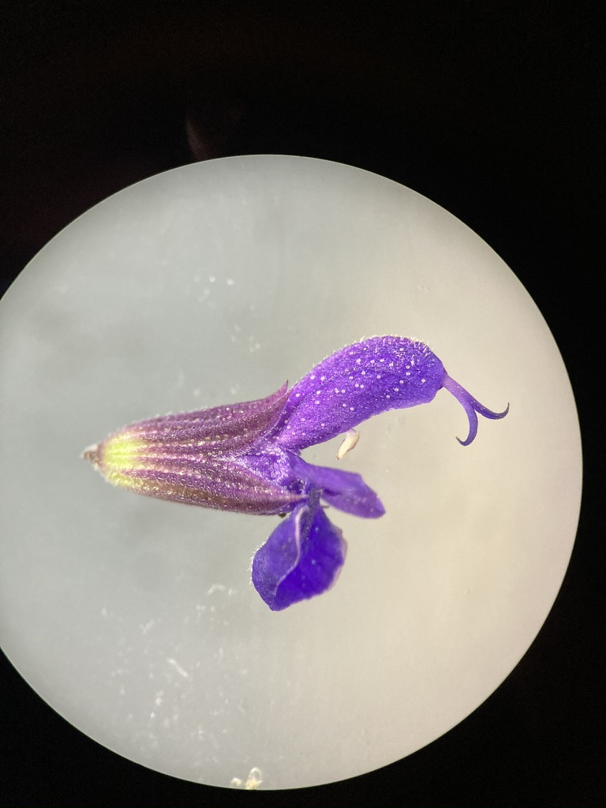

<!-- use this code to build the github site: -->
<!-- rmarkdown::render_site() -->

&nbsp;
&nbsp;

---

# Lamiaceae (Mint family)

---

**1.  Herbs with square stems, usually aromatic.**  
**2.  Leaves simple, opposite or whorled, without stipules.**  
**3.  Flowers perfect, zygomorphic.  Sepals 5, fused.  Petals 5, fused, bilabiate.  Stamens 2 or 4, epipetalous, often didynamous.  Pistil compound, ovary superior, carpels 2, but deeply lobed, appearing as 4, placentation basal.**  
**4.  Fruit 4 nutlets.**  
**5.  About 200 genera, 3200 species, cosmopolitan**  

&nbsp;
   
Most Lamiaceae contain fragrant oils, and many are used as herbs or flavorings, including *Mentha* (mint), Salvia (sage), *Rosmarinus* (rosemary), *Thymus* (thyme), *Marrubium* (horehound), *Nepeta* (catnip), *Satureja* (savoury), *Origanum* (oregano), *Majorana* (sweet marjoram), *Ocimum* (sweet basil).

&nbsp;

---

## Diagrams


</br>


</br>


&nbsp;

---

## Leaves


Members of the Lamiaceae have distinctive vegetative characteristics: square stems and decussate leaves. You can see the square stems quite well in the below pictures of *Stachys chamissonis*. The picture on the right shows a cross-section of the stem.

<p align="center">
{width=40%} {width=40%}
</p>

&nbsp;

The leaves are most often "decussate" in this family (leaves opposite at each node, with each pair of leaves rotated 90&deg; with respect to those above and below). Given this "phyllotaxy", how would these plants look from above?

<p align="center">
{width=40%} {width=40%}
</p>

&nbsp;

Flowers are zygomorphic and bilabiate, with fused sepals and petals. The flowers are quite often arranged in "verticils" (whorls of flowers in cyclical arrangement attached to a central point). Note the flower structure and verticils below in *S. chamissonis* (left) and *Salvia nemorosa* (right). Would you describe these flowers as sessile or pedicellate?

<p align="center">
{width=40%} {width=40%}
</p>

&nbsp;

---

## Flowers

Many flowers in Lamiaceae and the Scrophularioid families have "galea", where the upper lip of the corolla is shaped like a hood or helmet. The galea is quite strong in the *Salvia* (right). Do you remember another family we've seen galea in?

<p align="center">
{width=40%} {width=40%}
</p>

&nbsp;

Lamiaceae flowers can have 2 or 4 stamens, and when there are 4 they are often didynamous (2 long and 2 short). Members of the genus *Salvia* have very interesting stamens. They've got an expanded connective (tissue between the two anther sacs), separating them to a high and low point that forms a lever-like mechanism. The lower anther sac is infertile (a "dud" anther-sac), and when the pollinator presses on it it brings the upper functional anther sac down onto its body. You can see pictures of the *Salvia* flower and specialized stamens below.

<p align="center">
{width=40%} {width=40%}
</p>

</br>

As mentioned above, many members of Lamiaceae are aromatic and used as culinary herbs (e.g., rosemary, thyme, mint, sage, etc). These delicious flavours and dank smells come from fragrant oils, which are often stored in glandular trichomes. In the close-up of the *Stachys* calyx below, can you differentiate between glandular and eglandular trichomes?

<p align="center">
{width=60%}
</p>

&nbsp;

---

## Fruit

Lamiaceae flowers have superior ovaries, with compound pistils and 2 carpels. While the ovary only has two carpels, each carpel is deeply lobed and breaks in two, eventually developing into 4 "nutlets" that break off individually. What hints that these flowers have 2 carpels instead of 4?

Quite often you will just see a bunch of persistent calyxes, with the nutlets hidden inside. Here you can see a developing fruit:

<p align="center">
{width=40%} {width=40%}
</p>

</br>

Here you can a fully developed fruit:

<p align="center">
{width=40%} {width=40%}
</p>

&nbsp; 

---

## -KNOWLEDGE CHECK 6.1-

Using the above pictures (and your imagination!), make some drawings of a Lamiaceae plant and include the following:    

- Square stems and decussate leaves
- Flowers in verticils 
- Flower with a fused calyx and bilabiate corolla
- A developed fruit (make sure to label the type)
- Make sure to include the following terms: Calyx, corolla, stamens, style, stigma lobes, ovary, fruit, verticils, stems, node, leaves.

</br>

---

# Scrophularioid families

---


**1.  Mostly herbs**  
**2.  Leaves simple, alternate, or opposite, without stipules.**  
**3.  Flowers perfect, zygomorphic.  Sepals 5, free or fused.  Petals 5, fused, often bilabiate.  Stamens 2, 4, or 5, epipetalous, often didynamous, staminode often present.  Pistil compound, ovary superior, carpels 2, placentation axile.**  
**4.  Fruit a capsule.**  
**5.  About 210 genera and 3000 species, cosmopolitan.**  

&nbsp;

The traditionally large and heterogeneous family Scrophulariaceae *sensu latissimo* has recently been divided into a number of separate families on the basis of molecular phylogenetic studies. *Paulownia*, always of uncertain placement but often included in the Scrophulariaceae s.l., now is placed in a separate family. For further details see:

Olmsted, R. M., dePamphilis,  C. W., Wolfe, A. D., Young, N. D., Elisens, W. J., & Reeves, P. A. 2001. Disintegration of the Scrophulariaceae. American J. Bot. 88: 348-361.

PLANTAGINACEAE Jussieu, nom. cons.  (Snapdragon family)
Ca 90 genera, 1700 species.
Examples: *Veronica* (ca 450, inc. *Hebe*, *Parahebe*,  *Synthyris*, etc.), *Penstemon* (275), *Plantago* (275), *Litorella*, *Linaria* (150), *Bacopa* (55), *Antirrhinum* - snapdragon, *Sibthorpia*, *Collinsia*, *Digitalis*, *Hippuris* - marestail, *Callitriche* - water starwort. 

PHRYMACEAE Schauer, nom. cons. (Monkeyflower family)
Ca 19 genera, 234 species
Examples: *Erythranthe* (formerly *Mimulus*) (150-170) - monkeyflower, *Mazus* (30), *Phryma*, *Rehmannia*

SCROPHULARIACEAE Jussieu, nom. cons. (Figwort family)
65 genera, 1700 species.
Examples: *Verbascum* (360) - mulleins, *Eremophila* (210), *Scrophularia* (200) - figworts, *Selago* (190), *Buddleja* (125), *Jamesbrittenia* (85), *Manulea* (75), *Diascia* (70), *Nemesia* (65)

OROBANCHACEAE Ventenat, nom. cons. (Lousewort family)
99 genera, 2061 species. Parasites or hemiparasites.
Examples: *Pedicularis* (600-800), *Castilleja* (200), *Euphrasia* (170-350), *Orobanche* (150),  *Buchnera* (100), *Bartsia* (50), *Agalinis* (45), *Rhinanthus* (45).

PAULOWNIACEAE Nakai 
1 genus, 6 species. 
Example: *Paulownia* (foxglove tree).

&nbsp;

---

## Diagrams


&nbsp;


---

## Flowers

Most members of the Scrophularioid families have fused, tubulur, and bilabiate corollas. Some of these can be quite showy, as pictured below in *Penstemon davidsonii* (left) and *Erythranthe lewisii* (right); both of these plants can be found along subalpine streambanks in the Pacific Northwest.

<p align="center">
{width=40%} {width=40%}
</p>

&nbsp;

A more common and widespread example is foxglove (*Digitalis purpurea*). Like other members of the Scrophularioids, it has 5 sepals and 5 fused petals. Can you see any indication of petal lobes in the picture below?

<p align="center">
{width=40%} {width=40%}
</p>

&nbsp;

The stamens are "epipetalous", meaning that the filaments are fused to the petals instead of emerging separately from the receptacle. See the dissected foxglove flower below:

<p align="center">
{width=60%}
</p>


&nbsp;

These families exhibit a wide diversity of floral forms, which makes it a difficult group to identify by sight. For example, *Antirrhinum* (snapdragons - left) and *Linaria* (toadflax - right) both have petal spurs. Can you identify the spurs? What other family have we seen spurs in?


<p align="center">
{width=40%} {width=40%}
</p>

&nbsp;

Some genera, like the beautiful and dainty *Veronica* (left) and *Euphrasia* (right), have small and almost radially symmetric flowers. Why would these still be considered zygomorphic?

<p align="center">
{width=40%} {width=40%}
</p>

&nbsp;

The family Orobanchaceae (also originally housed within Scrophulariaceae) has many plants with wild floral structures, like *Castilleja* (paintbrushes - left) and *Pedicularis* (louseworts - right). Most of these plants are parasitic on the roots of other plants, with some (the holoparasites) completely lacking clorophyll. In paintbrushes, most of the vibrantly coloured (in this case red) bits are actually bracts (modified leaves)- can you see which bits might be parts of the perianth? In the Elephant's head lousewort (*Pedicularis groenlandica*) displayed on the right, the upper corolla lip is strongly galeate and beaked, resembling the head and trunk of an elephant.

<p align="center">
{width=40%} {width=40%}
</p>

&nbsp;

*Plantago* (one of the only three genera originally in Plantaginaceae) also has weird flowers that are highly reduced and a lot less showy than other Scrophularioids. *Plantago lanceolata*, a widespread weed pictured below, has a spike (inflorescence) of densely clustered flowers that are quite drab and greenish-brownish. What are the whitish-yellow things poking out of the inflorescence? 

<p align="center">
{width=60%}
</p>

&nbsp;

Like with all things that seem boring at first, things get a lot more interesting when you use some magnification! Here you can see all those tiny flowers densely clustered together.

<p align="center">
{width=60%}
</p>

&nbsp;

---

## Fruit

Carefully removing a *Plantago* flower shows a developing capsule that dehisces like an Easter egg or Matroyshka doll, revealing the seeds inside. What type of dehiscence is this? Using the photo on the left, can you identify the sepals and petals?.

<p align="center">
{width=40%} {width=40%}
</p>

These families have superior ovaries (2 carpels) that develop into capsules. Below, you can see foxglove capsules at various stages of development (left). Once the fruit is fully developed, the capsule dehisces and releases the seeds (right). What type of dehiscence is displayed here?

<p align="center">
{width=40%} {width=40%}
</p>

</br>


---

## -KNOWLEDGE CHECK 6.2- 

Using the pictures above, draw a foxglove flower and make sure to include the following:  

- Fused, bilabiate corolla  
- Epipetalous stamens  
- Mature capsule (note the type of dehiscence)
- Include the following terms: corolla, calyx, anther, filament, capsule, seeds
- Write down some of the characters that are consistent across most of the Scrophularioids we've shown you. Are there any examples that don't follow these patterns? How do they differ? Compare and contrast Lamiaceae and Scrophularioid families.

&nbsp;

---

# R activity 1: Intro to R, Rstudio, Data Wrangling, and Plotting

&nbsp;

## Motivation {#motivation}

Data management and analysis is increasingly important in the sciences, and this is particularly true for biology. Data science has transformed plant taxonomy, whether it be for mapping species occurrence records, or using morphometrics to quantify variation in shape among taxa. In previous years, biologists used a combination of spreadsheets (e.g., MS Excel) and statistical software such as JMP or SPSS to conduct their statistical analyses. More recently, many fields have transitioned to using the R programming language for data analysis.

R provides many advantages to traditional programs: R is open-source (free to use, all code is shared freely for users to modify how they wish), reproducible, and powerful. Its open-source nature has led to the creation of thousands of custom packages, providing unprecedented access to advanced statistical analyses for anyone willing to learn. For example, you can now use R to crunch sophisticated genomic data or make highly detailed geographic maps, both of which used to require proprietary software (e.g., CLC workbench, ArcGIS) that cost thousands of dollars to use. Because every analysis done in R is written step-by-step by the user (you!), R 'scripts' can be saved, shared, and re-run at any time by anybody. This aspect of R separates it from traditional software platforms because data analysis has become reproducible; this is good for science. 

R's main disadvantage is that it has a steep learning curve. Because R is a programming language, you do most of the heavy lifting by writing code instead of clicking around as with a traditional program. This is quite scary for a lot of folks, your intrepid teaching team included! If you told us at the beginning of our R journeys that we'd be actually *teaching* R in the future, we would have taken a break from our frustrated crying to laugh in your face! Like with anything challenging and worthwhile in life, the only way to make progress is to push past your fear and start grinding ;-).

One more note before we jump in: *this is not a programming class*. Our main goal is to provide some  exposure to R, and for you to learn and become more comfortable with programming if/when you end up using these tools in the future. We'll provide the resources needed to learn the basics, and there will be plenty of lab time to work together and tackle the learning curve. Aside from some participation marks (and a few Canvas quiz questions), *we will not be evaluating you based on your ability to write R code*. Instead, you will be assessed based on your ability to understand and interpret taxonomic concepts and data. And the payoff is worth it: Knowing R can help you land summer research jobs (put it on your CV!), and is increasingly used for teaching in UBC BIOL classes (e.g. BIOL300, BIOL406, BIOL413, BIOL416). 


&nbsp;
&nbsp;

--- 

## Pre-lab

Before starting this week's lab you (hopefully) have: &nbsp;

<!-- 1. completed pre-lab [Activity 1: Exploring the GBIF website](#A1) &nbsp; -->

1. completed the pre-lab reading: [Introduction for Students](https://moderndive.com/preface.html#introduction-for-students) and [Chapters 1.1&ndash;1.3](https://moderndive.com/1-getting-started.html) from ModernDive&mdash;a textbook for learning data science using R. We will work through Chapters 1&ndash;4 of this textbook over the semester, and we encourage you to read ahead (through Ch.4) on your own time! &nbsp;

2. R and RStudio downloaded onto your computer. [Chapter 1.1 in ModernDive](https://moderndive.netlify.app/1-getting-started.html) provides instructions for downloading R and RStudio. If you have trouble with installation, contact the TAs as soon as possible for guidance, &nbsp;

<!-- 3. [OPTIONAL] created an RStudio Cloud account. Although ModernDive provides an excellent introduction to R, RStudio Cloud has some [useful interactive primers](https://rstudio.cloud/learn/primers/) that make sense of the R language by getting you to write some simple code. **This pre-lab activity is not required**, but recommended for anyone that is completely new to R, or wants some hands-on experience with R right away.  -->

&nbsp;
&nbsp;

--- 

<!-- ## Outcomes {#outcomes} -->

<!-- By the end of this lab you will: &nbsp; -->

<!-- <!-- 1. be familiar with GBIF and the types of data that can be obtained, &nbsp; -->

<!-- 1. Know the difference between R and RStudio, &nbsp; -->

<!-- 2. Be familiar with the layout of RStudio, and understand how to install packages and navigate the `iris` dataset. -->

<!-- 3. Have a basic understanding of how to use functions (both in Base R and with useful packages) to manipulate and plot data. -->


<!-- ---  -->

&nbsp;
&nbsp;


## An Introduction to R


<!-- Now that we have a sense of what kinds of data we could get from GBIF (namely, observation records of a species), we need a tool that will allow us to organize, filter, and visualize this data. While there are many options for handling biodiversity data, in BIOL324 we will focus on using R. The layout and style of R can be daunting if this is your first time using it. Don't worry! In this course, we don't expect you to know how to use R&mdash; -->

From reading [Chapter 1.1 of ModernDive](https://moderndive.netlify.app/1-getting-started.html), you will know that R is a programming language, while RStudio is simply a user interface that 'wraps around' R. RStudio is not _needed_ to use R, but it sure is helpful! 

<!-- While R and RStudio are apps that you download  locally to your computer, RStudio Cloud is web-based, meaning that you can use RStudio in your web browser without downloading anything. If you created an RStudio Cloud account to complete the primers (see: [pre-lab activities](#prelab)) then you can use your account to use RStudio online (**not required for this class**).  -->

<!-- During this activity, we'll work through [Chapter 1.4](https://moderndive.com/1-getting-started.html) to explore a dataset in R. Along the way, we'll learn some basic R skills like creating an object, determining classes, using functions, and dissecting datasets. All of these skills will come in handy as we move towards using R and GBIF together to solve taxonomic problems.  -->

<!-- To follow along, open RStudio cloud and attach the required packages (see: [Chapter 1.4](https://moderndive.com/1-getting-started.html)). The TA will step through this activity while you follow along. If something isn't working for you, please let us know in the chat! It is **very likley that someone is having or will have the same problem as you!**.  -->

During this activity, we'll be exploring the `iris` dataset in R. Along the way, we'll learn some basic R skills, like attaching packages, creating objects, filtering data, and making some basic plots. All of these skills will come in handy as we move towards using R to solve taxonomic problems.

Open RStudio, and follow the instructions on this webpage. First, open a new R script file (File -> New File -> R script), save it into your working directory, and write all of the code from this exercise in your new .R script file. This will allow you to keep a record of your code, re-run your code later, and share code with others. Type (or copy) the following code into your script file, and run it (highlight and hit command / Ctrl + Enter, or click the "Run" button at the top of the script pane).

--- 

&nbsp;
&nbsp;

## Installing and attaching packages and data

&nbsp;

```{r, eval=FALSE}
library(datasets) # attaches the 'datasets' package, which contains a bunch of datasets to explore
iris # typing the name of the dataset (object) will display the contents of the data in the console pane
class(iris) # displays the 'class' of the object 'iris'
summary(iris) # gives various summary statistics on the dataframe 'iris'
```

Running the code `class(iris)` showed us that `iris` is a `data.frame`. A `data.frame` is very similar to a spreadsheet, but exists as an 'object' within R. This is useful because R objects can be subset, rearranged, pivoted, and plotted using only a few lines of code! Then, running the code `summary(iris)` showed us that there are five columns in this `data.frame` object: `Sepal.Length`, `Sepal.Width`, `Petal.Length`, `Petal.Width`, and `Species`. Note that there are periods instead of spaces in the column names&mdash;R has trouble reading spaces, so it's good practice to use periods or underscores when creating objects or names in R. 

Now, let's install a couple of useful packages that will help us organize and plot data from `iris`:

```{r, eval=FALSE}
install.packages("dplyr", "ggplot2") # you can install multiple packages by separating each with a comma. 
```

You only need to install packages once. Anytime you open a new RStudio session, you'll need to attach the packages that you want to use:

```{r, message=FALSE}
library(dplyr)
library(ggplot2)
```


`dplyr` is a package that is useful for data "wrangling" (filtering, summarizing, re-organizing, etc.), while `ggplot2` is a popular package for making beautiful and customizeable plots. First we'll create some simple plots using the `iris` data. Then, we'll see how `dplyr` can better organize the `iris` data to customize our plots. 

&nbsp;

---

&nbsp;


## Plotting data


Let's use some of the plotting functions in R to help us visualize the `iris` dataset. We'll start with the base R function `plot()`:

```{r}
plot(iris)
```

As you can see, this very simple function made a pretty complicated scatterplot displaying the relationship between every variable in the dataset. If we want to look at the relationship between two specific variables, we go like this:

```{r}
plot(x=iris$Sepal.Length, y=iris$Petal.Length)
```

Using the `plot()` function, we can specify which variables will be on the $x$ and $y$ axes by setting the arguments `x=` and `y=`. Notice that each argument is separated with a comma. We also specified the variables that we wanted to use in the `iris` dataset using the `$` operator. `$` allows us to look inside of an object (in this case `iris`) and isolate element of that object (e.g. `Sepal.Length`). 

How would you interpret this plot? Does it look like there is a relationship between sepal length and petal length in _Iris_ species?

&nbsp;

---

**-TEST YOURSELF-** 

Modify the above code to plot the relationship between sepal width and petal width. To spruce it up a little bit, try adding the argument `col=iris$Species` inside the `plot()` function.

<!-- plot(x=iris$Sepal.Width, y=iris$Petal.Width, col=iris$Species) -->

---

&nbsp;

We can also use the base R function `hist()` to make a simple histogram:

```{r}
hist(iris$Sepal.Length)
```

From this plot, we can see that the majority of sepals are between 4.5&ndash;7 cm in length.

&nbsp;

---

Remember box and whisker plots from your statistics classes? It just takes a single line of code to make a boxplot of sepal length for each species:

```{r}
boxplot(Sepal.Length ~ Species, data = iris) 
```

In the `boxplot()` function, the `~` symbol specifies the reponse (left side) and predictor (right side) variables. In this case, we've told the `boxplot()` function to plot variation in `Sepal.Length`  for each *Iris* species. 

&nbsp;

---

**-Test Yourself-** 

Given the relationship between sepal length and petal length, what might we guess about the petal length of _I. virginica_? Modify the above code to make box plots of petal length instead, and see if you were right.

---

&nbsp;


Earlier in this exercise, we had you install the `ggplot2` package. Many people find that `ggplot2` is more intuitive and customizeable than base R for making plots. Let's recreate the scatterplot of sepal length and petal length that we made above, but with the `ggplot()` function instead:

```{r}
ggplot(data = iris, aes(x = Sepal.Length, y = Petal.Length)) + 
  geom_point()
```

In the first line we're using the `ggplot()` function. The `data = iris` argument tells `ggplot()` to use the `iris` dataset for plotting. The `aes()` argument (aesthetics) allows us to specify which variables will be on which axis.  Running that code alone won't produce a plot, because we haven't specified the `geom` (type of plot) we want to display. We add a `+` to the end of the first line, and specify `geom_point()` on the next line. This tells `ggplot()` to create a scatterplot. Using this basic framework, we can add in more code bits and really start sprucing up our plot:

```{r}
ggplot(data = iris, aes(x = Sepal.Length, y = Petal.Length)) +
  geom_point(aes(color = Species, shape = Species)) # we can add some aes() to geom_point() to change the colour and shape of our points depending on what species it is
```

Isn't that amazing??? With just two lines of code, we've created a beautiful plot, complete with data points labeled by shape and colour, and it adds a legend automatically! Let's fiddle around a bit more:

```{r}
iris.ggplot1 <- # assigns plot to an object named "iris.ggplot1"
  ggplot(data=iris, aes(x = Sepal.Length, y = Petal.Length)) + # calls the ggplot() function
  geom_point(aes(color=Species, shape=Species)) + # specifies that we want a scatterplot
  ggtitle("Relationship between sepal length and petal length by Iris species") # adds a title to our plot

iris.ggplot1 # calls our saved ggplot object
```

Here, we assign our plot to an object that we've named `iris.ggplot1` using the `<-` operator. We also added the function `ggtitle()` to our ggplot by adding a `+` to the end of the previous line. You can keep adding more and more stuff to your plot, just make sure you put a `+` at the end of each line.

&nbsp;

---

## -KNOWLEDGE CHECK 6.3-

Make your own ggplot from the `iris` dataset. Make sure to:

- Plot different variables than the example above. 
- Include your name in the title, and add axis labels using `xlab()` and `ylab()` (don't forget to add a `+` before adding a new line to your ggplot).
- Interpet the plot you made. Think about what the data tell you about the relationship between different floral characters, and how they differ between *Iris* species.
- Export your plot. In the lower right-hand pane in RStudio, select the "Plots" tab and click the "Export" button to save it to your computer.

---

&nbsp;
&nbsp;

## Data Wrangling 

&nbsp;
&nbsp;

Now that we've visualized some parts of the `iris` dataset, we can inspect, re-organize, and summarize ('wrangle') the data to quantify differences in floral traits. Some of the most useful functions for data wrangling come from the `dplyr` package, so let's see what we can do with it. For example, what if we wanted the floral trait data for only one of the *Iris* species?

```{r}
iris.virginica <- # assign an object named "iris.virginica"
  dplyr::filter(iris, Species == "virginica") # takes only the rows for which 'Species' is 'virginica' 
```

```{r}
head(iris) # head() shows the first 6 lines of any data frame
head(iris.virginica) 
```

Notice that the structure of `iris` and `iris.virginica` are the same? While `iris` contains data for all *Iris* species, `iris.virginica` contains data only for one species, *Iris virginica*. Notice that we use the logical double equal sign as in `species == "virginica"`, and quotations around `virginica` since this data type is of class `character`. 

&nbsp;

We can also filter using multiple conditions:

```{r}
iris.virginica.sepal6 <- # create a new object
  dplyr::filter(iris, Species == "virginica", Sepal.Length > 6) #keeps virginica species that have sepals longer than 6

head(iris.virginica.sepal6)
```

&nbsp;

We can also use the `dplyr` package to select certain columns from a `data.frame`, while leaving other ones out:

```{r}
iris.selected <- # create a new object
  select(iris, Sepal.Length, Sepal.Width, Petal.Length) # list the columns you want to select

iris.selected2 <- select(iris, Sepal.Length:Petal.Length) # select all columns from sepal.length to petal.length using colon symbol
```

```{r}
head(iris.selected)
```

```{r}
head(iris.selected2)
```

Notice that `iris.selected` and `iris.selected2` are the same?

```{r}
identical(iris.selected, iris.selected2)
```

Above we used the `:` symbol to select a series of values. You can use the same concept to select columns/rows in a `data.frame`:

```{r, eval=FALSE}
iris[1:3,]
iris[,1:3]
iris[1:3,1:3]
```

What do these different bits of code do? Why does each one give different results? Based on the output, what do you think the `[` operator does with the `iris` object?

&nbsp;

---

**Test Yourself** 

Write a bit of code that takes the first 3 columns and the first 5 rows of the `iris` data, and store it in a new object (name it something silly).

<!-- DrabaIsTheBestGenus <- iris[1:5,1:3] -->

---

&nbsp;

We'll look at one last `dplyr` function, `summarise()`, which is extremely useful for data exploration.

```{r}
iris.sums <- summarise(iris, mean.Sep.length = mean(Sepal.Length), mean.Pet.length = mean(Petal.Length)) #calculate mean of Sepal.Length and Petal.Length, name the columns for our new means, and store in the object 'iris.sums'

iris.sums 
```

This took the average of every value in the `Sepal.Length` and `Petal.Length` column, but what if we want the average for each species? Below, we'll introduce the pipe operator `%>%`, which allows us to pipe the results of one function into another:

```{r, message=FALSE}
iris.sums.species <- # creates a new object
  iris %>%  # takes the iris dataset and pipes into the next function
  group_by(Species) %>% # groups the iris dataset by Species and pipes into the next function
  summarise(mean.Sep.length = mean(Sepal.Length), mean.Pet.length = mean(Petal.Length)) # takes the mean per Species

iris.sums.species
```

In the above code, we used the pipe operator `%>%` to connect our three lines of code kind of like a flow chart. In the line `iris %>%`, we say we're going to be using the `iris` data and piping it into the function that follows.  `group_by(Species) %>%` says we will be grouping the `iris` data based by `Species` (you can specify any other variable here as well), and piping the result into the next function. Finally, the last line uses the same `summarise()` function as above to calculate the means, but this time, the `iris` data has been grouped by `Species`. The results is that we get the average `Sepal.Length` and `Petal.Length` for all three *Iris* species, instead of a single mean across all species. Looking back to the first boxplot that we made, do the sepal lengths in this table agree with the plot? Pretty cool, eh? This is just scratching the surface of what `dplyr` can do to help you wrangle your data and start to make sense of it.

---

**Test Yourself**

Modify the above code to also calculate the mean petal and sepal widths in each species. Which species do you think has the largest flowers?

---

<!-- ### Homework -->

<!-- 1. Complete your Canvas quiz -->
<!-- 2. Review GBIF -->
<!-- 3. Lab 7 pre-lab readings -->

<!-- --- -->

<!-- &nbsp; -->


<!-- **CANVAS QUIZ QUESTIONS**    -->
<!-- - What are the different windows (console, script, environment, plot) and what do they do?   -->
<!-- - what is an object?   -->
<!-- - what is a function?    -->
<!-- - Get them to interpret a few plots of the 'iris' dataset   -->
<!-- - Label Lamiacious and Scrophulariacious flowers   -->

<!-- ---  -->

<!-- &nbsp; -->
<!-- &nbsp; -->
