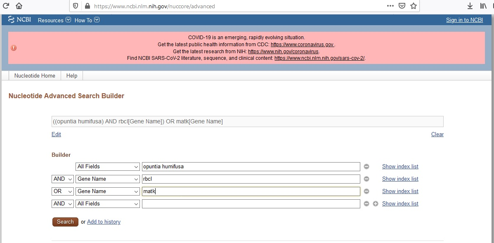

<br>
<br>

#### Motivation

Phylogenetics is one of the most important and controversial fields within plant taxonomy. The ability to sequence and compare plant DNA has split, grouped, and uncovered taxa in ways never expected. In modern plant taxonomy, phylogenetic relationships are a key piece of evidence to consider when delimiting species. In this lab, we'll be downloading and aligning DNA sequences from five species of _Opuntia_. Using these sequences, we'll construct a phylogenetic tree and consider how the species relationships hold up to the published literature. 


---

<br>
<br>

#### Prerequisites 

Before starting this week's tutorial you will have: <br>

1. completed some pre-assignment reading on DNA barcoding, multiple sequence alignment, phylogenetics, and their role in plant taxonomy, <br>

2. completed some pre-assignment reading on why/how Genbank is used by plant taxonomists, <br>

3. navigated through the Genbank website and understand what it is and why it exists. 

4. **MB** Get students to read (for example, something like) [Majure et al (2012), Am. J. Bot.](https://bsapubs.onlinelibrary.wiley.com/doi/full/10.3732/ajb.1100375) if we end up using _Opuntia_ as an example...

---

<br>
<br>

#### Outcomes

By the end of this tutorial you will have: 

1. experience using Genbank, CLUSTAL, and the most common phylogenetics packages in R 

2. familiarity with Genbank and the types of data that can be obtained, 

3. the tools and knowledge needed to create your own phylogenetic tree as part of a taxonomic research project, 

&nbsp;
&nbsp;

---


#### Activity 1: Downloading, Aligning, and Graphing DNA Sequences from Genbank

In previous Assignments we familiarized ourselves with GBIF, R, and the R packages that allow us to connect to databases. Today, we'll learn how to use our newfound R skills to download and align nucleotide sequences from [GenBank](https://www.ncbi.nlm.nih.gov/nuccore), a repository of DNA sequences hosted by the U.S. National Center for Biotechnology Information (NCBI). We'll then use the aligned sequences to create a phylogenetic tree that will organize species based on their relatedness.

In this lab, we'll explore further the genus _Opuntia_: 

_Opuntia basilaris_ (Mojave Desert, Colorado, Utah) 
_Opuntia fragilis_  (Northwestern) 
_Opuntia humifusa_  (Eastern) 
_Opuntia polyacantha_ (Great Plains, foothills of Rocky Mountains) 
_Opuntia stricta_ (Gulf Coast and Caribbean)

**MB** Could add in some natural history background to better motivate this activity. <br>


As usual, we'll start by installing the necessary packages using `install.packages()`:

```{r, eval = FALSE}
install.packages(c('ape', 'msa', 'seqinr'))
```

Then we'll attach some packages designed specifically for connecting with the Genbank database (`ape`), filtering and organizing our data (`tidyverse`), aligning sequences (`msa`), concatenating sequences (`seqinr`), and constructing phylogenetic trees (`ape`):
```{r, results = 'hide', warning = FALSE, message = FALSE }
# attach packages once they are installed 
library(ape)      
library(here)   
library(msa)    
library(seqinr) 
library(tidyverse)
```

First, we're going to build a spreadsheet that will help us keep track of our _Opuntia_ species and the GenBank accession codes for both the matK and rbcL genes for each species. The accession numbers were found by searching the GenBank website like so:



Once the accession numbers are found, they can be saved in a data frame:
```{r}
# build data frame
# accession numbers found by searching GenBank
species <- c('O. basilaris', 'O. fragilis', 'O. humifusa', 'O. polyacantha', 'O. stricta') 
matK_acc <- c('JF786750.1', 'JF786786.1', 'JF786791.1', 'JF786823.1', 'JF786853.1') 
rbcL_acc <- c('JF787189.1', 'JF787223.1', 'JF787227.1', 'JF787259.1', 'JF787288.1' ) 

df <- data.frame(species, matK_acc, rbcL_acc)
```

Now we're ready to search and download the matK sequence for each _Opuntia_ species, using the `read.Genbank()` function:
```{r}
# call GenBank
matK <- 
  read.GenBank(
    df$matK_acc,
    species.names = FALSE,
    as.character = TRUE) %>% 
  lapply(., paste0,collapse="") %>%  # remove spaces
  lapply(., str_to_upper) # capitalize 

# replace Accession IDs with English names
names(matK) <- df$species
```

We can inspect the DNA sequence for _O. basilaris_ by running:
```{r}
head(matK$`O. basilaris`)
```

Cool, [I feel like I'm on CSI](https://pubmed.ncbi.nlm.nih.gov/16100764/). The code for searching and downloading the rbcL sequences is similar:
```{r}
# call GenBank
rbcL <- 
  read.GenBank(
    df$rbcL_acc,
    species.names = FALSE,
    as.character = TRUE) %>% 
  lapply(., paste0,collapse="") %>%  # remove spaces
  lapply(., str_to_upper) # capitalize 

# replace Accession IDs with English names
names(rbcL) <- df$species
```

We now have two DNA sequence objects, `matK` and `rbcL`, that contain sequences from each of our five _Opuntia_ species. In the next step, we'll use the `msa()` function to align our five matK sequences so that their ends are lined up. You could also do this by eye, but it's a bit tedious and not as reproducible:

```{r, results = 'hide', message = FALSE}
# matK alignment
matK_alignment <- 
  msa(unlist(matK),
      type ='dna', 
      method ='ClustalW',
      verbose = TRUE)
```

```{r}
# inspect alignment
print(matK_alignment) 
```

By using the `print()` function, we see that our sequences are aligned pretty well! You can also notice some differences in nucleotide position between the species. Those are 'single nucleotide polymorphisms' (SNPs) that, when considered across the entire genome, distinguish one species from another.

We'll now align our rbcL sequences:

```{r, results = 'hide', message = FALSE}
rbcL_alignment <- 
  msa(unlist(rbcL),
      type ='dna', 
      method ='ClustalW',
      verbose = TRUE)
```

```{r}
# inspect alignment
print(rbcL_alignment)
```


We're ready to create some phylogenetic trees! First, we'll convert our alignment objects to `seqinr` objects. Then, we'll use the `dist.alignment()` function to calculate how similar or different each species' sequence is from one another. We'll do this for the matK, rbcL, and concatenated sequences, so that we can compare the trees:

```{r, results = 'hide'} 
# convert alignment object into seqinr object 
matK_r <- msaConvert(matK_alignment, type="seqinr::alignment") 
rbcL_r <- msaConvert(rbcL_alignment, type="seqinr::alignment") 
  
# create distance matrices
matK_dist <- dist.alignment(matK_r)
rbcL_dist <- dist.alignment(rbcL_r)
```

Now, we'll use the `nj()` function to construct trees:

```{r}
# neighbour joining trees
matK_tree <- nj(matK_dist)
rbcL_tree <- nj(rbcL_dist)
```

Plot your new trees:
```{r}
# plot trees
plot(matK_tree, main ='matK tree')
plot(rbcL_tree, main = 'rbcL tree')
```

Finally, we'll save our trees so that we can use them again in Lab 10:

```{r}
saveRDS(matK_tree, file = here('R_scripts/matK_tree.rds'))
saveRDS(rbcL_tree, file = here('R_scripts/rbcL_tree.rds'))
```

**-KNOWLEDGE CHECK-** How do the matK and rbcL trees differ? Which tree best aligns with the [Majure tree (Figure 3)](https://bsapubs.onlinelibrary.wiley.com/doi/full/10.3732/ajb.1100375)? According to Majure et al (2012), why might our trees differ? 


<!-- For consensus trees: -->

<!-- Recall that matK and rbcL are two separate segments of the chloroplast genome. By sticking them together, we'll create a super-sequence that contains more information than either of the sequences alone. The more sequence information, the better, because it gives us a bigger sample of the entire genome. Concatenation is done by the `seqinr` package, so we'll need to convert our alignment objects into `seqinr` objects: -->

<!-- ```{r, results = 'hide'} -->
<!-- # convert alignment object into seqinr object -->
<!-- matK_r <- msaConvert(matK_alignment, type="seqinr::alignment") -->
<!-- rbcL_r <- msaConvert(rbcL_alignment, type="seqinr::alignment") -->

<!-- # concatenate (merge) sequences -->
<!-- conseq <- mapply(paste0, matK_r$seq, rbcL_r$seq) -->
<!-- names(conseq) <- df$species -->

<!-- # re-align -->
<!-- con_alignment <- -->
<!--   msa(unlist(conseq), -->
<!--       type ='dna',  -->
<!--       method ='ClustalW', -->
<!--       verbose = TRUE) -->
<!-- ``` -->

<!-- ```{r} -->
<!-- # inspect  -->
<!-- print(con_alignment) -->

<!-- # convert alignment object into seqinr object -->
<!-- con_r <- msaConvert(con_alignment, type="seqinr::alignment") -->

<!-- ``` -->


