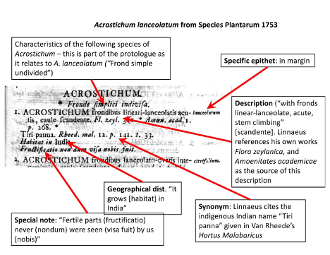

 

---

# Background

---

**Task:** to report on the description, typification and current use of a Linnaean species name.

**Goal:** Understand Linnaean descriptions in the *Species Plantarum*. 

**Resources introduced**: IPNI, Biodiversity Heritage Library, Linnean typification project [N.B. “Linnaean” and “Linnean” are both correct alternative spellings]. 

**Platforms/programs**: The Internet. 

**Key skills:** accessing public taxonomic data, literature of taxonomy, typification.

**Learning objectives:** 

1. Learn how to investigate the basis of a 18th century plant name and consider whether it is correctly applied. 
2. Learn to use the important online resources for taxonomic botany. 
3. Obtain first-hand experience of the historical basis of taxonomy and nomenclature, and its problems. 
4. Gain experience of interpreting botanical Latin and parsing the elements of a protologue.

---

# Exercise

---

-  *Cypripedium bulbosum* is a Linnaean name from *Species Plantarum*. First, go to the online resource “International Plant Name Index (IPNI)” to find the precise publication details of this name, including the page number in Species Plantarum.
-  Go to the website of the Biodiversity Heritage Library (BHL), search for *Species Plantarum* and examine the page on which your species is described. Download that page (only) using the download tools. General information about the [*Species Plantarum* can be found here](https://en.wikipedia.org/wiki/Species_Plantarum).
-  Consider what the protologue means in Latin (N.B. the “protologue” is all the information associated with the description of a new species). Online resources for the translation of botanical Latin are given below. Look out for the “long s” which appears like an f (roman) or an elongated s (italic) – today we treat these as an ordinary s.
-  Include a digital image of the protologue with your report. Take a digital image using scree capture, or download the relevant single page using the download tools.
-  Distinguish the different elements of your protologue (e.g. “name” [genus in capitals; specific epithet in margin], “description” [usually a phrase name previously used by Linnaeus], “synonyms” [phrase names used by previous authors, with the author and book abbreviated], “distribution” are among the elements that may or may not be present). Entries in *Species Plantarum* can be confusing at first but are actually very logical. Annotate your image by hand or in powerpoint as in the example shown here.

 

 

---

**Write a brief report answering the following questions:**

-  Can you work out the previous works that Linnaeus cites? These pre-Linnaean books are abbreviated, but often BHL will understand the abbreviation if you type it into the BHL search box.
-  Does Linnaeus list any specimens? Commonly Linnaeus cites no specimens and the name has to be lectotypified (Google will tell you what a lectotype is if you are unsure). All Linnaean types have been listed by the “Linnaean Typification Project”. Go to the webpage of this project and find the type of your species. Do you agree with the choice of type?
-  Go to recent online taxonomic resources, such as “The Plant List” and see whether your Linnaean name is still used, or whether it has been rejected, synonymised or recombined for some reason. How is this name applied currently? Does it have a synonymy?

---

# Notes

---

- Botanical Latin - bear in mind that botanical Latin is not classical Latin but a technical language derived from it. Linnaeus uses many abbreviations, e.g. “Ind. or.” = “India orientalis” = East Indies
- Symbols. Printing was expensive in the 18th century so L. uses symbols as well as abbreviations; œ (oe ligature); α β γ δ ε (Greek letters, used to distinguish varieties); ✠ ▽ (symbols); astrological symbols: ♄ (Saturn = fruiting); ♃ (Jupiter = perennial); ♂ (Mars = biennial); ☉ (Sun = annual); † (dagger = plants known only from imperfect specimens)
- [Online resources for Botanical Latin](http://www.mobot.org/mobot/LatinDict/search.aspx) 
- [Some general information about botanical Latin](https://en.wikipedia.org/wiki/Botanical_Latin) 
- The classic work “Botanical Latin” by W.T. Stearn is not properly on line but is in print and in libraries. [A poor online text of it (that can be searched for words)](https://archive.org/stream/BOTANICALLATINWILLIAMSTEARN/BOTANICAL%20LATIN%20WILLIAM%20STEARN_djvu.txt)
- The meaning and grammar of Latin terms can be searched in Wiktionary (but bear in mind Wiktionary gives classical Latin information, not botanical Latin, and is incomplete.

---

# Due date

---

**This assignment is due at the beginning of Lab 9 (2:00pm Nov. 18th/19th), and will be turned in on Canvas.**

