---

---

# Leaf Types

 

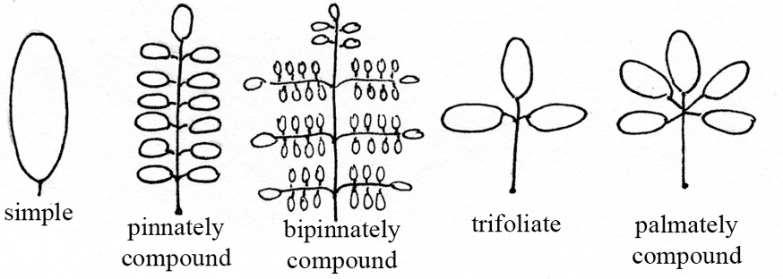{width=80%}

---

---

# Leaf Venation

 

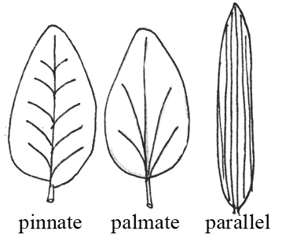{width=50%}

---

---

# Leaf Arrangement

 

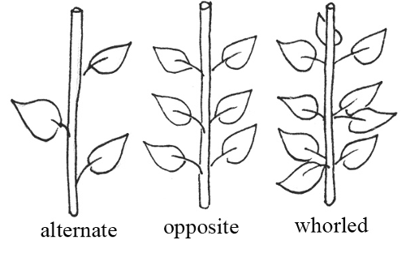{width=50%}

---

---

# Leaf Shapes

 

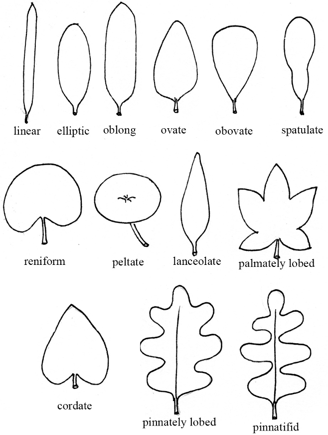{width=80%}

---

---

# Leaf Apexes

 

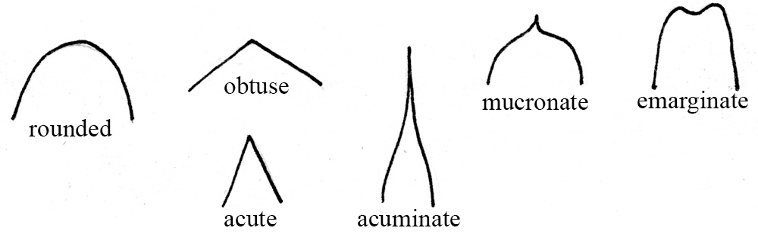{width=80%}

---

---

# Leaf Margins

 

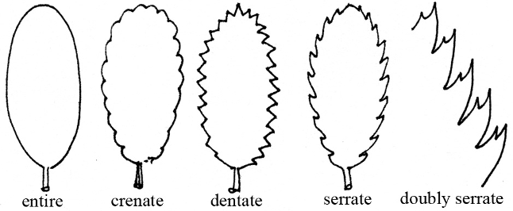{width=80%}

---

---

# Surfaces and Pubescence (hairs)

 

**Ciliate** = with a marginal fringe of hairs  
**Glabrate** = nearly glabrous, or becoming glabrous with age  
**Glabrous**  = without pubescence of any kind, smooth  
**Glandular** = having glands or small secretary structures  
**Glaucous**  = having a whitish waxy or powdery coating  
**Hirsute**  = with long, shaggy hairs  
**Pubescent**  = covered with hairs  
**Scabrous**  = rough to the touch  
**Scurfy**  = covered with scales  
**Stellate** = with star shaped (branched) hairs  
**Tomentose**  = with densely matted soft hairs, wooly in appearance 

---

---

# Basic Flower Parts

 

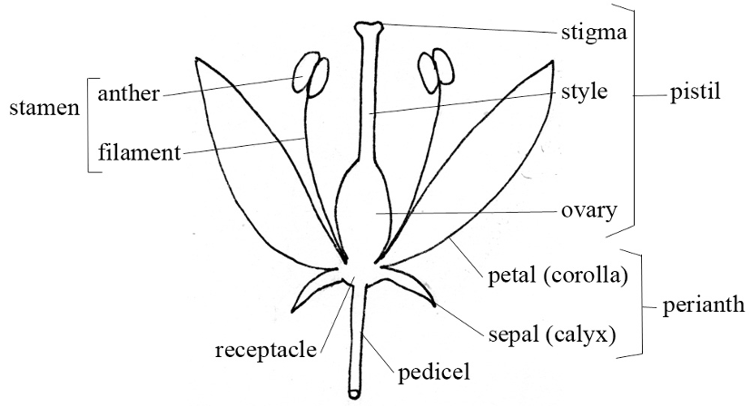{width=80%}

---

---

# Types of Placentation

 

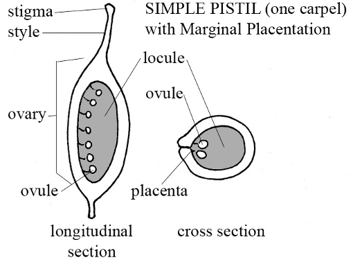{width=50%}

 

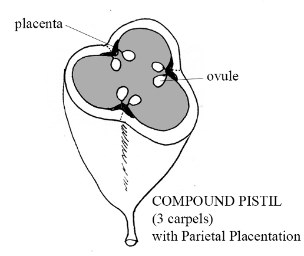{width=50%}

 

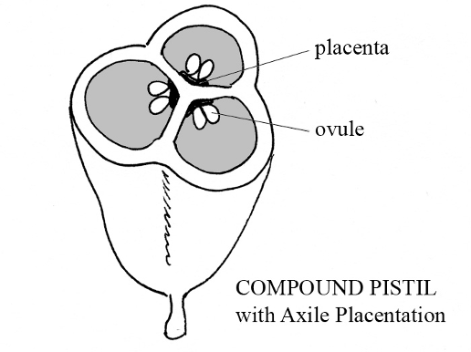{width=50%}

 

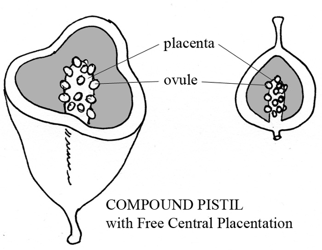{width=50%}

 

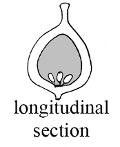{width=20%}

---

---

# Ovary Position and Flower Type

 

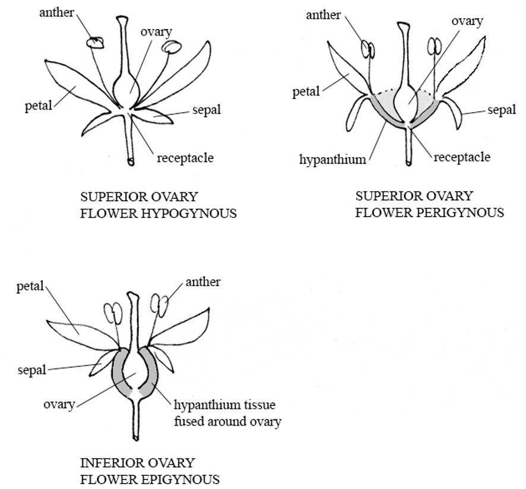{width=80%}

---

---

# Floral Symmetry

 

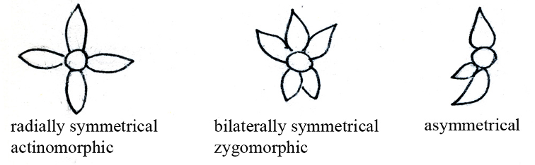{width=50%}

---

---

# Common Inflorescence Types

## Sessile

 

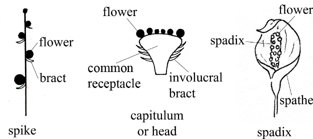{width=60%}

 

---

## Pedicellate

 

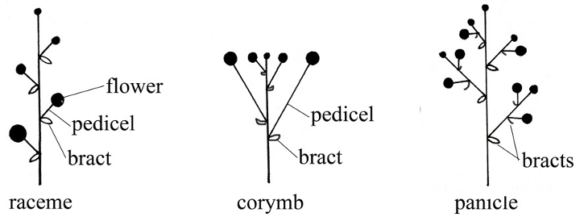{width=60%}

 

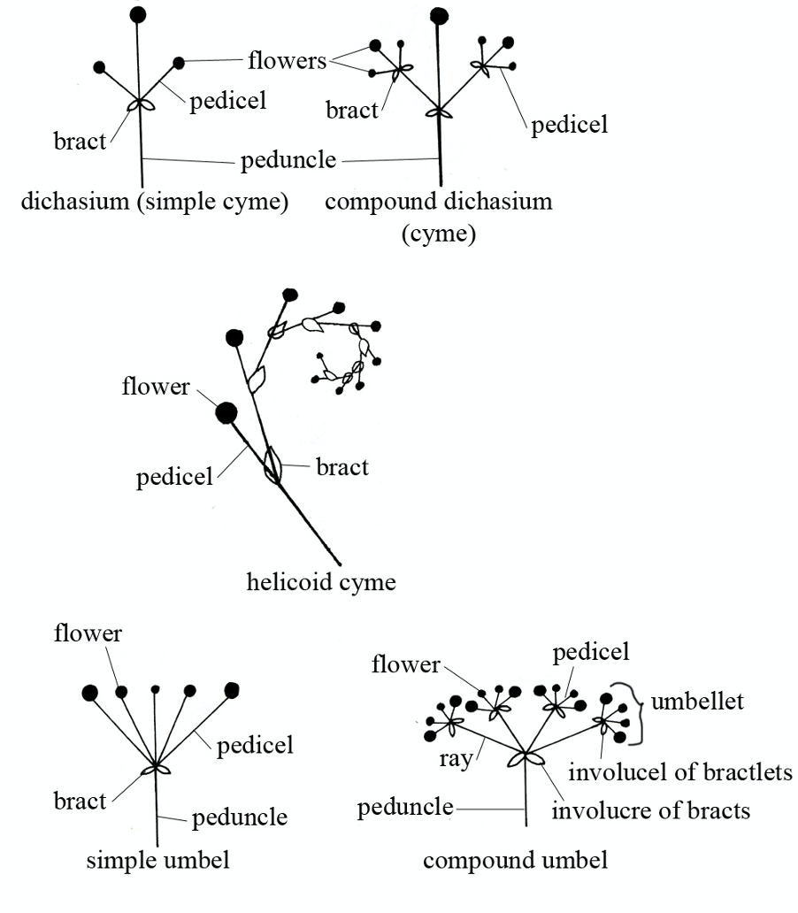{width=80%}

---

---

# Fruits

---

---

## Simple Fruits
**(Fruits developing from one ovary)**

### Fleshy fruits: 

* **Berry**
  + entire fruit wall fleshy (may be from superior or inferior ovary).
    + Examples:  tomato, grape, cranberry, banana.
  + Specialized berries: 
    + hesperidium: a berry with a tough leathery rind, a citrus fruit
    + pepo: a one locular berry with a hard outer covering, a melon.
* **Drupe**
  + fruit wall (or pericarp) of 3 distinct layers, the outer skin like (exocarp), the middle fleshy (mesocarp), and the inner hard and woody (endocarp).
    + examples: cherry, peach, plum.  The small drupes that form the aggregate fruits of raspberries and blackberries are called drupelets.
* **Pome**
  + fruit developing from an inferior ovary, with the seeds encased within a cartilaginous core, and the fleshy part consisting largely of the adnate hypanthium and receptacle.
    + Examples: apple, pear.
    
 

### Dry Indehiscent Fruits
**(Not opening when mature, usually 1-seeded fruits)**

* **Achene**
  + small, 1 seeded fruit, developing from a simple pistil, the seed attached to the ovary wall in only one place, that is, not fused with it.
    + buttercup, the "seeds" of a strawberry; the term achene is also used for similar fruits that develop from 1 locular compound ovaries as in the sedges and Asteraceae. 
* **Cypsela**
  + an achene-like fruit developed from an inferior 2-carpellate ovary as in the Asteraceae.  Usually called achenes in floras and manuals.
* **Utricle**
  + achene like, but ovary syncarpous and ovary wall corky or bladdery.
    + beet, *Rumex* (dock)
* **Samara**
  + a winged achene.
    + Examples: elm, maple.
* **Caryopsis (grain)**
  + like an achene but ovary wall tightly fused to seed.
    + Example: Poaceae
* **Nut**
  + ovary wall hard and woody, developing from a syncarpous ovary.
    + Example: filbert, acorn
* **Nutlet**
  + a small, hard-walled, single-seeded "fruit" that develops from half of a carpel.
    + Example: Lamiaceae, Boraginaceae
* **Schizocarp**
  + a fruit from a syncarpous ovary that splits into its separate but indehiscent carpels at maturity.
    + Example: Apiaceae
    
 
    
### Dry Dehiscent Fruits
**(Opening at maturity, usually with several seeds)**

* **Follicle**
  + formed from 1 carpel (a simple pistil) and dehiscing along 1 suture.
    + Examples: *Aquilegia*, *Delphinium*
* **Legume**
  + formed from 1 carpel and dehiscing along 2 sutures.
    + Examples: Fabaceae. 
    + A legume that breaks crosswise into 1-seeded segments is called a **loment**
* **Silique**
  + formed from a 2-carpellate, 2-celled ovary with parietal placenta, and more than 3 times as long as wide.
    + Examples: Brassicaceae
* **Silicle**
  + a short silique, less than 3 times as long as wide.
    + Examples: Brassicaceae
* **Capsule**
  + dry, dehiscent fruits developing from syncarpous ovaries.  They may dehisce by pores (Poricidal dehiscence), along the partitions or septa (septicidal dehiscence), directly into the locules or cavities (loculicidal dehiscence) or by a lid (circumscissile dehiscence).
  
 

## Compound Fruits
**(Fruits formed from multiple ovaries)**

* **Multiple Fruits**
  + fruits developing from the coalescence of several ovaries from several separate flowers.  
    + Examples:  pineapple, mulberry.
* **Aggregate Fruits**
  + fruits developing from the coalescence of several ovaries of one flower.  
    + Examples:  raspberry, blackberry