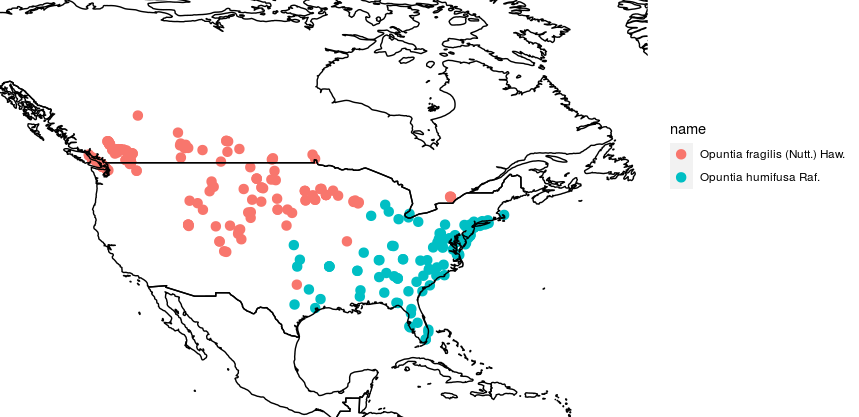

 
 

#### Motivation

**MB**: Some brief explanation of the importance of mapping species distributions in plant taxonomy.

---

 
 

 

#### Prerequisites 

Before starting this week's tutorial you will have:  

1. created an RStudio Cloud account and completed the introductory R exercises from Assignment 1,  

2. researched 2-3 of your favourite plant groups for creating a species distribution map,  

3. navigated through the GBIF website and understand what it is and why it exists,  

4. researched 2-3 of your favourite plant groups for creating a species distribution map,  

5. More?

---

 
 

#### Outcomes

By the end of this tutorial you will have:  

1. experience manipulating and mapping species distribution data in R,  

2. familiarity with GBIF and the types of data that can be obtained,  

3. More?

---

 
 

#### Activity 1: Mapping Species Distributions

In the last tutorial we familiarized ourselves with GBIF, R, and RStudio Cloud. Now, let's navigate to the [BIOL324 Workspace](https://rstudio.cloud/) and select the project titled _Mapping Species Distributions_. In the **Source Pane** (top left quadrant) we'll see a sequence of functions. This is a script that collects, filters, and maps distribution data for two species of cacti _Opuntia fragilis_ Nutt. Haw. and _Opuntia humifusa_ Raf. By highlighting the script from lines 10-54 and pressing **Ctrl+Enter** (or clicking **Run** at the top of the Source Pane), the functions will execute consecutively, storing data for _O. humifusa_ in the **Environment Pane**.

Obtaining the data for _O. fragilis_ requires an additional step. Highlight lines 62-63 and run the code. In the **Console Pane** a warning will appear stating `More than one GBIF ID found for taxon 'Opuntia fragilis'!`, and listing possible matches to the search query. We'll select the first option by typing "1" (without quotation marks) into the **Console Pane** and pressing **Enter**. Now, select lines 67-108 in the **Source Pane** and run the rest of the code. 
After it has executed, a map will be generated in the **Plots** tab of the **Files Pane**. In the **Plots** tab, click **Zoom** to adjust the image dimensions. 

MB: Any other plants could go here. I chose these somewhat haphazardly, but they do show a distribution that could be used to discuss allopatry. 

---

 
 

#### Activity 2: Decyphering some code

Let's step through the script in order to understand what is happening here. 

 

**Lines 10-15**: The `library()` function loads various packages designed specifically for connecting with the GBIF database (`rgbif`, `spocc`, `taxize`), filtering data (`tidyverse`), and mapping (`mapr`). 

**Lines 23-24**: The `get_gbifid()` function searches GBIF for taxon IDs associated with your search query. The `<-` function stores the results in an object that we named `group1_ids`. By storing the results in an object we can later return to the object and inspect it, subset it, and feed it to other functions. 

**Lines 27-28**: The `occ()` function uses the taxon ID stored in `group1_ids` to search GBIF for occurence records associated with that ID. 

**Line 30**: The `head()` function lets us preview the object `group1_metadata` created in the previous step. You can inspect the structure of `group1_metadata` in the **Console Pane**. Notice that there are numerous 'named elements' starting with `$`, such as `$gbif`, `$bison`, `$inat`, etc. Only the element `$gbif` contains any information, because in the previous step we instructed `occ()` to search only GBIF for occurence data (as opposed to other databases). 

**Line 37**: Here, we are subsetting the large object `group1_metadata` into a smaller object `group1_data`. By doing this, we discard the empty elements, and other superfluous information that was collected by the `occ()` function. We can choose which elements to keep by using the `$` operator. The code `group1_metadata$gbif$data$'5384047'` says: 

> "Within the large object `group1_metadata`, select the element named `$gbif`. Within the element `$gbif`, select the sub-element `$data`. Within the sub-element `$data`, select the sub-sub-element `5384047` (the taxon ID for _O. humifusa_). 

We are left then with an object `group1_data` that is considerably more simple to navigate than `group1_metadata`.

**Line 40**: The `unique()` function is applied to the `$ScientificName` column of `group1_data`. This function inspects the specified column and tells us how many unique entries exist there. In the **Console Pane** the output tells us that there are some synonyms that have been included.

MB: There's an opporunity here to teach about synonyms and how to make decisions about including/excluding them. 

**Line 43**: Similarly, the `unique()` function is applied to the `$country` column of `group1_data`. In the **Console Pane** the output tells us that some records from Eurasia have been included. These are likely museum specimens, not natural observations. 

**Lines 49-54**: We can remove synonyms and misplaced country records by using the `filter()` function. The `select()` function chooses columns 1,2, and 3, which store the plant name, latitude, and longitude, respectively.

**Lines 62-94**: The above steps are repeated for _O. fragilis_.

**Lines 101-102**: The `full_join()` function combines the occurence data for _O. humifusa_ and _O. fragilis_. 

**Lines 107-108**: The `map_ggplot()` function maps the combined data. The `coord_fixed()` function adjusts the mapping window, using latitude and longitude as parameters.

**The result**:

---

 
 

#### Activity 3: Creating your own species distribution map

MB: Basically, the existing code can be modified to replace _Opuntia_ with any other plant name. Re-running the code will create a map for any species that GBIF has records for. Of course, some taxa are have more complicated nomenclature, and sometimes weird entries make it onto the map. In these cases, a little troubleshooting is required. Also, if one wanted to search for genera, families, orders, etc. some additional modifications are needed. For the majority of students in BIOL413, generating their own maps didn't require my intervention. 

 
 

