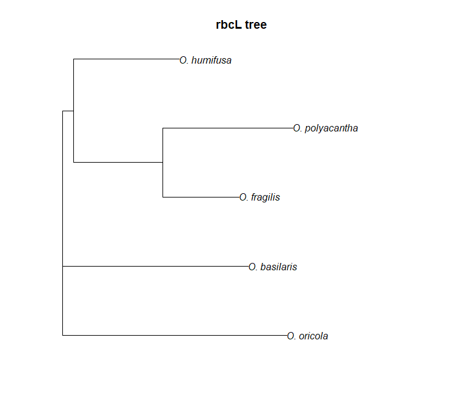

 
 

#### Motivation

Add section...

---

 
 

#### Prerequisites 

Before starting this week's tutorial you will have:  

1. completed some pre-assignment reading on DNA barcoding, multiple sequence alignment, phylogenetics, and their role in plant taxonomy,  

2. completed some pre-assignment reading on why/how Genbank is used by plant taxonomists,  

3. navigated through the Genbank website and understand what it is and why it exists. 

4. **MB** Get students to read (for example, something like) Majure et al (2012), Am. J. Bot. if we end up using _Opuntia_ as an example...

---

 
 

#### Outcomes

By the end of this tutorial you will have:  

1. experience using Genbank, CLUSTAL, and the most common phylogenetics packages in R  

2. familiarity with Genbank and the types of data that can be obtained,  

3. the tools and knowledge needed to create your own phylogenetic tree as part of a taxonomic research programme,  

4. ...more

---

 
 

#### Activity 1: Downloading, Aligning, and Graphing DNA Sequences from Genbank

In previous Assignments we familiarized ourselves with GBIF, R, RStudio Cloud, and the R packages that allow us to connect to databases. Today, we'll learn how to use our newfound R skills to download and align nucleotide sequences from [GenBank](https://www.ncbi.nlm.nih.gov/nuccore), a repository of DNA sequences hosted by the National Center for Biotechnology Information (NCBI). We'll then use the aligned sequences to create a phylogenetic tree that will organize species based on their relatedness.

In this lab, we'll explore further the genus _Opuntia_:  

_Opuntia basilaris_ (Mojave, Colorado, Utah)  
_Opuntia fragilis_  (Northwestern)  
_Opuntia humifusa_  (Eastern)  
_Opuntia oricola_   (Coastal sage and chaparral of S. California)  
_Opuntia polyacantha_ (Great Plains, foothills of Rocky Mtns)  

**MB** Could add in some natural history background to better motivate this activity.  

Open this week's .R file ('324_Phylogenetics.R') and navigate to the source pane. Install and attach the necessary packages using `install.packages()` and `library()`. By highlighting and running lines 38-111, we can run the script that searches Genbank for _matK_ and _rbcL_ sequences from our five _Opuntia_ species.

Selecting and running lines 120-167 will generate three phylogenetic trees. The first tree illustrates the relationships between species based only on the nucleotide sequences of the _matK_ gene. The second tree does the same thing, but for the _rbcL_ gene. The third tree considers both sequences. Since this tree has the most information, it is often considered a better estimate of the true relationships between species. 

 

**MB** Could add in some discussion here about why different genes produce different trees. 

---

 
 

#### Activity 2: Dechyphering some code

Let's step through the script in order to understand what is happening here. 

 

**Lines 14-18**: The `library()` function loads various packages designed specifically for connecting with the Genbank database (`ape`), filtering and organizing our data (`tidyverse`), aligning sequences (`msa`), concatenating sequences (`seqinr`), and constructing phylogenetic trees (`ape`). 

**Lines 38-40**: The `c()` concatenates the elements specified inside the brackets `()` into an object. For example, the `species` object contains five elements - each one is the name of an _Opuntia_ species that we are interested in. The `matK_acc` object contains the Genbank accession numbers for each species. These were found by searching Genbank like so:

 

**Line 42**: From our three objects created above, we will merge them together into a dataframe. The purpose of this dataframe is to keep our accession numbers and species names organized - it will come in handy later!

function searches GBIF for taxon IDs associated with your search query. The `<-` function stores the results in an object that we named `group1_ids`. By storing the results in an object we can later return to the object and inspect it, subset it, and feed it to other functions. 

**Lines 50-56**: The `read.Genbank()` function searches Genbank for nucleotide sequences associated with our search query. In this case, we are giving `read.Genbank()` our accession numbers for the _matK_ that we collected earlier.

**Line 59**: Because Genbank returns the nucleotide sequences with accession numbers, we want to re-name them with English names for easier reading later on.

**Lines 70-79**: Here, we're collecting sequence information from Genbank, but for the _rbcL_ gene. 

**Lines 93-98**: Now that we have some DNA sequences, we need to align them. The `msa()` function takes our sequences and uses the CLUSTAL algorithm to make an optimal alignment (you could also do this by eye, but this becomes difficult with many sequences). 

**Line 100**: The `print()` function allows us to inspect the alignment.

**Lines 103-111**: Here, we'll go through the same alignment procedure for the _rbcL_ sequences.

**Line 124**: In addition to constructing phylogenies for each gene separately, we'll also construct a phylogeny using both sequences concatenated together. The `paste0()` function allows us to string the _matK_ and _rbcL_ sequences together.

**Lines 128-135**: With our concatenated sequences, we'll re-align with CLUSTAL once more using the `msa()` function.

**Lines 148-150**: To construct a phylogeny, we first need to know how similar or dissimlar each species' DNA sequence is from another. The `dist.alignment()` function calculates a 'distance matrix' that describes these similarities. 

**Lines 154-156**: With our distance matrices, we can now construct a phylogenetic tree. The `nj()` function creates a certain type of tree called a 'neighbour joining tree`

**MB**: Perhaps need to explain this terminology (distance matrix, neighbour joining) in pre-assingment reading, or lectures. 

**Line 159-161**: Now it's time to plot our trees! The _matK_ and _rbcL_ trees were shown earlier, below is the consensus tree:

 
 

