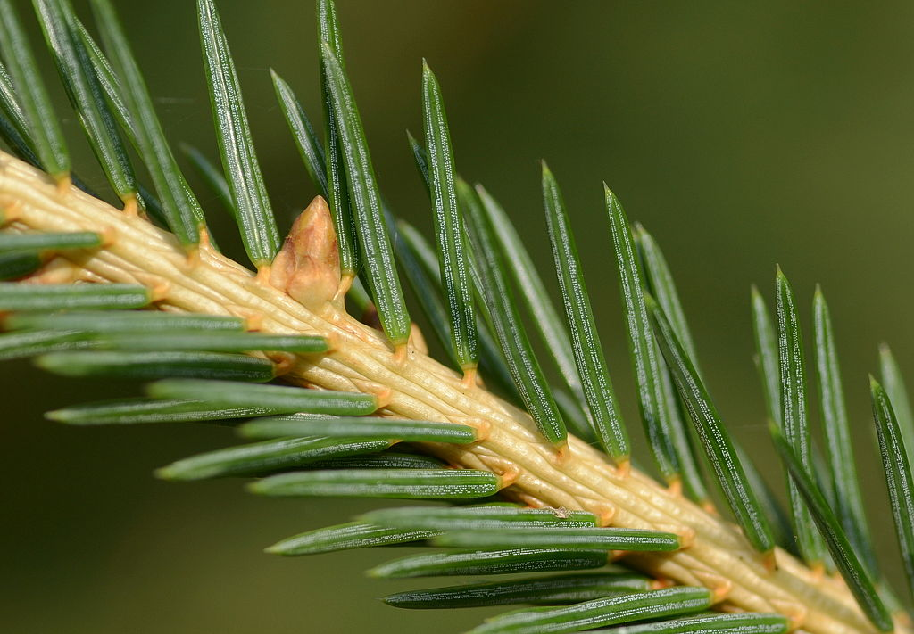
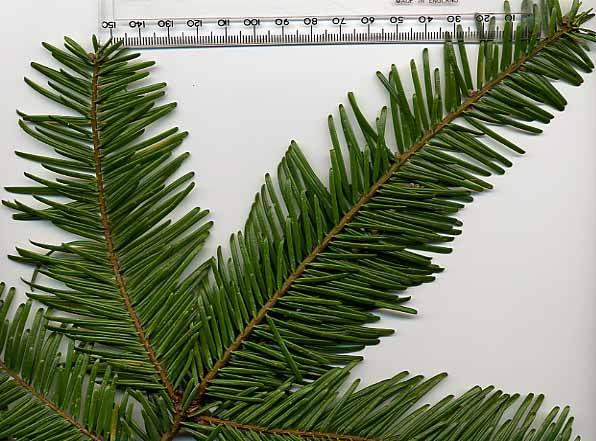

**Gymnosperms** (meaning "naked seeds") are non-flowering plants with ovules that are not borne in ovaries but are naked on the surface of cone scales or at the ends of branches.  While the seed plants form a monophyletic group, the relationship between the various groups of gymnosperms remains elusive. We will focus on the morphology of conifers (in the order **Coniferales**) for the purposes of this lab, but also show you some examples of other gymnosperm groups for fun! **For your last Family ID quiz, you will be responsible for knowing the Pinaceae and Cupressaceae families.**

---

**Coniferales** (conifers)
(Includes families Pinaceae, Cupressaceae, Podocarpaceae, Araucariaceae, and Taxaceae.)

**1. Conifers are for the most part large trees.**  
**2. Their stems come in the form of large, woody trunks and thinner (but still quite robust) branches. Leaves are tough and green, and come in the form of long, thin, spirally arranged needles (Pinaceae) or smaller, decussate scale-like needles (Cupressaceae)**  
**3. Conifers do not have flowers. Instead, their reproductive structures are separately housed in male and female cones (monoecious). Male (pollen) cones are small and short-lived, releasing large amounts of pollen from small sacs (microsporangia) within the cone. Female (seed) cones are much larger and may remain on the tree for multiple years as they develop. Ovules are borne on woody bracts within the female cones and catch wind-dispersed pollen via a small droplet, which then enter the ovule via a small hole called the micropile.**  
**4. Conifers do not produce fruit (as there is no flower or ovary). Naked ovules develop into seeds within seed cones after fertilization, and the seeds are quite often winged to aid dispersal. Once the ovules have fully matured into seeds (which can take up to two years after pollination like in *Pinus*), the seed cones open up to release the seeds.**

---

Conifers are the most important plants in B. C., economically, since most of our industry is based on killing them.  The yews (Taxaceae) resemble conifers but have berry like arillate seeds rather than cones.  There are 3 families of conifers (including yews) native to North America: Pinaceae, Cupressaceae (now includes Taxodiaceae), and Taxaceae. 

The following species are native to the UBC campus and Pacific Spirit Park:

*Abies grandis* GRAND FIR (common near trail 6 to Wreck Beach)
*Picea sitchensis* SITKA SPRUCE (a few along S.W. Marine Drive)
*Pinus contorta*  LODGEPOLE PINE (Camosun Bog)
*Pseudotsuga menziesii*  DOUGLAS-FIR (everywhere)
*Taxus brevifolia*  PACIFIC YEW (scattered, a few used to be near the top of the trail to Tower Beach)
*Thuja plicata*  WESTERN RED CEDAR (everywhere)
*Tsuga heterophylla*  WESTERN HEMLOCK (everywhere)

Many other genera are planted as ornamentals on campus, including all the genera native to North America except *Torreya*, plus the Old World genera *Cedrus* (Pinaceae), *Platycladus*, *Thujopsis* (Cupressaceae), *Cryptomeria*, *Cunninghamia*, *Metasequoia*, *Sciadopitys* (Taxodiaceae), and the Southern Hemisphere *Araucaria* (Araucariaceae). 
In addition, *Podocarpus* (Podocarpaceae) and *Cephalotaxus*  (Cephalotaxaceae) are planted in the UBC Botanical Garden.

---

# Pinaceae

**Pine Family**

---

## Diagrams

---

## Vegetative characters

As mentioned above, members of the Pinaceae family have long, thin needles for leaves. The needles take a different size, shape, and arrangement in different genera. 

In the genus *Picea* (spruce), their needles are flattened, pointed, and tend to be more stiff than other genera (hurting a bit when you grab a leafy branch with your hand). After the needles fall off, they leave behind persistent, woody leaf bases called sterigmata or pulvinus. 

You can see a close-up of the leaves and woody stem bases in Norway spruce (*Picea abies*). If you look closely, you can see two whitish lines of dots. These are stomata, which structures in the epidermis of leaves that allow gas exchange.

{width=100%}

Source: Wikipedia

 

The leaves of *Abies* (fir) are actually spirally attached to the stem, but twist so that they lie flat in one plane. They thus appear to be coming off the stem in two directions, making them 2-ranked. Unlike *Piceae*, 

{width=80%}

Source: Wikipedia

 

**Cycadales**
Cycadaceae and Zamiaceae (Cycad families)

At first glance these plants seem fern-like (the leaves are pinnately compound).  However cycads are dioecious seed plants.  The ovules and pollen sacs are borne on leaves (megasporophylls and microsporophylls respectively) that are grouped into strobili (see demonstration).  Pollination may be accomplished with insect vectors.  Once a pollen grain has been delivered to an ovule it produces a pollen tube, which grows through the ovule, the tip bursts when in close proximity to an archegonium (each archegonium contains one egg), releasing two sperms which will swim to the egg.  One sperm will fertilize the egg, the other will die!

**Ginkgoales**
Ginkgoaceae (Maidenhair Tree family)

*Ginkgo biloba* is the only extant member of this order. The ovules are borne in pairs on short branches.  The outer part of the seed coat is fleshy and very unpleasant smelling.   While a common ornamental plant, it is usually only male trees that are planted; no surprise there!  Pollen cones are long and pendulous and not smelly.  Like cycads, *Ginkgo* relies on motile sperm to accomplish fertilization.

**Gnetales**
The Gnetales is made up of three dissimilar families that are of particular evolutionary interest because they have features apparently intermediate between the rest of the gymnosperms (naked seeds) and the angiosperms (double fertilization of sorts, wood with vessels, and flower-like reproductive structures).  Like most of the gymnosperms and angiosperms, sperm nuclei are delivered to the egg through a pollen tube (sperm is not motile).

