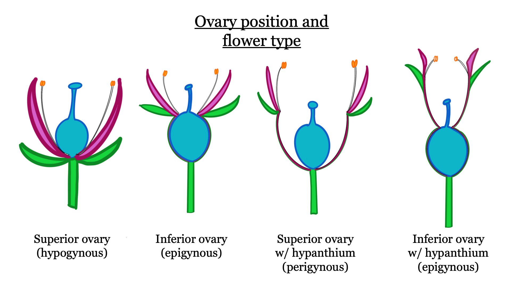
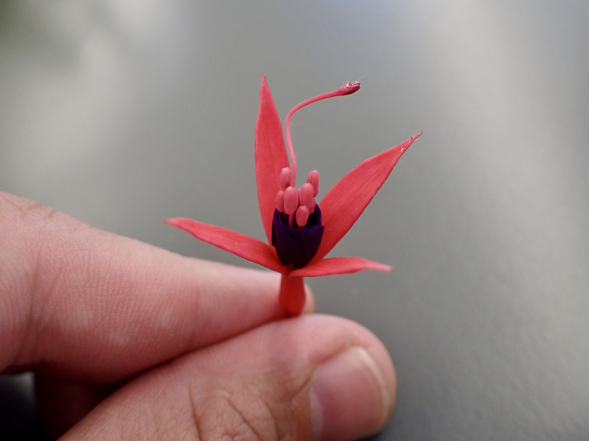
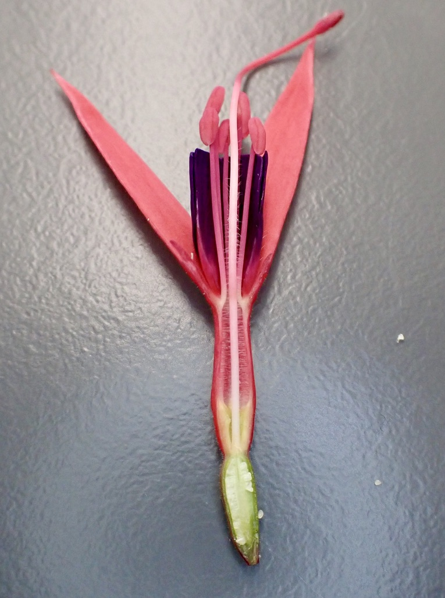
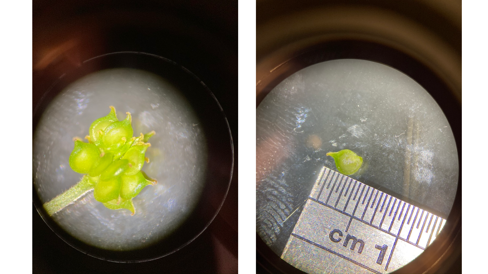

---

---

# Botany Basics: Flower and fruit parts

---

---

---

--- 

---

---

---

---

The purpose of this lab exercise is to familiarize you with basic flower parts, fruit characteristics, and inflorescence structure. Follow the instructions and take labeled drawings of the flowers and fruits below and answer the questions about them (indicated by **-Knowledge Check-** ). Remember that there is an [illustrated glossary of plant parts](Morphological_Terminology.html) that may be useful when you're making your drawings.  There is also a wiki glossary of common botanical terminology [here](https://en.wikipedia.org/wiki/Glossary_of_botanical_terms). It is good practice to refer to these resources when you come across new terms (it will happen a lot), and make sure to utilize your TA's / Lab instructor as well!

---

---

## Flowers

The flower depicted below is *Fuchsia* sp. in the Onagraceae family, which we will explore in detail in Lab 3. 

&nbsp;

{width=40%} {width=40%}
{width=40%} {width=40%}

&nbsp;

This picture displays a longitudinal section of the flower (cut in half length-wise), which allows us to see what's going on inside the flower. It is difficult to see how many stamens there are from the photos, but the numbers of parts in each whorl are often the same or in multiples within each family. Given the number of sepals you see, how many petals and stamens do you think there are? (hint: there are twice the number of stamens as sepals/petals)

{width=80%}

&nbsp;

---

---

The pictures below display *Antirrhinum* sp. (snapdragons). We will go into the Scrophularioid families in greater detail in Lab 6. In this case the petals are fused, which makes it a little bit trickier to tell how many petals there are...you can, however, count the number of petal lobes to get an indication of the number of fused parts.

{width=40%} {width=40%}
{width=40%} {width=40%}

In these photos, the petals are removed to unveil the reproductive parts inside the flower tube. You can see that there are only four stamens, so not all plants follow the rule of multiples between whorls...

{width=40%} {width=40%}

---

---

## -KNOWLEDGE CHECK 2.1-

Using the above photos, make drawings of the *Fuchsia* and *Antirrhinum* flowers and indicate the following:  
- What type of symmetry does this flower have?  
- How many sepals?  
- How many petals? (hint: same as the number of sepals)   
- How many stamens?  
- Is the ovary superior or inferior?  
- Is a hypanthium present?  
- What type of inflorescence does *Antirrhinum* have?  
- Label your drawing with the following terms if present: sepal, petal, stamen, anther, filament, pistil, ovary, style, stigma, hypanthium.  

---

---

### Fruits

Most people do not realize that in many cases that fruit are just as important for identification as flowers (in some cases fruit are even more important!). As a refresher: after a flower has been pollinated and the ovules (located within the ovary) have been fertilized, the ovary begins to transform into a fruit (and typically the sepals, petals, and stamens wither away) and the ovules develop into seeds. This means that (botanically speaking) **every fruit was once the ovary of a flower**. So in this course, forget about your grocery store definition of "fruits and vegetables"...in our world, tomatoes, cucumbers, pea pods, and peppers are all considered fruits!

In the case of a pea, the pod is the fruit and the peas inside are the seeds. A pea pod is a legume, a fruit formed from a single carpel (a simple pistil). It dehisces (splits open when ripe) along two sutures (lines that split open). Below you can see that the seeds are attached to the margins of the ovary wall - this is called marginal placentation (a type of parietal placentation). 

{width=40%} {width=40%}

&nbsp;

A tomato fruit develops from a compound pistil. Here is a cross-section through a tomato:

{width=40%} {width=40%}

The cucumber is another fruit derived from a compound pistil. 

**INSERT CUCUMBER PICTURES**

---

---

## -KNOWLEDGE CHECK 2.2-  
Draw sections (longitudinal-section of pea, cross-sections of tomato and cucumber) of the above fruits and indicate the following:  
- What is the type of fruit?  (hint: use the list of fruit types found here **point to fruit list**)  
- How many carpels does it have?  
- How many locules does it have?    
- What type of placentation does it have?  
- Label your drawings with the following terms: ovary wall, seeds, placenta, locule(s).  

&nbsp;

---

---

# Ranunculaceae (Buttercup family)  

 

**1. Usually herbs.**  
**2. Leaves simple to compound, usually alternate, without stipules, often palmately veined.**  
**3. Flower perfect (or imperfect), mostly actinomorphic, the parts spirally arranged.  Sepals 3-20, often 5, free.  Petals 0, 2, 4, 5  10, free.  Stamens usually numerous.  Pistils simple, ovary superior, carpels usually several to numerous, placentation parietal (marginal).**  
**4. Fruit an achene, follicle, (or berry).**  
**5. About 50 genera and 1900 species, mainly in North Temperate regions.**  

---

---

---

---

---

Ranunculaceae is the 8th largest family in B.C. with 97 species and varieties.  The family contains many poisonous plants; some, such as *Delphinium* can cause serious livestock poisoning.  Cultivated ornamentals include *Aconitum* (monkshood), *Anemone* (windflower), *Aquilegia* (columbine), *Clematis*, and *Delphinium* (larkspur).

---

Below are photos of Japanese anemone (*Eriocapitella* sp., previously placed in *Anemone*). In this case the sepals are petaloid (they are coloured and appear like petals), and the petals are missing. In plants where it looks like either sepals or petals are missing, typically the petals are absent and the sepals remain. The third picture shows a close-up of the pistils, with the sepals and stamens removed.

{width=40%} {width=40%} {width=40%}

---

Similar examples are *Thalictrum* spp., which are small flowers that also have missing petals. The first two photos show flowers at very different stages of development. Can you guess what type of fruits *Thalictrum* has?

{width=40%} {width=40%} {width=40%}
{width=40%}

---

Ranunculaceae also has species with quite intricate and modified floral structures, like in *Aconitum* sp. (left) and *Delphinium* sp. (right). The showy purple bits are the sepals, and the petals are highly modified and somewhat hidden in the center of the flower. 

{width=40%} {width=40%} 

&nbsp;

Let's take a closer look at *Aconitum*. Here you can take a peak inside the flower from the front (left) and from the side with some sepals removed (right). The upper-most sepal resembles a hood (also known as a galea - we'll revisit this in a later lab). You can also see some strange looking structures inside...

{width=40%} {width=40%} 

&nbsp;

These weird looking things are actually the petals! Each petal has a long, narrow "claw", with a flattened "blade" and a rounded "spur" sitting at the top of the claw. Can you identify each part of the petal? What function do you think the spur serves?

{width=40%} {width=40%} 
{width=40%}

&nbsp;

Here are some developing *Aconitum* fruit. Can you tell the fruit type?

{width=40%} {width=40%} 

---

---

## -KNOWLEDGE CHECK 2.3- 

Using the above photos, draw *Thalictrum* and *Aconitum* and indicate the following:

- What type of symmetry does the flower have?  
- How many sepals?  
- How many petals?  
- What is the fruit type? 
- Label with the following terms if present: sepals, petals, stamens, pistils, fruit, seeds, claw, blade, spur. 

&nbsp;

---

---

# Keying

The use of dichotomous keys to identify species is an absolutely crucial aspect of taxonomy. In many cases, the only way to confirm a species' ID is to wade through the key with a specimen in hand that has reproductive structures present (preferably flowers AND fruits) and some form of magnification (preferably a dissecting microscope). Typical plant taxonomy courses have students spending the majority of their time keying, but it is rather difficult to do in a virtual lab environment. Nonetheless, we have prepared a virtual keying exercise to give you some experience and exposure to this vital part of taxonomy.

Your instructor will give you an overview of how keying works using the online Flora of North America (FNA), but the same basic concepts apply to any dichotomous key you might use. Basically, keys work through "couplets" (e.g., 1A vs 1B), where you choose the option of the two that more closely fits your specimen. Once you choose a path, it will direct you to the next couplet (e.g. 2A vs 2B, though in some cases it will direct to skip over several couplets) where you will choose the best option, and so on and so forth. Eventually, you will reach the end of a path and have narrowed down a species. At this point, you can read the species description (and cross-reference other keys and lots of pictures) to make sure your ID is correct.

Keying is a lot easier if you already know what family your plant is in - that's why we place such a great emphasis in this course on identifying families by sight! If you are confident on the family, you can skip right to that part of the key and start right away on narrowing down the genus. Once you follow the path of the key and land on a genus, click on that genus and you will start from 1A vs 1B again until you reach the species. 

You will use the below pictures to attempt to identify the plant to species! Start by going to the [Flora of North America website](http://www.efloras.org/flora_page.aspx?flora_id=1), and type 'Ranunculaceae' into the search field at the top of the page. Clicking on 'Ranunculaceae' will take you to the beginning of the family key. Note that instead of 1A vs 1B, FNA refers to the couplet options as the number and a '+' (e.g., 1 vs +, 2 vs + and so on). Start at couplet 1, and once you've decided which option fits the plant below best, click on the corresponding number in parentheses on the right - so if '1' fits best click on '(2)', and if '+' fits best click on '(4)'. Once you click on an option, your browser will automatically move to the next couplet. Remember to continue all the way until you reach a species - once you land on a genus, click on it to go to the genus key and begin at couple 1 again. Be sure to use [the botanical glossary wiki](https://en.wikipedia.org/wiki/Glossary_of_botanical_terms) to look up all those unfamiliar terms!

&nbsp;

&nbsp;

&nbsp;

---

---

## -KNOWLEDGE CHECK 2.4-

Write down your journey through the key (e.g., 1, 2+, 3, 4, 8+, etc), and indicate the genus and species you landed on. Make sure to list the authority after the species name. 

