# Brassicaceae - Mustard family

---

**1.  Herbs.**  
**2.	Leaves simple, pinnatifid, or pinnately compound, alternate, without stipulates.**  
**3.	Flowers perfect, cruciform (cross or X shaped).  Sepals 4, free.  Petals 4, free, clawed.  Stamens 6 and tetradynamous (the 2 outer stamens shorter than the 4 inner stamens).  Pistil compound, ovary superior, carpels 2, placentation parietal.**  
**4.  Fruit a silique or silicle.**  
**5.  About 350 genera and 3,000 species, primarily North Temperate.**  

&nbsp;

---

## Diagrams

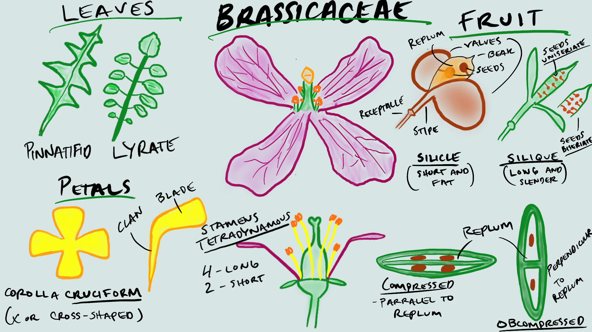

&nbsp;

---

Brassicaceae is the 4th largest family in B.C., with 169 species and varieties.  The family is very important economically, providing cabbage, broccoli, cauliflower (all species or varieties of *Brassica*), mustard, turnips, rapeseed or canola, radish (*Raphanus*), horseradish (*Amoracia rusticana*), and watercress (*Rorippa*).  Numerous genera are cultivated as ornamentals, including *Lobularia* (sweet alyssum), *Matthiola* (stocks), and *Aubrieta*.

&nbsp;

---

## Flowers

Brassicaceae flowers are very characteristic, making them fairly easy to identify to family. The genera and species are more difficult however, and often require ripe fruit and sometimes a microscope to examine minute trichome (hair) structure. Let's look at some flowers. Below you can see the typical 'cruciform' (cross-like) structure of the petals, and 'tetradynamous' stamens.

{width=40%} {width=40%}
{width=40%} 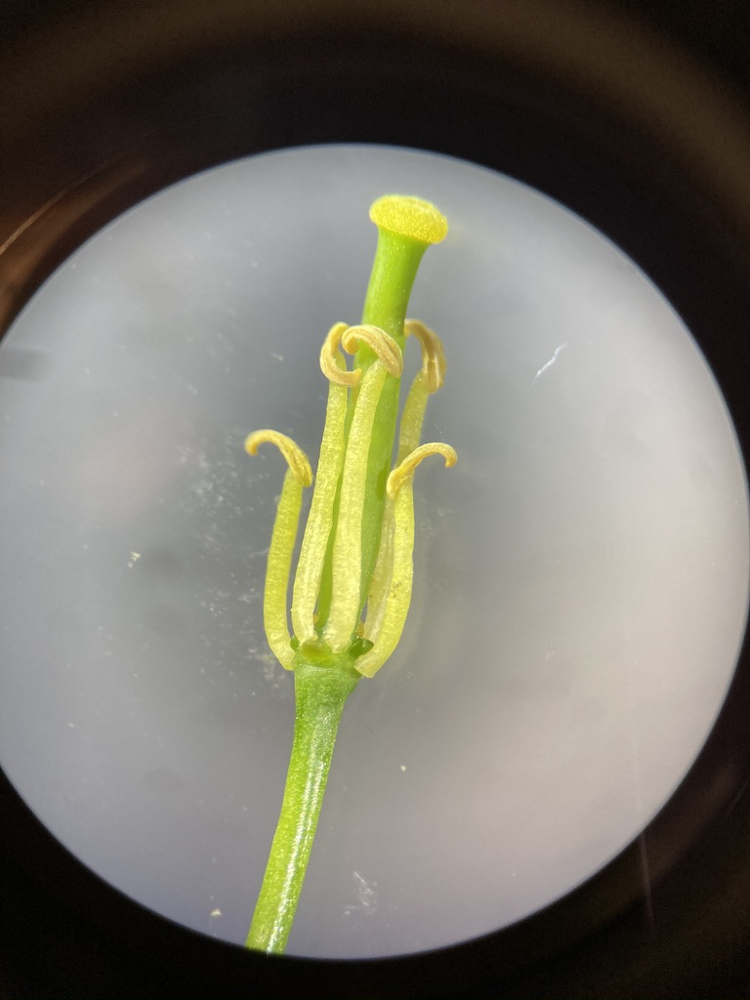{width=40%}

&nbsp;

The petals typically have a narrow "claw" at the base, with the "blade" bending outwards at the throat of the corolla. 

{width=40%} {width=40%}

&nbsp;

---

## Fruit

As mentioned above, much of the Brassicaceae key is concerned with the fruits. The family has two unique fruit types, siliques and silicles. Siliques are more the twice as long as they are wide (appearing long and narrow), while silicles are less than two times as long as wide (appearing short and wide in comparison). Can you identify which is which from the photos below?

{width=40%} {width=40%}
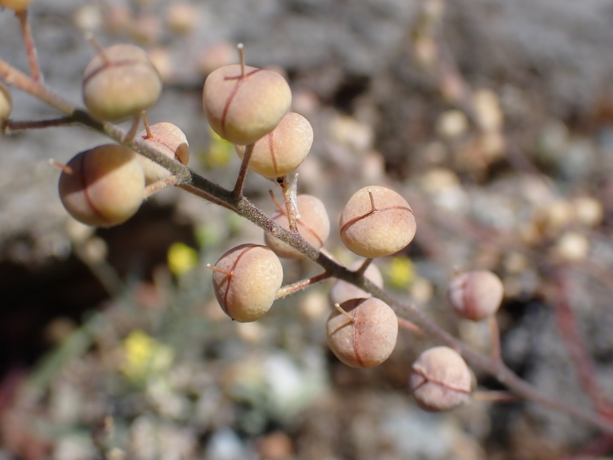{width=40%} {width=40%}

&nbsp;

Siliques and silicles are dehiscent fruit from a 2-carpellate, 2-loculed ovary. The two carpels (or valves) split away from a central structure called a "replum", which is a thin, often papery/translucent plane that sits in between the two valves like a wall. These fruit are typically flattened in two different ways: if the fruit is flattened parallel to the replum (so that the replum is rather wide) we refer to that as "compressed", and if the fruit is flattened perpendicular to the replum (so that the replum is quite thin) we call that "obcompressed". See if you can identify the two valves, replum, and the type of compression in the fruit below. 

<!-- (hint: it is also possible that the fruit are not flattened in either direction, which would be described as "terete", or cylindrical in cross-section...) -->

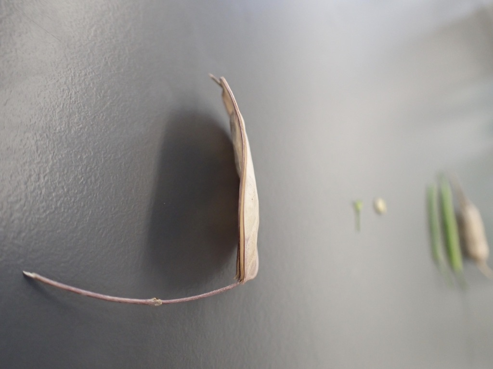{width=40%} 
{width=40%}
{width=40%} {width=40%}
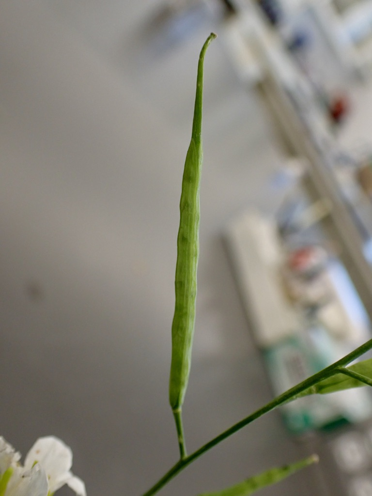{width=40%} {width=40%}

&nbsp;

---

## Leaves

Brassicaceae leaves can be simple or compound, and are arranged alternatively and without stipules. Many leaves are pinnately compound or "pinnatifid", which are pinnately divided or lobed but not all the way to the midrib of the leaf. 

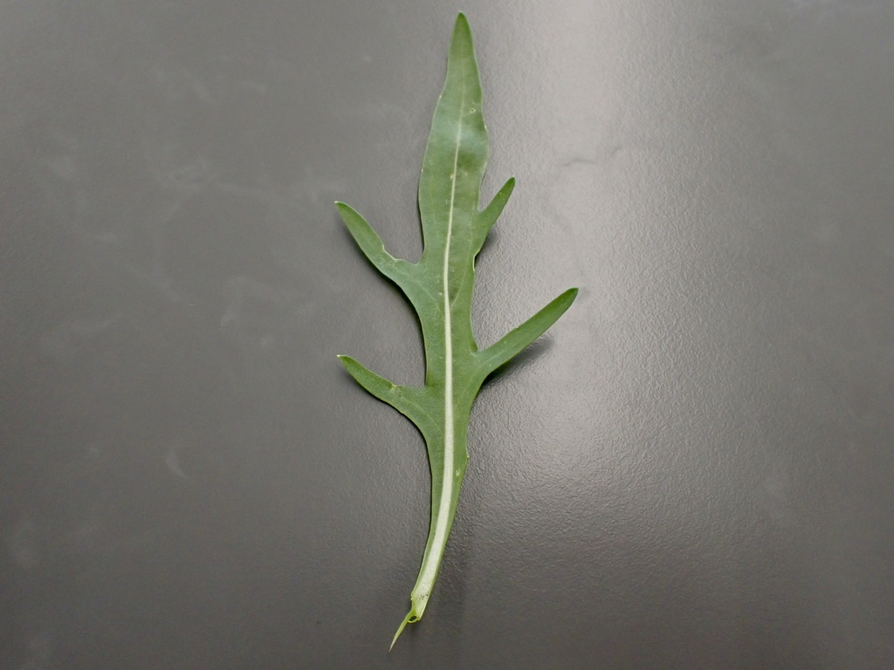{width=40%} 

&nbsp;

Another important characteristic for identification is trichomes, which can be quite complex and varied in the Brassicaceae. A stunning example of intricate trichome morphology is displayed in the genus *Draba* (Evan's personal favorite genus!!!), a hyper-diverse group that are typically only found in alpine areas. *Draba* (amongst many other members of Brassicaceae) have particular trichome patterns that can be useful (and sometimes necessary) to identify identify individual species. Can you identify different types of trichomes in the two *Draba* species below? Make sure you zoom in!

{width=40%}
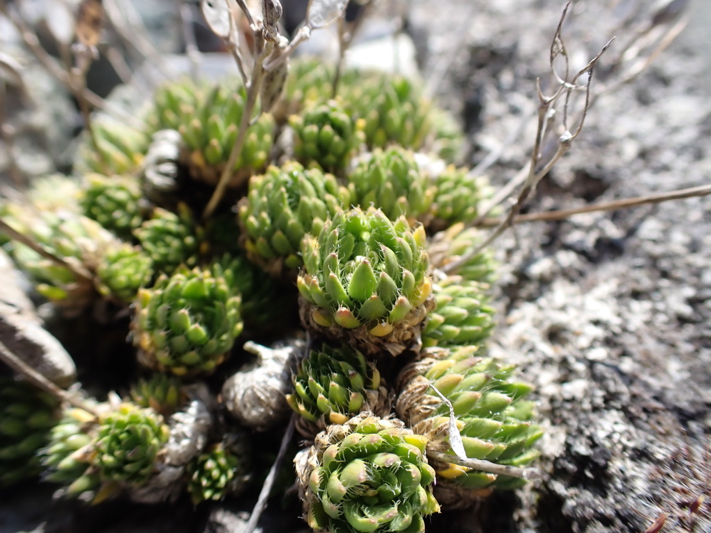{width=40%}

&nbsp;

---

## KNOWLEDGE CHECK 5.1

---

# Malvaceae - Mallow family

---

**1.	Mostly herbs, some shrubs or small trees, usually with stellate hairs.**  
**2.	Leaves simple, petiolate, alternate, palmately veined and often palmately lobed, 	with stipules.**  
**3.	Flowers perfect or rarely unisexual, usually radially symmetrical.  Sepals 5, 	usually fused below, sometimes with calyx-like involucral bracts below the true 	calyx.  Petals 5, separate, short clawed, attached to staminal tube just above 	receptacle.  Stamens numerous, monadelphous, filaments connate into a tube 	around the ovary and style.  Pistil compound, ovary superior, carpels 2-many, 	placentation axile.**  
**4.	Fruit usually a capsule or schizocarp, separating into mericarps.**  
**5.	About 100 genera and 2000 species, widespread but mostly tropical, often in dry 	areas.**  

&nbsp;

Malvaceae is easily recognized by the filaments connate into a tube around the ovary, and the alternate, palmately 3-veined leaves with stellate or scaly pubescence.  It is a small family in B.C. with 10 taxa, half of them introduced weeds.  Several genera are grown as ornamentals, including *Althea*, hollycock, *Hibiscus*, *Sidalcea*, and *Lavatera*.  Cotton (*Gossypium*) is the most important crop in the family; unripe fruits of okra, *Abelmoschus esculentus*, are used as a vegetable and the fleshy red calyxes of *Hibiscus sabdariffa* (roselle or jamaica flower) are used for herbal teas, cold drinks, and jelly.

&nbsp;

---

Those familiar with *Hibiscus* flowers should have a pretty good search image in mind for this family. The flowers tend to be large and conspicuous, 5 showy petals, and numerous stamens and styles fused into a prominent central tube rising out of the center. Here are some examples:

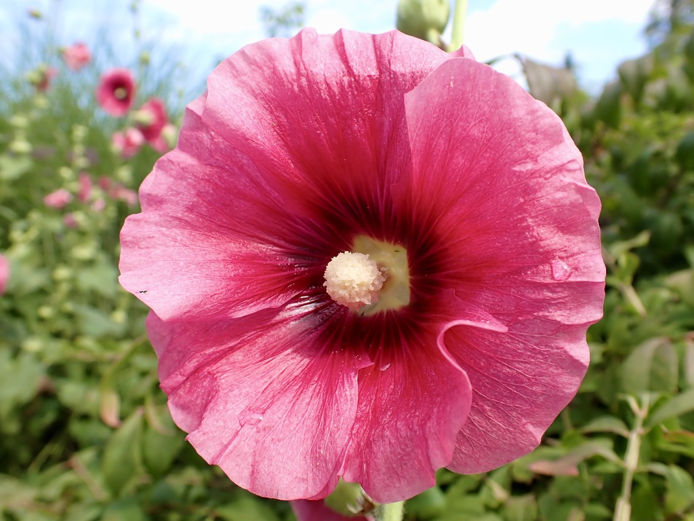{width=40%}
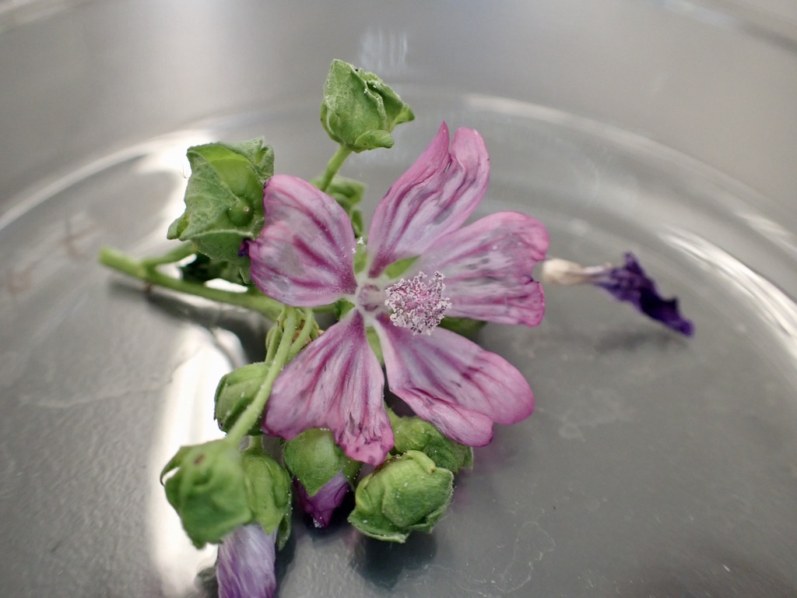{width=40%}

&nbsp;

Here you can see a longitudinal section of the flower:

{width=80%}

And close-ups of the staminal tube with styles emerging through the center:

{width=40%}
{width=40%}
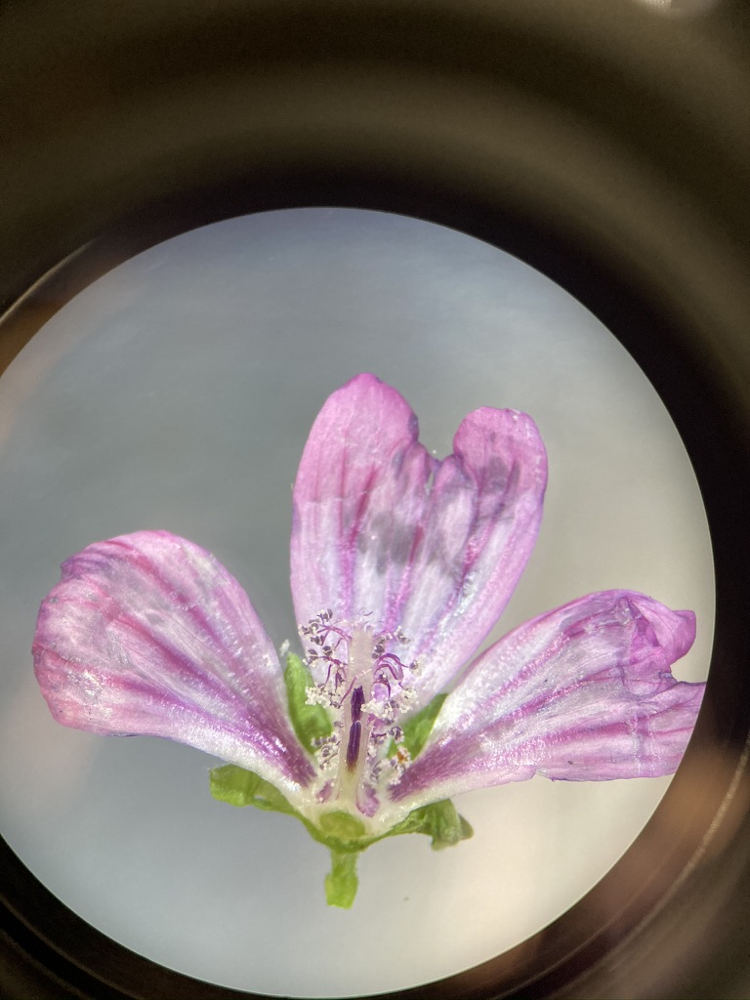{width=40%}
{width=40%}

&nbsp;

Malvaceae flowers tend to have 5 sepals, and many appear to have two sets of sepals. In actuality, the lower ones are a set of calyx-like involucral bracts. 

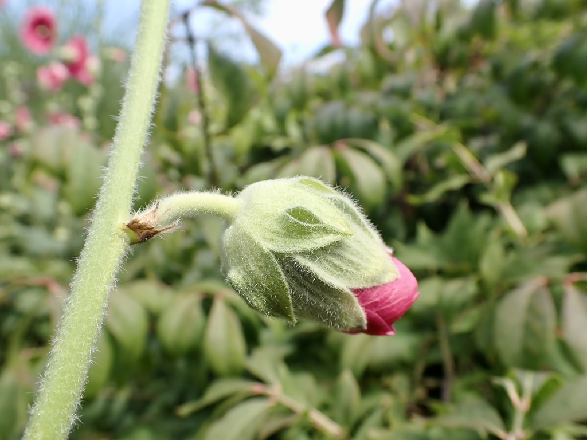{width=80%}

---

Malvaceae species often have leaves with palmate lobes and venation. Many species also have dense pubescence all over the leaves, stems, and calyxes, often comprised of "stellate" trichomes. 

{width=40%}
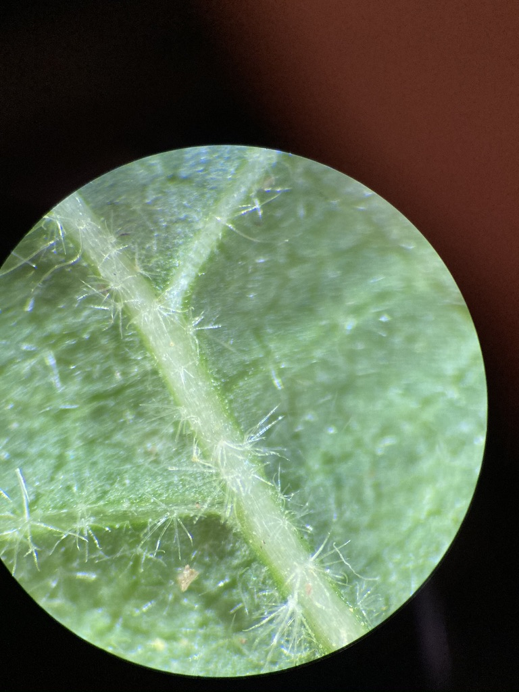{width=40%}
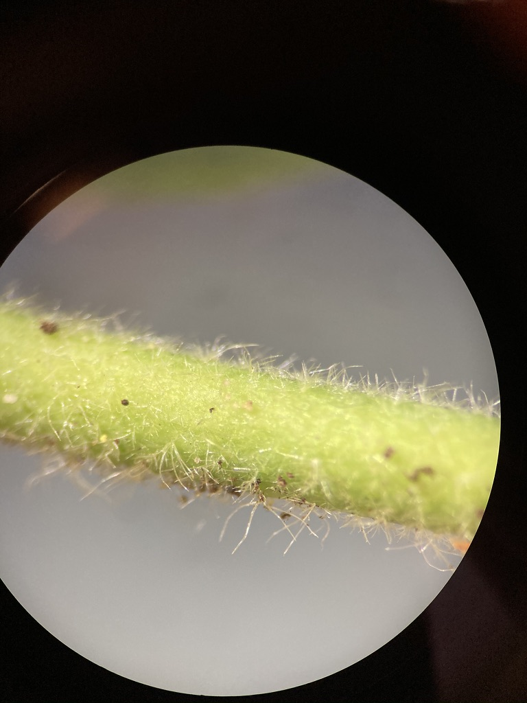{width=40%}
{width=40%}

&nbsp;

---

Malvaceae species either have capsules (in the case of cotton) or "schizocarps" as their fruit type. A schizocarp is a cool looking fruit that somewhat resembles a bundt cake in appearance. It splits into several segments called "mericarps", each representing a single, indehiscent carpel with one seed inside. Once the schizocarp is mature, the mericarps harden and fall out individually.

{width=40%}
{width=40%}
{width=40%}
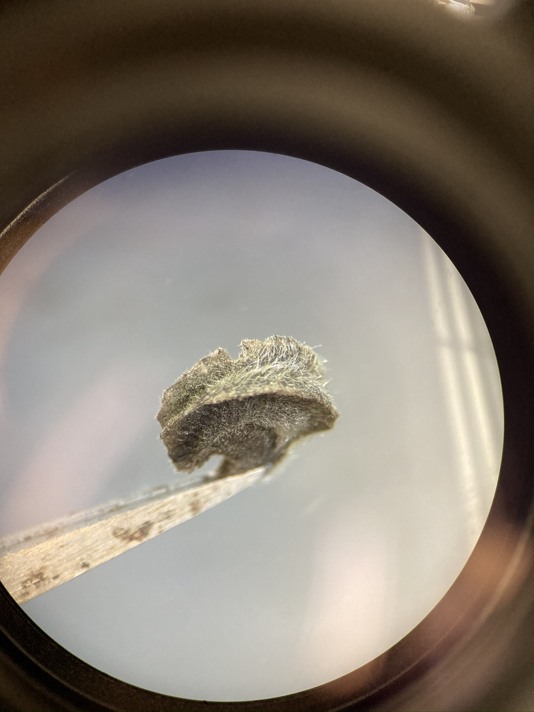{width=40%}

&nbsp;

---

## Ericaceae - Heath family

**1.	Mostly shrubs or autotrophic or saprophytic herbs which are sometimes separated into two other families, the Monotropaceae and Pyrolaceae.**  
**2.	Leaves simple, alternate, often leathery and evergreen, without stipules.**  
**3.	Flowers perfect, usually actinomorphic.  Sepals usually 4 or 5.  Petals usually 4 or 5, usually fused.  Stamens usually 4, 5, 8 or 10, free from corolla, anthers usually with poricidal dehiscence.  Pistil compound, ovary superior or inferior, carpels usually 4 12, placentation axile.**  
**4. 	Fruit a capsule, berry, or berrylike drupe.**  
**5.	About 75 genera and 2,000 species, primarily in cold temperate regions and at high elevations on tropical mountains, often growing in acid soils or bogs.**  

Members of the Ericaceae are common shrubs in B.C.  Familiar genera include *Arbutus*, *Arctostaphylos* (kinnikinnick), *Gaultheria* (salal, wintergreen), *Kalmia* (swamp laurel), *Ledum* (now *Rhododendron*, Labrador tea), *Rhododendron*, and *Vaccinium* (blueberries, cranberries, and huckleberries).  Many genera are cultivated as ornamentals.

The Ericaceae traditionally consists of 4 subfamilies which are sometimes but incorrectly considered separate families.

Ericoideae -  Photosynthetic shrubs, ovary superior, petals usually fused, sometimes free, anthers usually with pores, sometimes slits, pollen shed in tetrads.  (Erica, Rhododendron, Gaultheria).  
Vaccinioideae  -  Photosynthetic shrubs, ovary inferior, petals fused, anthers with pores, pollen shed in tetrads (Vaccinium).  
Pyroloideae - Photosynthetic or saprophytic herbs, ovary superior, petals free or slightly fused, anthers with pores, pollen shed in tetrads (Pyrola).  
Monotropoideae - Saprophytic herbs, ovary superior, petals fused or free, anthers with slits, pollen grains shed individually (Monotropa, Allotropa).  

Recent cladistic analyses of DNA sequences have resulted in Empetraceae and Epacridaceae being added to Ericaceae.  *Empetrum* (crowberry) occurs in B.C. and is basically a wind pollinated Ericaceae with reduced flowers.  Epacridaceae were primarily Australian, and no one could tell them from Ericaceae anyway.

&nbsp;

---

Ericaceae flowers are characterized as "urceolate" or urn-shaped. The corollas are sympetalous (peak at the top to count the number of corolla lobes), and flowers can have superior or inferior ovaries. 

{width=40%}
{width=40%}
{width=40%}
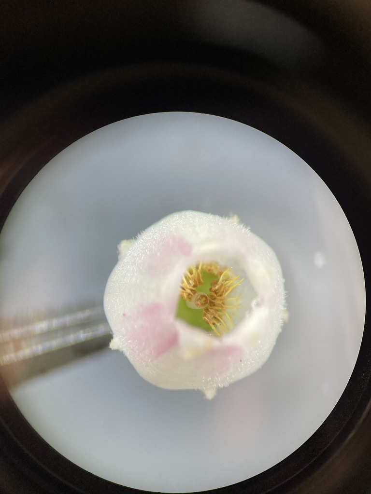{width=40%}

&nbsp;

Ericaceae species have very cool stamens that are adapted to buzz pollination. The stamens have expanded filaments with conspicuous awns that release pollen via "poricidal" dehiscence. When bumblebees visit the flower and climb inside the corolla, the buzzing from their wings vibrates the awns (which act like little tuning forks), causing pollen to be released from the pores on top. Pretty cool! Can you identify the filaments, pores, and awns in the pictures below?

{width=40%}
{width=40%}
{width=40%}
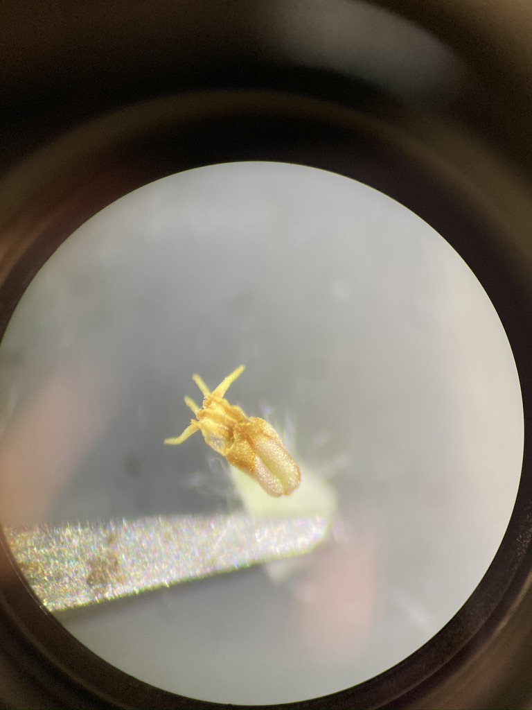{width=40%}

&nbsp;

---

Ericaceae often have berries or berry-like capsules as their fruit type. 

{width=40%}
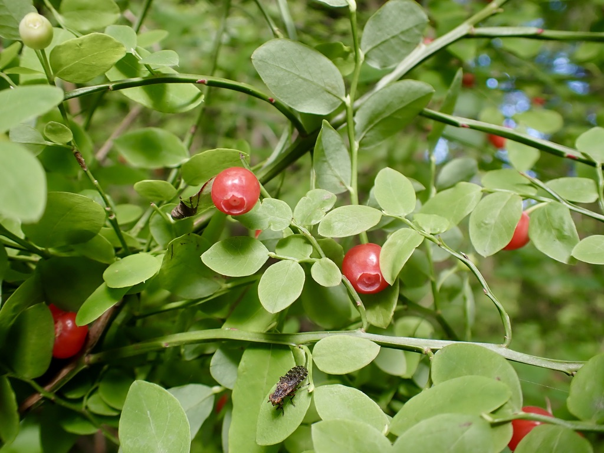{width=40%}
{width=40%}
{width=40%}

&nbsp;

Most are familiar with blueberries (*Vaccinium* sp), which produce berries from an inferior ovary. What indicates that blueberries develop from inferior ovaries?

{width=40%}
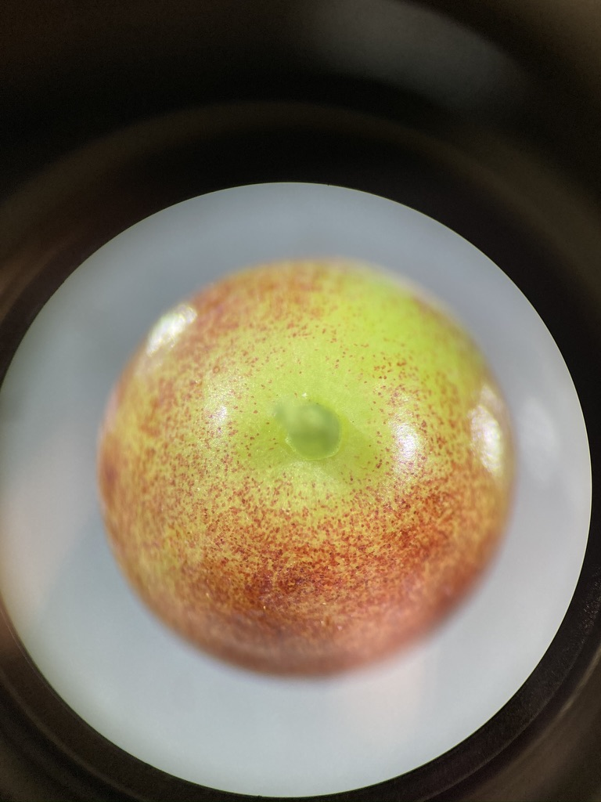{width=40%}

&nbsp;

If you look closely at a salal "berry", you'll see that it actually has a capsule enclosed within a fleshy, juicy calyx. Would this be considered a superior or inferior ovary?

{width=80%}

&nbsp;

---

## Introduction to phylogenetics

&nbsp;
&nbsp;

#### Motivation

Phylogenetics is one of the most important and controversial fields within plant taxonomy. The ability to sequence and compare plant DNA has split, grouped, and uncovered taxa in ways never expected. In modern plant taxonomy, phylogenetic relationships are a key piece of evidence to consider when delimiting species. In this lab, we'll be downloading and aligning DNA sequences from five species chosen from your iNaturalist observations. Using these sequences, we'll construct a phylogenetic tree and consider whether the species relationships support what you have learned about the taxonomic organization (e.g. grouping by family) of these taxa. 

---

&nbsp;
&nbsp;

#### Prerequisites 

Before starting this week's tutorial you will have: 

1. completed some pre-assignment reading on DNA barcoding, multiple sequence alignment, phylogenetics, and their role in plant taxonomy, 

2. completed some pre-assignment reading on why/how Genbank is used by plant taxonomists, 

3. chosen five plant species from your iNaturalist project to use in this activity.

---

&nbsp;
&nbsp;

#### Outcomes

By the end of this tutorial you will have: 

1. experience using Genbank, MUSCLE, and NCBI tree viewer.

2. familiarity with Genbank and the types of data that can be obtained, 

3. the tools and knowledge needed to create your own phylogenetic tree as part of a taxonomic research project.

---

&nbsp;
&nbsp;

#### Activity 1: Search Genbank for sequence data

After selecting your five focal species, [navigate to the Genbank website](https://www.ncbi.nlm.nih.gov/genbank/). From the drop-down menu next to the search bar, make sure that the database selected is *Nucleotide*. Type in scientific name of your first plant, followed by the name of the barcode. For demonstration purposes we'll use five species of pussytoes (*Antennaria*, Asteraceae), and the rbcL barcode. Here's what our first search looks like:

 

The search will return list of sequence submissions from various authors and projects that have barcoded *Antennaria*. When possible, use sequences that were generated from the same project &mdash; you can check by clicking on an entry and looking at the AUTHORS and TITLE entries. For our *Antennaria* sequences, we'll be using rbcL sequences generated by [Fenneman and Graham (2016)](https://open.library.ubc.ca/cIRcle/collections/ubctheses/24/items/1.0340546) as part of their contribution to barcode over 5000 vascular plants [representing the flora of Canada](https://bsapubs.onlinelibrary.wiley.com/doi/full/10.3732/apps.1700079). 

After entering your search query, click on the 'FASTA' option under any entry to see the DNA sequence:

To save the sequence, we'll copy sequence string, as well as the header information (everything in the box above). Paste the FASTA entry into a text editor. Repeat this procedure for the remaining four taxa, pasting the FASTA entries into your text document, with each entry separated by a space. Then, simplify the headers by writing the scientific name with the genus and species separated by an underscore "_". Make sure to keep the ">" symbol at the beginning. 

&nbsp;
&nbsp;

#### Activity 2: Multiple Sequence Alignment

In order to compare the similarities of our sequences, we need to first align them. This ensures that any differences between samples are not caused simply by different reading frames. While we *could* align our sequences by eye, we'll use the MUSCLE algorithm which is much faster and reproducible. [Navigate to the MUSCLE webpage](https://www.ebi.ac.uk/Tools/msa/muscle/), and paste all of your sequencs into the first box:

After pasting your sequences, scroll down and click "Submit". The results page will show you the optimal alignment of your five rbcL sequences. To see the associated phylogram, click on "Phylogenetic Tree" tab:

**MB** maybe we want to get them to continue by pasting the Tree Data in to [NCBI Tree Viewer?](https://www.ncbi.nlm.nih.gov/projects/treeview/)

