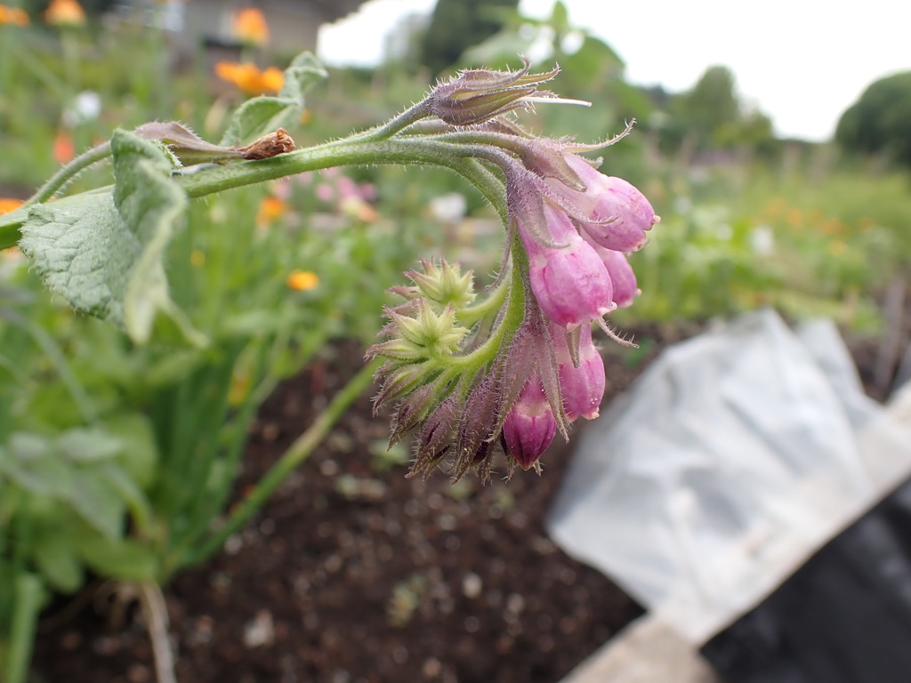
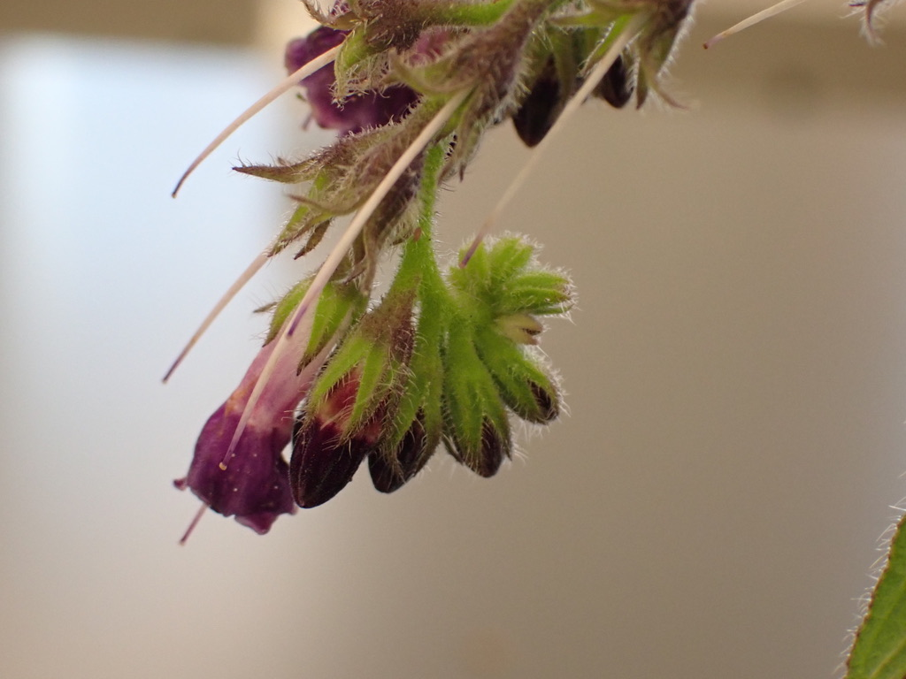
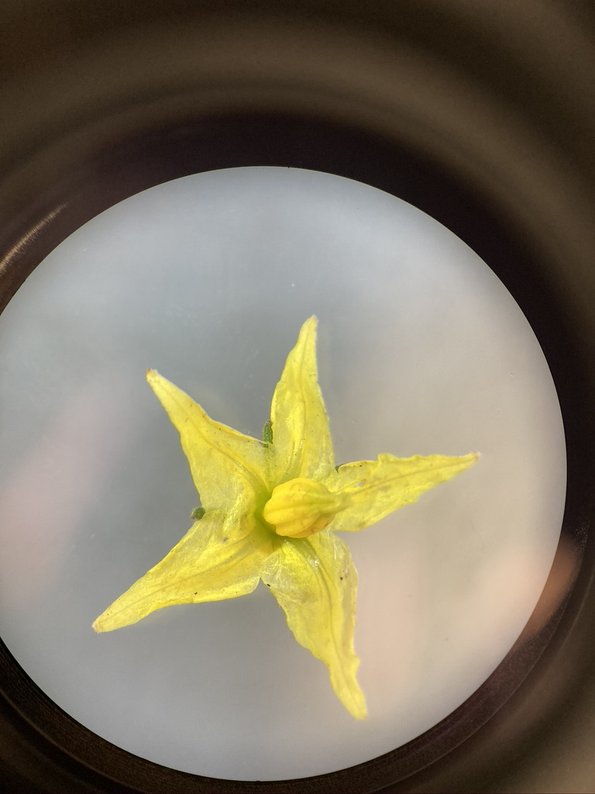
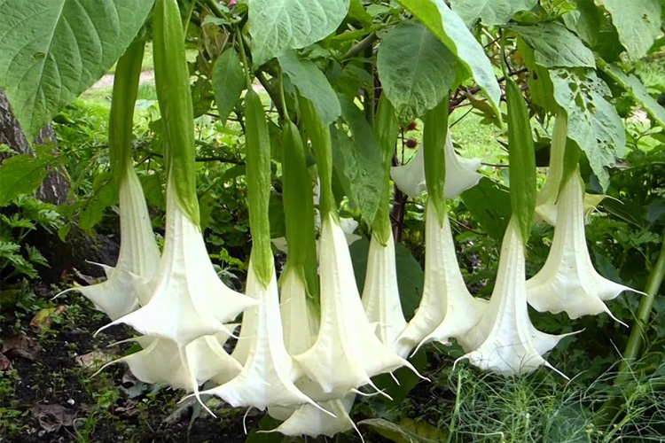

---

# Boraginaceae

**Borage Family**

---

**1.  Herbs (some tropical species are trees or shrubs)**  
**2.  Leaves simple, alternate, commonly hairy, without stipules.**  
**3.	Flowers perfect, usually actinomorphic, usually borne in a scorpioid or helicoid cyme (drepanium).  Sepals 5, free or partially fused.  Petals 5, fused.  Stamens 5, epipetalous.  Pistil compound, ovary superior, carpels 2, but deeply lobed, appearing as 4, style gynobasic, placentation basal.**  
**4.  Fruit 4 nutlets.**  
**5.  About 100 genera and 2000 species, widely distributed.**  


## Diagrams

---

## Leaves

Boraginaceae does not have super distinctive leaf characteristics - they are typically simple, alternate, and lacking stipules. One good character, however, is that they tend to be covered in stiff (and irritating to touch!) trichomes. These trichomes cover most vegetative parts of the plant, including the stems, leaves, peduncles/petioles, and calyxes. 

<p align="center">
{width=100%}
</p>

</br>

<p align="center">
{width=100%}
</p>

---

## Flowers

The flowers and inflorescence structure of Boraginaceae are quite distinctive, and once you get the visual in your mind it should be fairly easy to narrow down to this family. The flowers are usually actinomorphic, with 5 sepals, 5 fused petals, and 5 stamens. In addition, there are often corolla appendages (aka fornix) forming a ring around the throat of the flower. You can see the fornices quite well in the *Myositis* sp. (Forge-me-nots) below.

<p align="center">
{width=100%}
</p>

</br>

Here's another example from *Anchusa* sp.

<p align="center">
{width=100%}
</p>

</br>

*Borago officinalis* (Borage) takes the corolla appendages to the next level, forming two fornices on each petal (instead of the single fornix that is usually present). The inner fornix takes the shape of a tower or pedestal, with epipetalous stamens emerging from the inner curve of the fornix. Examine the below pictures (use the family diagrams to help you), and see if you can identify the different parts of the Borage flower.

<p align="center">
{width=100%}
</p>

</br>

<p align="center">
{width=100%}
</p>

</br>

<p align="center">
{width=49%} {width=49%}
</p>

</br>

Here you can see a close-up of the inner fornix with the stamen attached.

<p align="center">
{width=100%}
</p>

</br>

---

Another good characteristic for this family is the inflorescence type. Members of the Boraginaceae have helicoid or scorpioid cymes (see the family diagram for cartoons of what these look like). The development of the flowers spatially and temporally tend to give the inflorescence a coiled look, quite like a fern fiddlehead or a scorpion's tail (hence "scorpioid" cyme). For the purposes of our lab, we won't be asking you to differentiate between scorpioid vs helicoid cymes, but getting an appreciation for what they look like can help you identify this family in the field (or narrow down to Boraginaceae in a family ID quiz). Here are some examples:

<p align="center">
{width=100%}
</p>

</br>

<p align="center">
{width=100%}
</p>

</br>

<p align="center">
{width=100%}
</p>

</br>

---

## Fruit

Similar to the Lamiaceae, members of the Boraginaceae typically form nutlets as their fruit type. They form four nutlets from two carpels, with a gynobasic style attached at the base and emerging from the center of the four nutlets. The nutlets also often have a thickened rim at the base. Here you can see a flower with 3 developed nutlets (the fourth has already fallen out):

<p align="center">
{width=100%}
</p>

</br>

And here you can see the depressions that the thickened rims of the nutlets made in the receptacle of the flower.

<p align="center">
{width=100%}
</p>

</br>

---

## KNOWLEDGE CHECK 7.1

Draw a *Borago officinalis* flower, and make sure to label the following: sepals, petals, fornices, stamens, pistil, trichomes.

</br>

---

# Solonaceae

**Potato or Nightshade Family**

**1.  Herbs, vines, shrubs, or trees.**
**2.  Leaves simple or occasionally pinnately lobed to compound, alternate, without stipules.**
**3.  Flowers perfect, actinomorphic or sometimes zygomorphic.  Sepals 5, fused.  Petals 5, fused.  Stamens 2, 4, or usually 5, epipetalous, sometimes with anthers connivent (converging or coming together but not fused).  Pistil compound, ovary superior, carpels 2, placentation axile.**
**4.  Fruit a berry or capsule.**
**5.  About 85 genera and more than 2200 species, primarily in tropical America.**

The Solanaceae is not a significant family in the flora of B. C., but it is one of the most important in agriculture, providing foods and drugs.  Important crops include *Solanum* (potato, eggplant, tomato), *Physalis* (tomatillo, ground cherry), *Capsicum* (red, yellow, and green peppers), and *Nicotiana* (tobacco).  Many species produce poisonous alkaloids.  Alkaloids from *Atropa* (deadly nightshade or belladonna), *Hyoscyamus* (henbane), *Datura*, *Mandragor*a (mandrake), and *Brunfelsia* are used as drugs, hallucinogens, and poisons.  *Petunia* is the most important ornamental member of the Solanaceae in temperate regions.

---

## Flowers

Members of the Solanaceae are characterized by 5 fused sepals and petals, and typically actinomorphic flowers. Corollas tend to be either wheel-shaped (rotate), trumpet-shaped (salverform), or funnel-shaped (funnelform). See if you can identify these different corolla shapes in the flowers below.

<br>

*Solanum lycopersicum* (tomato)

<p align="center">
{width=100%}
</p>

<br>

*Nicotiana* sp. (tobacco)

<p align="center">
{width=100%}
</p>

<br>

*Datura* sp.

<p align="center">
{width=100%}
</p>

<br>

---

# Apiaceae - Carrot Family

---

**1.	Mostly herbs.**
**2.	Leaves usually compound, alternate, without stipules, but usually the petiole has a sheathing base.**
**3.	Flowers usually perfect or andromonoecious (perfect and male on the same plant), radially symmetrical.  Sepals 5, usually small and sometimes absent.   Petals 5 (0), not fused.  Stamens  5, free.  Pistil compound, ovary inferior, carpels 2, placentation axile.  Inflorescence an umbel.**
**4.	Fruit a schizocarp.**
**5.	About 300 genera and 3000 species, mainly in north temperate regions.**

The Apiaceae is the 13th largest family in B.C., with 61 taxa occurring in the province.  The family is easily recognized by its usually compound leaves, umbellate inflorescence, 5-merous flowers with an inferior ovary, and distinctive fruit, but genera and species are often difficult to identify.  Many keys require mature fruits for definite identification.  The plants and especially fruits often contain aromatic oils, which are used as flavorings.  Many species are edible, but some are deadly poisonous, including the poison hemlock with which Socrates was executed.

Cultivated crops, herbs, and spices include *Apium* (celery, celeriac), *Pastinaca* (parsnip), *Daucus* (carrot), *Foeniculum* (fennel), *Anethum* (dill), *Cuminum* (cumin), *Pimpinella* (anise), *Petroselinum* (parsley), *Carum* (caraway), and *Coriandrum* (coriander, Chinese parsley, or cilantro).


---

# R Assignment 2

**Mapping Species Distributions using R and GBIF**

---

## Motivation

At its core, plant taxonomy is the science of naming and grouping plants based on their shared traits. Throughout this course we've seen how growth habit, morphology, and geographic distribution can provide valuable information about how to classify and define plants. When we consider geographic information, we are asking questions like "do the plants occupy similar or distinct habitats?" and "are the ranges of these plants disjunct or overlapping?". Depending on the answer to these questions, our decision to group or separate plants (and give them different names) can be changed dramatically. In this R activity, we'll demonstrate how we can use publically available occurence data to create distribution maps for plants and use these maps to make taxonomic decisions.


&nbsp;
&nbsp;

## Pre-lab

Before starting this week's lab you will have:

1. Completed R Assignment 1 (Lab 6) and the pre-readings assigned there.

2. Insert GBIF video tutorial here? Or have them do it in unit 1 (note: GBIF intro material lives as comments in Lab 6).

3. Read Chapter 2 up to [section 2.3.1 in Modern Dive](https://moderndive.com/2-viz.html). Make sure you are able to produce Figures 2.2 and 2.3 on your own (using the code provided in the textbook). If your R is giving errors while trying to make these figures, please reach out to the TAs to fix them &mdash; it won't be possible to finish this lab without the `ggplot2` package working correctly.

3. Selected your favourite plant group for creating a species distribution map (not sure if we're doing this)

&nbsp;
&nbsp;

---

#### Outcomes

By the end of this tutorial you will have: <br>

1. experience manipulating and mapping species distribution data in R, <br>

2. familiarity with GBIF and the types of data that can be obtained, <br>

3. More?

&nbsp;
&nbsp;

---

## Mapping Species Distributions

In previous labs we familiarized ourselves with GBIF, R, and RStudio. Today we'll be running a script that collects, filters, and maps distribution data for five species of "prickly pear" cacti (Opuntioideae: Cactaceae):

_Opuntia basilaris_ (Mojave, Colorado, Utah)

_Opuntia fragilis_  (Northwestern)

_Opuntia humifusa_  (Eastern)

_Opuntia polyacantha_ (Great Plains, foothills of Rocky Mtns)

_Opuntia stricta_ (Gulf Coast and Caribbean)

First let's install the required packages:

```{r eval = FALSE}
install.packages("mapr", "rgbif", "spocc", "taxize")

```

These packages are designed for connecting with the GBIF database (`rgbif`, `spocc`, `taxize`), filtering data (`tidyverse`), and mapping (`mapr`). Once installed, use the `library()` function to attach the packages (we'll also attach `tidyverse` to help with data wrangling and plotting):

```{r, results = 'hide', warning = FALSE, message = FALSE }

library(here)
library(mapdata)
library(mapr)
library(spocc)
library(taxize)
library(tidyverse)

```


Now let's get some occurrence data from GBIF!

```{r}
# The `get_gbifid()` function searches GBIF for taxon IDs associated with your search query. We wrote the code as `taxize::get_gbifid()` to be clear about which package the function originated from (`taxize`), but this isn't usually necessary. 


# opuntia_ids <-
#   taxize::get_gbifid(
#     sci=c("Opuntia basilaris Engelm. & J.M.Bigelow",
#           "Opuntia fragilis (Nutt.) Haw.",
#           "Opuntia humifusa Raf.",
#           "Opuntia polyacantha Haw.",
#           "Opuntia stricta (Haw.) Haw."),
#     rank='species',
#     rows = 1)

opuntia_wishlist <-
  c("Opuntia basilaris Engelm. & J.M.Bigelow",
    "Opuntia fragilis (Nutt.) Haw.",
    "Opuntia humifusa Raf.",
    "Opuntia polyacantha Haw.",
    "Opuntia stricta (Haw.) Haw.")
```


In this first step we're creating a list of all of the plant species that we're hoping to get GBIF data for. The `<-` operator stores the results in an object that we named `opuntia_wishlist`. By storing the results in an object we can later return to the object and inspect it, subset it, and pipe it to other functions. In the following step we'll use the `occ()` function to search GBIF for the species records:

```{r}
opuntia_metadata <- 
  occ(query = opuntia_wishlist, from = 'gbif', limit = 500)
```

In this code we've created a new object called `opuntia_metadata`. This object contains occurrence records found by the `occ()` function, where we specified our taxon ID (contained in `opuntia_ids`) and told the function that we wanted our data `from = gbif` (instead of another database) and that we wanted a maximum of `500` records. Let's inspect the structure of the `opuntia_metadata` object:

```{r}
str(opuntia_metadata, max.level=1)
```

The output tells us that `opuntia_metadata` is a `List` object with 9 named elements. We are specifically interested in the named element `$gbif`, so we can simplify our object by subsetting:

```{r chunk7}
opuntia_simple <- opuntia_metadata$gbif$data
```

While writing this code, we discovered that the `opuntia_metadata` object is pretty complex and with lots of layers! The code above says to take the large object `opuntia_metadata` and select the element named `$gbif`. Then, within the element `$gbif`, select the sub-element `$data`. Within `$data` there are 5 elements, each one contains the lat-long information for one of our *Opuntia* species.

Let's look at the lat-long data for *O. basilaris*:

```{r}
opuntia_simple$`Opuntia_basilaris_Engelm._&_J.M.Bigelow`
```

The output is pretty big and messy! The output tells us that it's a `tibble` (a type of spreadsheet) with 500 rows and 73 columns. Each row is a record of where _Opuntia basilaris_ has been found or collected. Each column is some information associated with that record. While some of the columns are useful (e.g. the latitude and longitude), most columns aren't needed (we'll get rid of them later). In the next step, we'll combine the five separate `tibbles` into one:

```{r, message = FALSE}

latlong <- c(1:3, 7, 16, 50, 53)

opuntia_combined <-
  full_join(
    opuntia_simple$`Opuntia_basilaris_Engelm._&_J.M.Bigelow`[, latlong], 
    opuntia_simple$`Opuntia_fragilis_(Nutt.)_Haw.`[, latlong]) %>% 
  full_join(., opuntia_simple$`Opuntia_humifusa_Raf.`[, latlong]) %>%
  full_join(., opuntia_simple$`Opuntia_polyacantha_Haw.`[, latlong]) %>%
  full_join(., opuntia_simple$`Opuntia_stricta_(Haw.)_Haw.`[, latlong])
```

Above, we used the `full_join()` function to merge the data. We specified that we only wanted to keep certain columns (columns `1:3, 7, 16, 50, 53`). Everything else was discarded. Whew! This is a lot of organizing.. we're almost there. Before we get to mapping, we should check our data for synonyms. The `unique()` function tells us how many unique entries exist within a column:

```{r}
unique(opuntia_combined$scientificName)
```

Unfortunately, lots of synonyms were included in the results. We'll make a object containing the names we want to keep, and use the `filter()` function to get rid of everything else:

```{r}
# filter out synonyms
# filter out entries outside of North America
opuntia_fil<-
  opuntia_combined %>%
  filter(scientificName == opuntia_wishlist) %>%
  filter(longitude < -58 & latitude > 18.1) %>%
  filter(basisOfRecord == "HUMAN_OBSERVATION")
```

We're ready to map! Pick some colours for your species (you can pick your own [from here](http://www.cookbook-r.com/Graphs/Colors_(ggplot2)/)):

```{r}
mycolors <- c( "#E69F00", "#56B4E9",  "#F0E442", "#D55E00", "#CC79A7")
```

And map using the `map_ggplot()` function:

```{r}
mapr::map_ggplot(opuntia_fil[,1:3], color = mycolors) +
      coord_fixed(xlim = c(-135, -55 ),  ylim = c(10, 90))
```


Beauty! After all of that hard work, we'll save the lat-long data object as an .rds file. We'll use this data again in Lab 10. If you downloaded or forked the [BIOL324 folder from the GitHub site](https://github.com/mannfred/BIOL324), you can run this code:

```{r}
saveRDS(opuntia_fil, file = here('R_scripts/filtered_gbif_dataset.rds'))
```
---

&nbsp;
&nbsp;

#### Activity 3: Creating your own species distribution map

MB: Not sure if we're going this route.. let's discuss!

MB: Basically, the existing code can be modified to replace _Opuntia_ with any other plant name. Re-running the code will create a map for any species that GBIF has records for. Of course, some taxa are have more complicated nomenclature, and sometimes weird entries make it onto the map. In these cases, a little troubleshooting is required. Also, if one wanted to search for genera, families, orders, etc. some additional modifications are needed. For the majority of students in BIOL413, generating their own maps didn't require my intervention.

<br>
<br>


