---

# Asteraceae

**Aster or Composite Family**

---

**1.	Usually herbs, some shrubs.**  
**2.	Leaves simple or compound, opposite or alternate, without stipules.**  
**3.	Inflorescence is a head: a group of sessile flowers surrounded by involucral bracts (also called phyllaries).  Heads may be variously arranged (eg. raceme of heads).  **  
**Flowers perfect or imperfect, radially symmetrical or zygomorphic.  Heads with tubular disk florets or flattened ray florets or both.  Sepals highly modified, absent or 2-many, the calyx reduced to hairs or scales called the pappus.  Petals 5, fused.  Stamens 5, epipetalous, the anthers fused into a tube (syngenesious stamens).  Pistil compound, ovary inferior, unilocular, with one ovule, carpels 2, placentation basal.**  
**4.	Fruit an achene (sometimes called a cypsela by purists).**  
**5.	Probably the largest family of plants, with nearly 1000 genera and more than 20,000 species, worldwide.**  

The Asteraceae is the largest family in B.C., with 396 species and varieties.  In Hitchcock and Cronquist the family is divided into 2 subfamiles and into 12 tribes.  In lecture you will learn about the current views on composite phylogeny.  

- **Asteroideae** disk or disk and ray flowers, sap not usually milky.  Some of the tribes common in North America include:
  - Cynareae (Cardueae):  Heads discoid or with bilabiate flowers, plants often spiny (thistles), receptacle usually bristly, style with a ring of hairs, anthers tailed.
  - Eupatorieae:  Heads discoid, never yellow, not common in B. C.
  - Inuleae:  Anthers tailed, white-woolly herbs.
  - Senecioneae:  Involucral bracts in one main series and all the same length, except for a few very small ones at the base, often black tipped, pappus of capillary bristles.
  - Anthemideae:  Involucral bracts with papery and dry edges, leaves alternate.
  - Heliantheae:  Involucral bracts usually green, pappus of chaffy awns or none, chaffy receptacular bracts usually present.
  - Astereae:  Involucral bracts usually green, receptacle naked, leaves alternate.
- **Lactucoideae** (or Cichorioideae): ligulate flowers only, sap usually milky. 
  - Cichorieae (only tribe in this subfamily)

Many genera are grown as ornamentals, such as *Dahlia*, *Tagetes* (marigold), *Cosmos*, *Aster*, *Zinnia*, *Chrysanthemum*, *Callistephus* (China aster), and others.  Crop plants are rather few for the size of the family but include *Lactuca* (lettuce), *Helianthus* (sunflower), *Carthamnus* (safflower), *Cynara* (artichoke), *Tragopogon* (salsify, oyster plant), *Cichorium* (chicory), and *Artemisia* (tarragon).  Many Asteraceae are pernicious weeds.

---

## Diagrams

<p align="center">
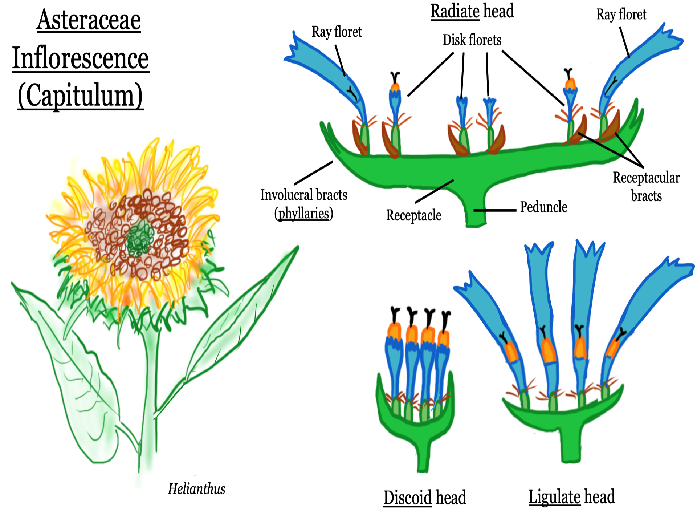{width=100%}
</p>

<br>

<p align="center">
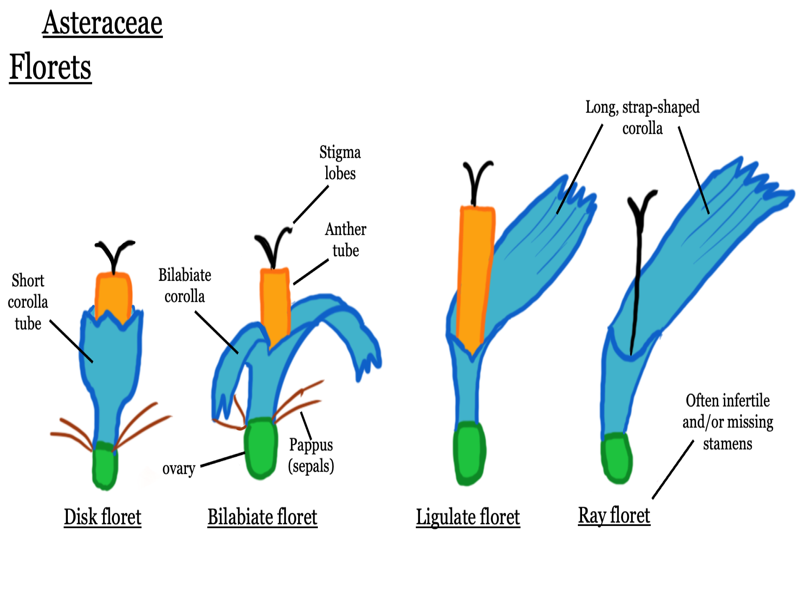{width=100%}
</p>

<br>

<p align="center">
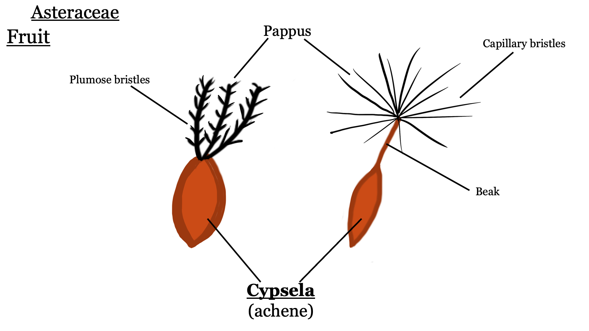{width=100%}
</p>

<br>


---

## Inflorescences

The mind-blowing thing about members of the Asteraceae is that what we would intuitively think of as a flower is actually an inflorescence (aka head or capitulum) made up of many tiny flowers (florets). This inflorescence structure is rather unique and is a reliable indicator for this family. There are several important structures associated with the flower heads that vary considerably between genera/species, and are extremely important for correct identification (in particular the involucral bracts or "phyllaries"). 

The capitulum of *Helianthus* (sunflower) is a good example to start with because it displays most of the important inflorescence structures. See if you can identify all of the following features (refer to the diagram in the lab manual): receptacle, ray floret, disk floret, receptacular bracts, ovary, pappus, corolla, style, stigma (stamens are hidden within the corolla and not really visible).

<br>

<p align="center">
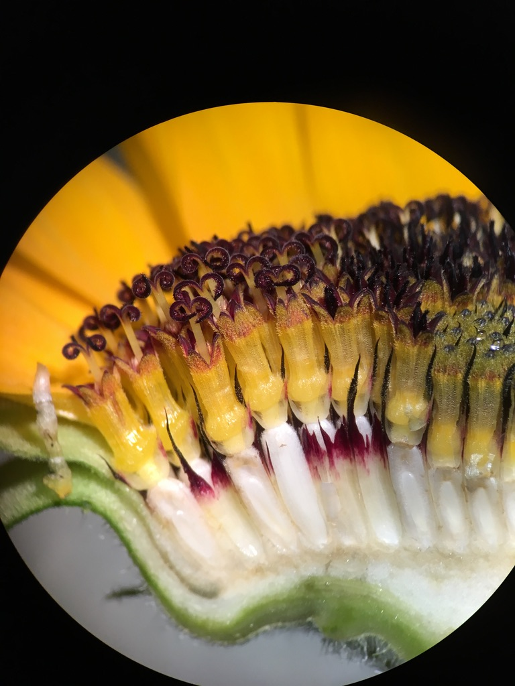{width=100%}
</p>

<br>

*Helianthus* has "radiate" heads (with both disk and ray florets), which is the most typical flower head structure. Other common inflorescence types include "discoid" heads (which only have disk florets) and "ligulate" heads (which only have ray or ligulate florets). 

Here are a few more examples of **radiate** heads. Note the difference in floret structure between those in the center and those on the perimeter.

<p align="center">
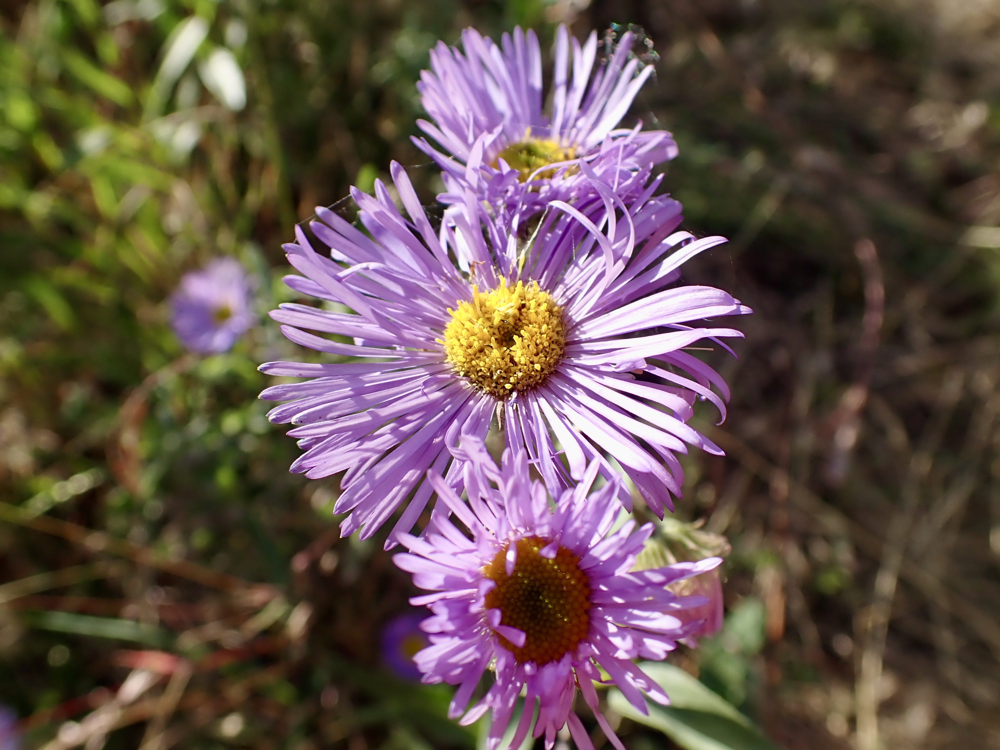{width=100%}
</p>

<br>

<p align="center">
{width=100%}
</p>

<br>

<p align="center">
{width=100%}
</p>

<br>

---


Here is an example of a **discoid** flower head. Notice how ray florets are absent.

<p align="center">
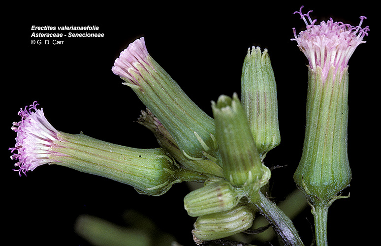{width=100%}
</p>

<br>

A variation on discoid heads is where all the florets are the same type, but may have longer bilabiate corollas (these are often included in the "discoid" category). This is quite typical in the tribe Cynareae, which includes thistles and artichokes. 

<br>

*Cirsium arvense* 

<p align="center">
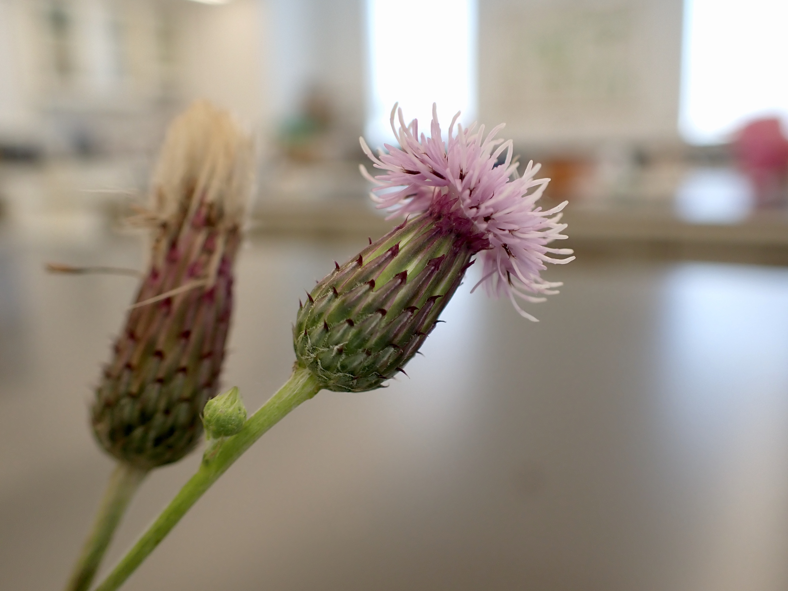{width=49%} 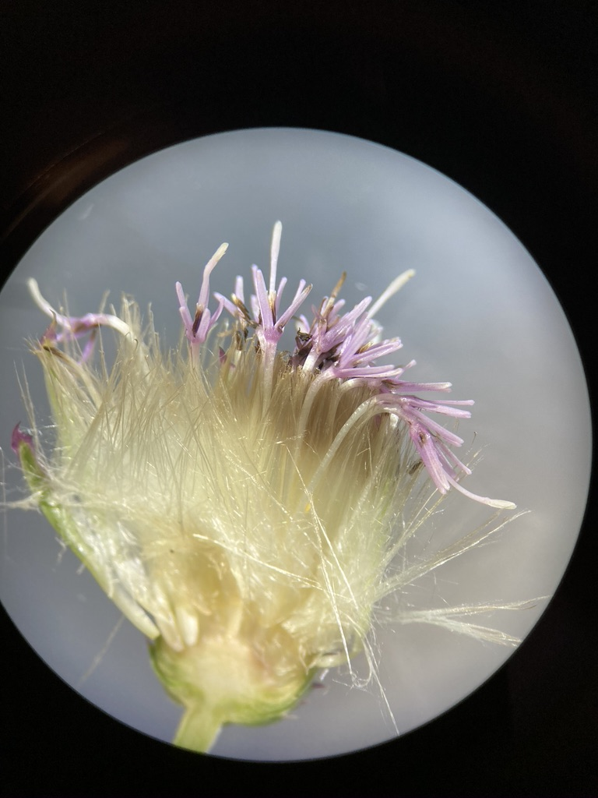{width=49%}
</p>

<br>

*Cynara scolymus* (artichoke)

<p align="center">
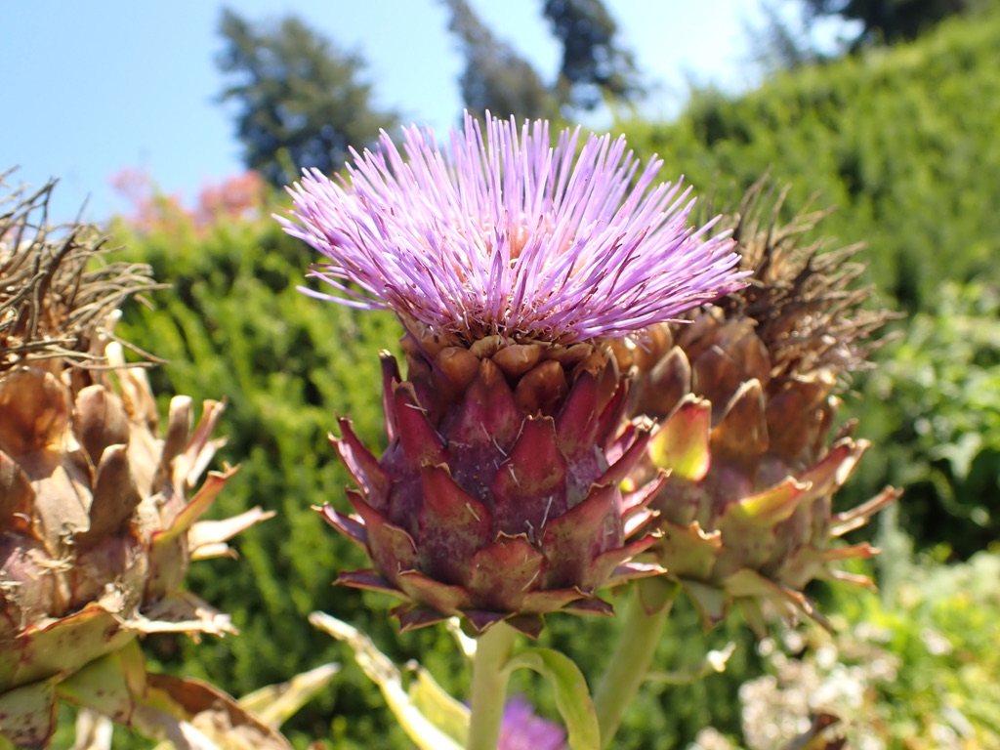{width=100%}
</p>

<br>

---

**Ligulate** heads are typical of the Cichorieae tribe, and include many familiar plants like dandelions (*Taraxacum* sp.) and lettuce (*Lactuca* sp.). These plants have no central set of disk florets, and are made up entirely of ligulate florets with long petals.

<br>

*Agoseris glauca*

<p align="center">
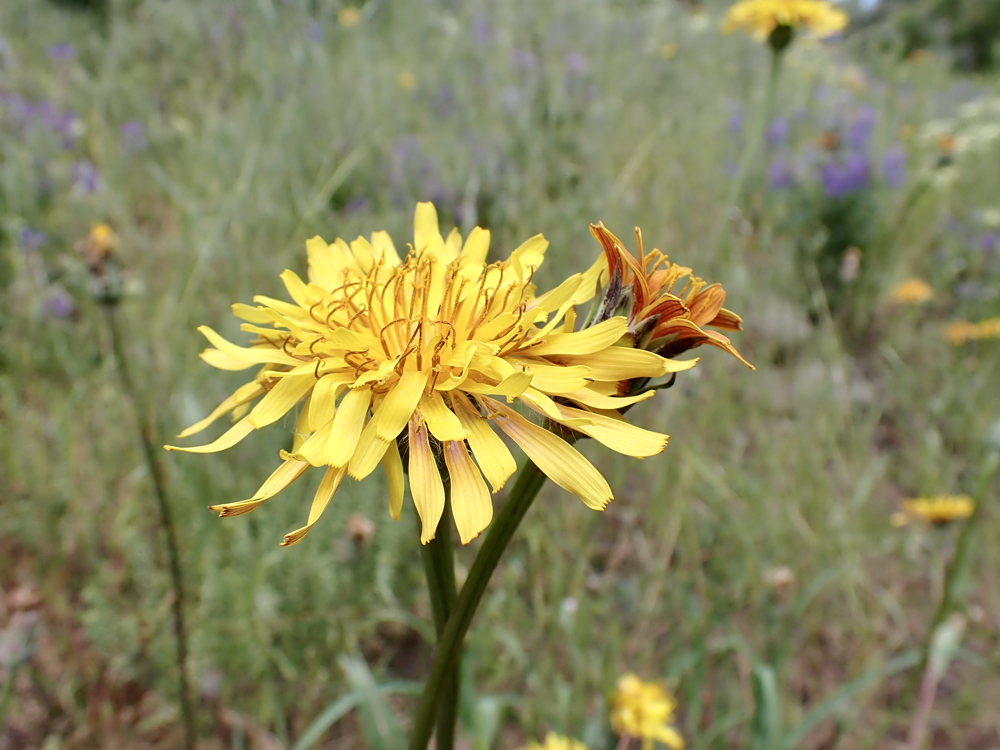{width=100%}
</p>

<br>

*Hieracium triste*

<p align="center">
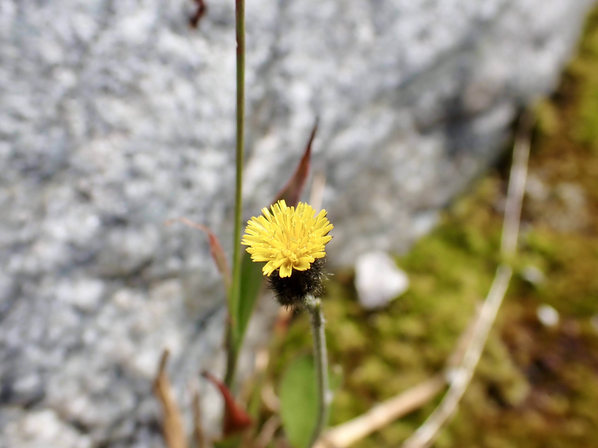{width=100%}
</p>

<br>

*Tragopogon dubius*

<p align="center">
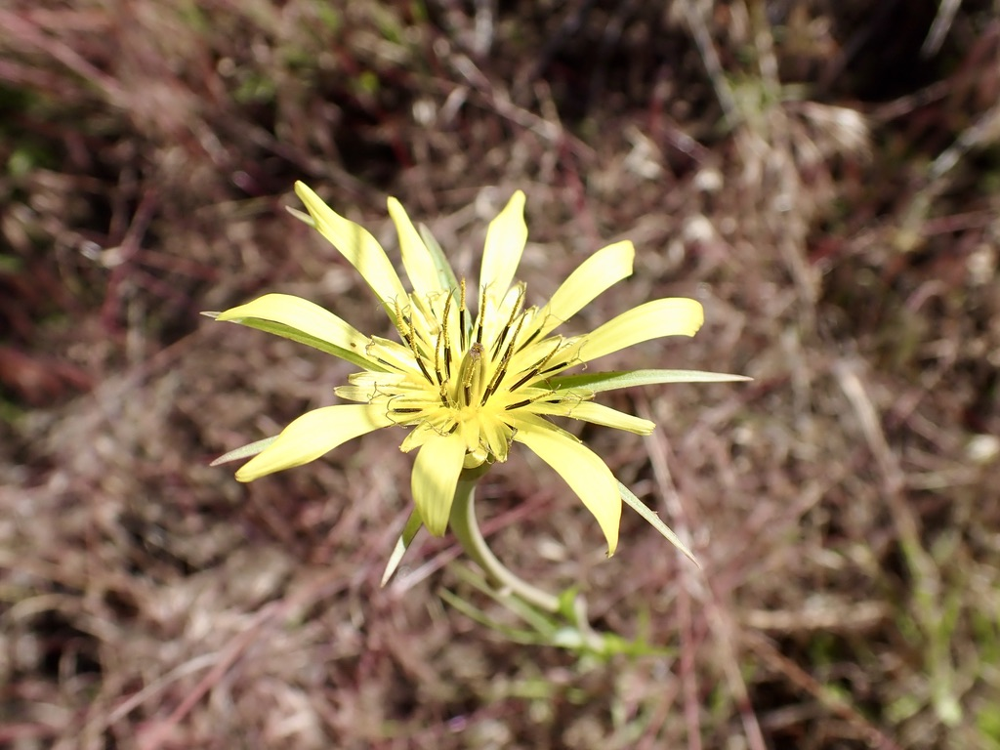{width=100%}
</p>

<br>

---

## Phyllaries

One of the most important characters for distinguishing between species/genera in the Asteraceae are their involucral bracts (aka phyllaries). You might mistake the phyllaries for sepals if you didn't know that the flower head is an inflorescence instead of an individual flower. 

Many phyllaries are green and leafy. The arrangement of the bracts can help point you to different tribes. For example, members of the Senecioneae tribe typically have bracts in a single series (they don't overlap and are neatly lined-up in a single row) like in this plant you've already seen:

<p align="center">
{width=100%}
</p>

<br>

Members of the Astereae tribe tend to have green involucral bracts that overlap in multiple series. 

<p align="center">
{width=100%}
</p>

<br>

Members of the Anthemideae have phyllaries with dry, papery margins.

<p align="center">
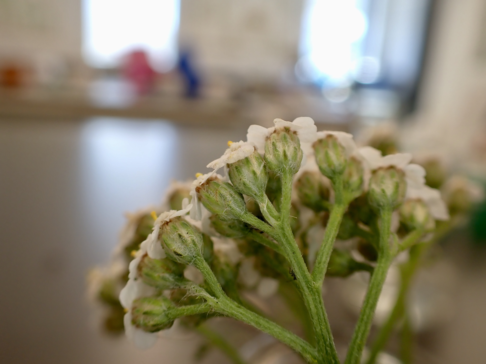{width=100%}
</p>

<br>

And members of the Cynareae of course have spikey (often quite painful) phyllaries (e.g., thistles, artichokes).

<p align="center">
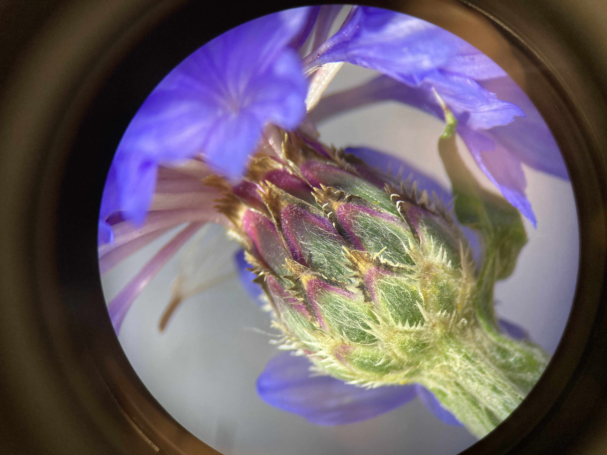{width=49%} {width=49%}
</p>

<br>


---

## Florets

Flowers are reduced to florets in Asteraceae, and have been modified quite significantly from your typical flower structure. The 5 petals are fused into a tube, and within the corolla tube the 5 epipetalous stamens have their anthers fused into a tube as well (syngenesious stamens). The sepals on the other hand have been reduced to hairs or scales (called "pappus" in this family). The pappus often remains after fertilization, and acts as a wind dispersal mechanism for the resulting fruit. 

Can you make out the ovary, pappus, corolla, and style in the disk floret pictured below?

<p align="center">
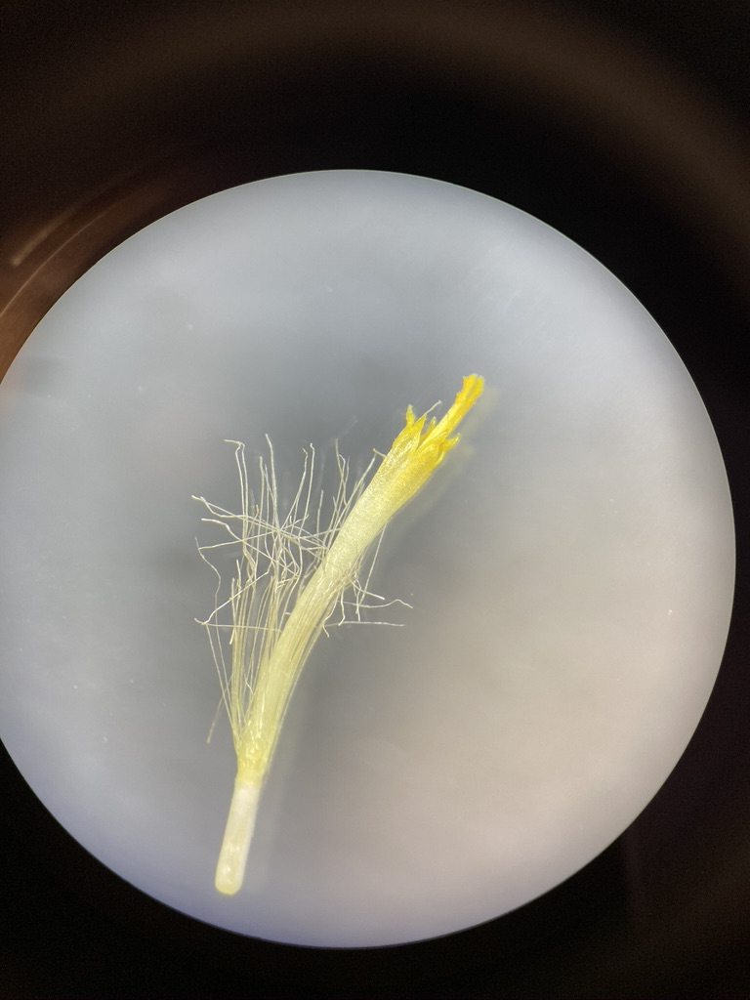{width=100%}
</p>

<br>

It is quite difficult to see the anther tube because the florets are so small, but you can just barely make it out here:

<p align="center">
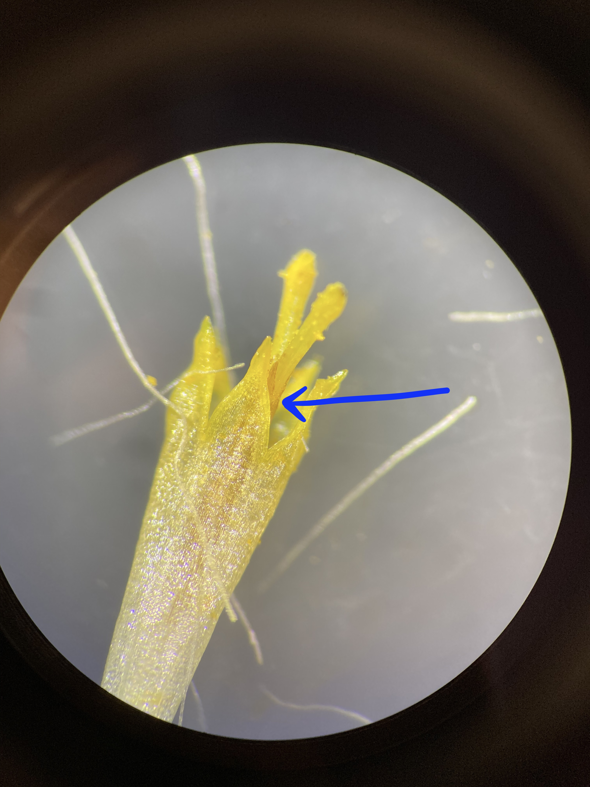{width=100%}
</p>

<br>

Here are two ray florets from the same flower head as the photo above. Can you see the comparatively longer, strap-shaped petals? Ray/ligulate florets are often missing stamens or are entirely sterile, thus acting solely to attract pollinators and serve no other reproductive function.

<p align="center">
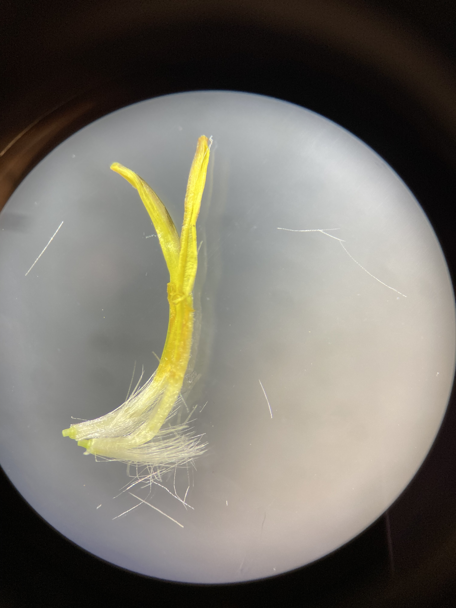{width=100%}
</p>

<br>

The ovary is inferior, and is made up of two carpels but only one ovule is formed. The style pushes upwards through the middle of the stamen tube, but the two stigma lobes remain pressed together (preventing self-pollination) and only split apart (revealing the receptive surface to incoming pollinators) once the style has emerged from and cleared the floral tubes. You can see the anther tube as well if you look closely.

<p align="center">
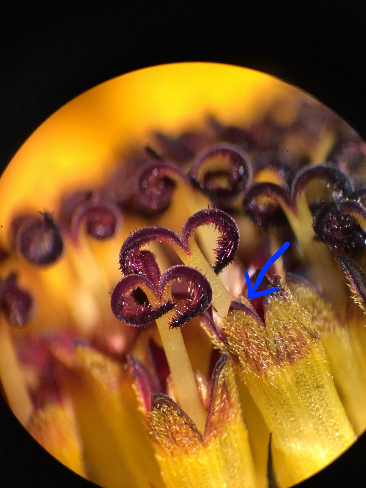{width=100%}
</p>

<br>

---

## Fruit

The inferior ovary of each floret in an Asteraceae flower head develops into a small, indehiscent fruit with a single seed inside; these are typically referred to as achenes. However, the ovaries are technically compound (they are made up of two carpels, though only one forms a seed), and the strict definition of an achene is a fruit that develops from a simple ovary. Therefore, it is more accurate to refer to Asteraceae fruit using their family-specific term: **cypsela** (cypselae plural).

Most cypsela have persistent pappus (which floral part is the pappus derived from?) that aid in dispersal via wind. Just like other traits in this family, the pappus and achene morphology can differ considerably between groups. Here is an example of a typical cypsela. If you zoom in, you can see that the pappus is made up of "plumose" bristles (slightly branched in a way that resembles a feather).

<p align="center">
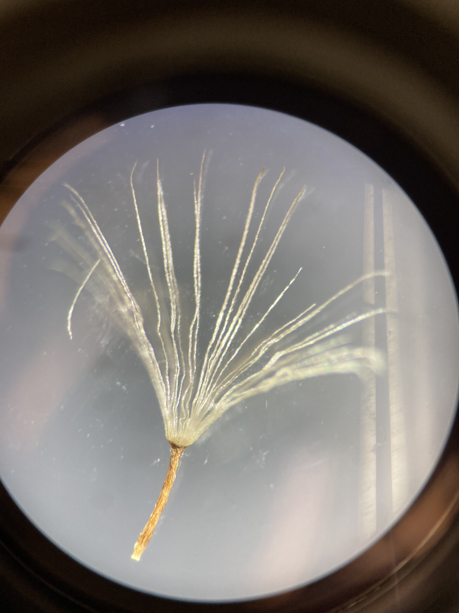{width=100%}
</p>

<br>

In some species, a long stalk (called a "beak") forms between the pappus and the cypsela as the fruit develops. You might be familiar with this morphology if you've ever blown on a dandelion (*Taraxacum* sp.) and made a wish... 

<p align="center">
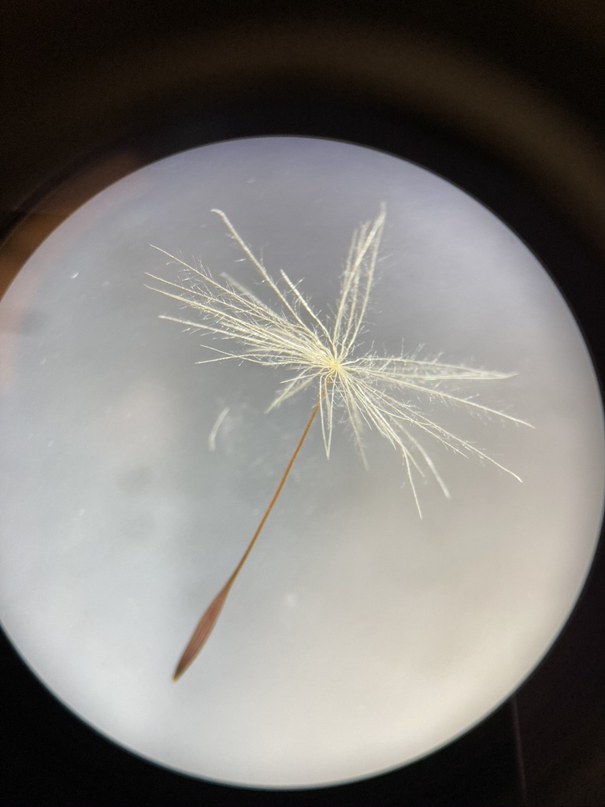{width=49%} 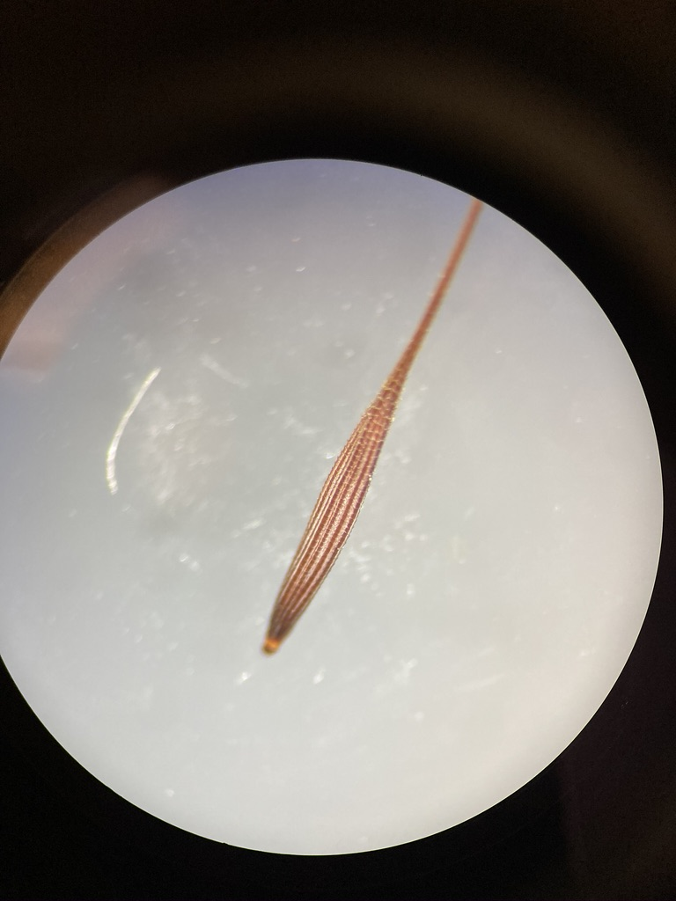{width=49%}
</p>

<br>

---

# R Exercise 3

**Morphometrics and Machine Learning in R**

## Motivation

Throughout this course we've seen how morphology plays a central role in plant taxonomy. The shapes of stems, leaves, and flowers are often the first traits listed in a dichotomous key. When a trait (like corolla width) is measured and quantified, we are able to use statistical tests to decide how to group or split individuals. The science of measuring and analysing shape is called _morphometrics_. In this lab, we'll be using a dataset of _Aquilegia_ flower morphology (see: Lab 1, Ranunculaceae) to determine whether two species, *A. formosa* and *A. flavescens*, show evidence of forming hybrids when co-occurring in a contact zone.

---

<br>
<br>

## Pre-lab

Before starting this week's lab you will have:

1. downloaded the program [Image_J](https://imagej.nih.gov/ij/download.htm) for making morphometric measurements,  <br>

2. downloaded the class google sheet in the file format .csv. Note: if you can’t use imageJ for any reason, don’t panic. Display the digital image of the herbarium sheet on any device and use a ruler held up to the screen to make measurements, <br>

3. **MB**: probably need to get students to do some pre-assignment reading on machine learning (decision trees, random forests). Also, some reading on MDS and interpreting MDS plots.

&nbsp;
&nbsp;

---

## Outcomes

By the end of this tutorial you will:

1.  have experience taking morphometric measurements from herbarium specimens,

2. understand some core concepts in machine learning and how it can be used in species delimitation,

3. the tools and knowledge needed to implement machine learning in R as part of a taxonomic research programme,

4. More?

&nbsp;
&nbsp;

---

<br>
<br>

## Activity 2: Delimiting Species using Morphometrics and Machine Learning

Let's get started by attaching the required packages:

```{r, message = FALSE}
library(caret)
library(here)
library(randomForest)
library(RCurl)
library(tidyverse)
```

`randomForest` and `caret` are packages with machine learning tools for classification, regression, and clustering. There are a few ways to implement machine learning. In this lab we will cover using ML in unsupervised mode. This means that the program will have to find the structure of the data itself, without us training it first.

Now we'll import, subset, and preview the *Aquilegia* morphometric data from Groh et al (2020):

```{r}
columbine_url <-
  RCurl::getURL('https://raw.githubusercontent.com/jgroh/mosaic/master/data/hrbm-pheno-mosaic.csv')

columbine_data_full <- read.csv(text = columbine_url)

columbine_data <-
  columbine_data_full %>%
  select(1, 3, 12:19)

head(columbine_data)
```

Now, we'll use the `randomForest()` function to analyse and sort our specimens:

```{r}
# run the function randomForest() on our morphometric data.
# ntree tells us how many decision trees to build
# mtry is the amount of variables that will be tested at each node of the tree
# proximity=TRUE so that the data saves a proximity matrix

rf <-
  randomForest(
    columbine_data[,-1],
    ntree=30000,
    mtry=3,
    proximity=TRUE,
    keep.forest=TRUE)
```

The `randomForest()` function generates 30,000 decision trees (`ntree`) that attempt to classify the specimens based on binary questions posed to the morphometrics data (`columbine_data`). Each question ('node') in the decision tree consideres three morphometric variables (`mtry`). Setting `proximity = TRUE` tells the function to calculate a similarity metric between specimens. This will help us to calculate a distance matrix describing how similar or dissimilar each sample is from one another:

```{r}
distance.matrix <- dist(1 - rf$proximity)
```

Now we'll perform MDS analysis on the distance matrix:
```{r}
mds.analysis <- cmdscale(distance.matrix, eig=TRUE, x.ret=TRUE)

mds.var.per <- round(mds.analysis$eig/sum(mds.analysis$eig)*100, 1)

mds.var.per[1:2]
```

The `cmdscale()` function finds the axes of greatest variation in our morphometrics dataset. For example, if corolla width was the trait that varied the most between all specimens, `cmdscale()` would assign this variable as _MDS axis 1_. In reality, it's unlikely that a single trait will explain the greatest variation in morphology, instead, MDS axes tend to be combinations of traits. In the second step we calculated how much of the total variation of the datset belongs to each of the MDS axes. The third step prints MDS axes 1 and 2, telling us that MDS axis 1 accounts for 42.3% of the morphological variation in the dataset. Each *Aquilegia* specimen exists somewhere in the 'shape space' created by MDS axes 1 and 2. For example, if MDS axes 1 and 2 described variation in corolla and sepal width, respectively, *Aquilegia* specimens with wide corollas and sepals would exist in the upper right corner of this 'shape space'. We'll see what this looks like in the plotting step. We'll store the shape space location of each *Aquilegia* sample in an object called `mds.data`:

```{r}
mds.values <- mds.analysis$points
mds.data <- data.frame(Sample = rownames(mds.values),
                       X = mds.values[,1],
                       Y = mds.values[,2],
                       Status = columbine_data$species.label)
```


Now we can plot each *Aquilegia* specimen in morphometric shape space:

```{r}

mds_plot <-
  ggplot(
    data = mds.data,
    aes(x = X, y = Y, label = Sample)) +
  geom_text(aes(color = Status)) +
  theme_bw() +
  xlab(paste("MDS1 - ", mds.var.per[1], "%",sep="")) +
  ylab(paste("MDS2 - ", mds.var.per[2], "%",sep="")) +
  ggtitle(" Unsupervised MDS plot using (1 - Random Forest Proximities)") +
  scale_colour_manual(name = "Species",
                      breaks = c("flavescens", "formosa"),
                      labels = c(expression(italic("A. flavescens")),
                                 expression(italic("A. formosa"))),
                      values = c("#009E73", "#CC79A7"))

mds_plot
```

The `ggplot()` function takes our `mds.data` object and plots it. _MDS1_ is the axis explaining the most morphometric variation in our herbarium dataset. Notice that this axis separates _A. flavescens_ and _A. formosa_.


**-KNOWLEDGE CHECK-**

When an individual specimen has a low *MDS2* value, would it be easier or harder to distinguish the species (and why)? If your specimen had a high *MDS2* and *MDS1* value, which *Aquilegia* species is it likely to be?

&nbsp;
&nbsp;


