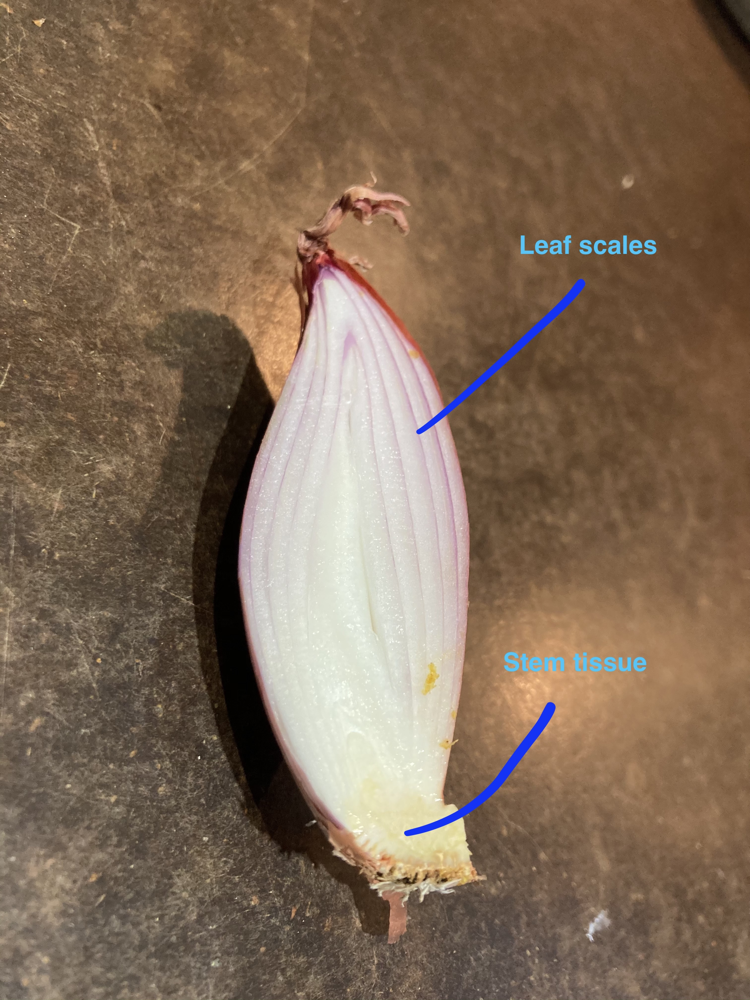

# Lily-like Monocots

---

**1.  Usually herbs.**  
**2.  Stems often modified as rhizomes, bulbs, or corms.  Leaves often linear or strap shaped, simple, usually alternate, but may be basal or whorled, without stipules.**  
**3.  Flowers usually perfect, actinomorphic, tepals 6, free or partially fused, or sometimes a hypanthium present.  Stamens 6 (rarely 3).  Pistil compound, ovary superior or inferior (those whith umbellate inflorescences and inferior ovaries are often put in the Amaryllidaceae), carpels 3, placentation axile.**  
**4.  Fruit a capsule or berry.**  
**5.  About 240 genera and 4,200 species, widely distributed.**  

Traditionally the bulk of the lily-like petaloid monocots were divided into two main families Liliaceae *sensu lato* (lily family mostly with superior ovary) and Amaryllidaceae *s.l.* (daffodil family mostly with inferior ovary). Cronquist took the approach of having a very broadly defined Liliaceae, which included both these families as well as others. The APG found that plants belonging to Cronquist's Liliaceae were highly heterogeneous (a circumstance variously known as a “rag-bag” or “taxodump”). The components of this broadly circumscribed Liliaceae *sensu latissimo* are assignable to both the APG orders Asparagales and Liliales. The old Liliaceae has therefore been broken up and lily-like plants have been assigned to a number of smaller monophyletic families.

**LILIALES** *sensu* APG Comprises:  
Alstroemeriaceae, Campynemataceae, Colchicaceae (autumn crocus family), Corsiaceae, Liliaceae (lily family), Luzuriagaceae, Melanthiaceae (trillium family), Petermanniaceae, Philesiaceae, Rhipogonaceae, Smilacaceae (smilax family).

**ASPARAGALES** *sensu* APG Comprises:  
Agapanthaceae (Alliaceae *s.l.*), Agavaceae (agave family), Alliaceae (onion family), Amaryllidaceae (daffodil family) (Alliaceae *s.l.*), Aphyllanthaceae, Asparagaceae (asparagus family), Asphodelaceae, Asteliaceae, Blandfordiaceae, Boryaceae, Doryanthaceae, Hemerocallidaceae (day lily family), Hyacinthaceae (hyacinth family), Hypoxidaceae, Ixioliriaceae, Lanariaceae, Laxmanniaceae, Ruscaceae (butcher's broom family), Tecophilaeaceae, Themidaceae, Xanthorrhoeaceae, Xeronemaceae, Iridaceae (irises),  Orchidaceae (orchids).

It should be noted that the Agapanthaceae (*Agapanthus* family), the Alliaceae (onion family) and the Amaryllidaceae (daffodil family) are all closely related and may be united in a single family (Alliaceae *s.l.*)

---

## Diagrams

---

## Leaves

Leaves in these families tend to be linear or strap-shaped, simple, entire, alternate (but sometimes basal or whorled), and with parallel leaf venation. This is a good search image for all of the families you'll be learning in this lab (lily-like monocots, Iridaceae, and Orchidaceae), and monocots in general. Here are some examples from members of the lily-like monocots:

<p align="center">
{width=100%}
</p>

<br>

<p align="center">
{width=100%}
</p>

<br>

<p align="center">
{width=100%}
</p>

---

In many cases, the stems are modified into underground bulbs, corms, or rhizomes. You are probably familiar with the genus *Allium*, which has been cultivated extensively by humans and includes onion, garlic, scallion, shallot, leek, and chives. These species (and many others in the Amaryllidaceae) have modified leaves and stems. The stem is modified down to a little nub or plate at the center/base of the bulb, and is surrounded by fleshy scale-like leaves (picture the layers of an onion). The less-modified leaves that emerge from the bulb are long, hollow, and cylindrical in shape.

<p align="center">
{width=100%}
</p>

<br>

<p align="center">
{width=100%}
</p>

<br>

Bulbs can also be found in the Asparagaceae family, as seen in the "pregnant onion" (*Ornithogalum caudatum*). In this case, the majority of the bulb sits above-ground, unlike what we typically see in *Allium*.

<p align="center">
{width=100%}
</p>

<br>


---

# Phylogenetics in R

## Motivation

Phylogenetics is one of the most important and controversial fields within plant taxonomy. The ability to sequence and compare plant DNA has split, grouped, and uncovered taxa in ways never expected. In modern plant taxonomy, phylogenetic relationships are a key piece of evidence to consider when delimiting species. In this lab, we'll be using R to download and align DNA sequences from five species of _Opuntia_. Using these sequences, we'll construct a phylogenetic tree and consider how the species relationships hold up to the published literature. 


---

<!-- &nbsp; -->
<!-- &nbsp; -->


<!-- ## Prerequisites  -->

<!-- Before starting this week's tutorial you will have: <br> -->

<!-- 1. completed some pre-assignment reading on DNA barcoding, multiple sequence alignment, phylogenetics, and their role in plant taxonomy, <br> -->

<!-- 2. completed some pre-assignment reading on why/how Genbank is used by plant taxonomists, <br> -->

<!-- 3. navigated through the Genbank website and understand what it is and why it exists.  -->

<!-- 4. **MB** Get students to read (for example, something like) [Majure et al (2012), Am. J. Bot.](https://bsapubs.onlinelibrary.wiley.com/doi/full/10.3732/ajb.1100375) if we end up using _Opuntia_ as an example... -->

<!-- --- -->

<!-- &nbsp; -->
<!-- &nbsp; -->

<!-- #### Outcomes -->

<!-- By the end of this tutorial you will have:  -->

<!-- 1. experience using Genbank, CLUSTAL, and the most common phylogenetics packages in R  -->

<!-- 2. familiarity with Genbank and the types of data that can be obtained,  -->

<!-- 3. the tools and knowledge needed to create your own phylogenetic tree as part of a taxonomic research project,  -->

<!-- --- -->


## Activity 1: Downloading, Aligning, and Graphing DNA Sequences from Genbank

**NOTE: You will need R version 4.0 or later. Check your R version by typing in `R.Version()` into the console.**

In previous Assignments we familiarized ourselves with GBIF, R, and the R packages that allow us to connect to databases. Today, we'll learn how to use our newfound R skills to download and align nucleotide sequences from [GenBank](https://www.ncbi.nlm.nih.gov/nuccore), a repository of DNA sequences hosted by the U.S. National Center for Biotechnology Information (NCBI). We'll then use the aligned sequences to create a phylogenetic tree that will organize species based on their relatedness.

In this lab, we'll explore further the genus _Opuntia_: 

_Opuntia basilaris_ (Mojave Desert, Colorado, Utah) 
_Opuntia fragilis_  (Northwestern) 
_Opuntia humifusa_  (Eastern) 
_Opuntia polyacantha_ (Great Plains, foothills of Rocky Mountains) 
_Opuntia stricta_ (Gulf Coast and Caribbean)


As usual, we'll start by installing the necessary packages:
```{r, eval = FALSE}
install.packages(c('ape', 'seqinr'))
```

We'll install the multiple sequence aligner `msa` separately:
```{r, eval = FALSE}
if (!requireNamespace("BiocManager", quietly = TRUE))
    install.packages("BiocManager")

BiocManager::install("msa")
```

At some point the console will ask `Update all/some/none? [a/s/n]:`. Type the letter `n` into the console to respond.

Once the packages are installed, we'll attach them: `ape` is used to connect with the Genbank database,  `tidyverse` helps us filter and organize our sequence data, `msa` will align our sequences, `seqinr` will allow us to concatenate sequences, and we'll use `ape` again to construct phylogenetic trees:

```{r, results = 'hide', warning = FALSE, message = FALSE }
# attach packages once they are installed 
library(ape)      
library(here) # this package is only needed for the website to run the tutorial -- you don't need it!
library(msa)    
library(seqinr) 
library(tidyverse)
```

First, we're going to build a `data.frame` (i.e. a spreadsheet) that will help us keep track of our _Opuntia_ species and the GenBank accession numbers for the _rbcL_ gene for each species. The accession numbers were found on the GenBank website, using the same protocol from Lab 5. 

 
Ahh.. simpler days.


Once the accession numbers are found, they can be saved in a data frame:
```{r}
# build data frame
# accession numbers found by searching GenBank
species <- c('O. basilaris', 'O. fragilis', 'O. humifusa', 'O. polyacantha', 'O. stricta') 
rbcL_acc <- c('JF787189.1', 'JF787223.1', 'JF787227.1', 'JF787259.1', 'JF787288.1' ) 

df <- data.frame(species, rbcL_acc)
```

<!-- Now we're ready to search and download the matK sequence for each _Opuntia_ species, using the `read.Genbank()` function: -->
<!-- ```{r} -->
<!-- # call GenBank -->
<!-- matK <-  -->
<!--   read.GenBank( -->
<!--     df$matK_acc, -->
<!--     species.names = FALSE, -->
<!--     as.character = TRUE) %>%  -->
<!--   lapply(., paste0,collapse="") %>%  # remove spaces -->
<!--   lapply(., str_to_upper) # capitalize  -->

<!-- # replace Accession IDs with English names -->
<!-- names(matK) <- df$species -->
<!-- ``` -->

<!-- We can inspect the DNA sequence for _O. basilaris_ by running: -->
<!-- ```{r} -->
<!-- head(matK$`O. basilaris`) -->
<!-- ``` -->

Now we're ready to search and download the _rbcL_ sequence for each _Opuntia_ species, using the `read.Genbank()` function: 
```{r}
# call GenBank
rbcL <- 
  read.GenBank(
    df$rbcL_acc,
    species.names = FALSE,
    as.character = TRUE) %>% 
  lapply(., paste0,collapse="") %>%  # remove spaces
  lapply(., str_to_upper) # capitalize 

# replace Accession IDs with English names
names(rbcL) <- df$species
```

Cool, [it's like we're on CSI](https://pubmed.ncbi.nlm.nih.gov/16100764/).

We now have a 'DNA sequence object' named `rbcL`. It contains the _rbcL_ sequences from each of our five _Opuntia_ species. In the next step, we'll use the `msa()` function to align our five _rbcL_ sequences so that their ends are lined up. You could also do this by eye, but it's a bit tedious and not as reproducible:
```{r, message = FALSE}
rbcL_alignment <- 
  msa(unlist(rbcL),
      type ='dna', 
      method ='ClustalW',
      verbose = TRUE)
```

```{r}
# inspect alignment
print(rbcL_alignment)
```
<!-- ```{r, results = 'hide', message = FALSE} -->
<!-- # matK alignment -->
<!-- matK_alignment <-  -->
<!--   msa(unlist(matK), -->
<!--       type ='dna',  -->
<!--       method ='ClustalW', -->
<!--       verbose = TRUE) -->
<!-- ``` -->

<!-- # ```{r} -->
<!-- # # inspect alignment -->
<!-- # print(matK_alignment)  -->
<!-- # ``` -->

By using the `print()` function, we see that our sequences are aligned pretty well! You can also notice some differences in nucleotide position between the species. Those are 'single nucleotide polymorphisms' (SNPs) that distinguish one species from another.

We're almost ready to create some phylogenetic trees! First, we'll convert our alignment objects to `seqinr` objects. Then, we'll use the `dist.alignment()` function to calculate how similar or different each species' sequence is from one another. 

```{r,  message=FALSE} 
# convert alignment object into seqinr object 
rbcL_r <- msaConvert(rbcL_alignment, type="seqinr::alignment") 
  
# create distance matrix
rbcL_dist <- dist.alignment(rbcL_r)
```

Now, we'll use the `nj()` function to construct trees. In the next step, we'll 'root' our trees by deciding which species is the outgroup:

```{r}
# neighbour joining trees
rbcL_tree <- nj(rbcL_dist)

rbcL_rooted <- root(rbcL_tree, outgroup = 'O. basilaris', resolve.root = T)
```

Plot your new tree:
```{r}
# plot tree
plot(rbcL_rooted, main = 'rbcL tree')
```

**IMPORTANT** Save your iNaturalist tree as an .rds file so that we can use it in Lab 10:

```{r}
saveRDS(rbcL_rooted, file = here('R_scripts/rbcL_rooted.rds'))
```

**-KNOWLEDGE CHECK-** How do the matK and rbcL trees differ? Which tree best aligns with the [Majure tree (Figure 3)](https://bsapubs.onlinelibrary.wiley.com/doi/full/10.3732/ajb.1100375)? According to Majure et al (2012), why might our trees differ? 


<!-- For consensus trees: -->

<!-- Recall that matK and rbcL are two separate segments of the chloroplast genome. By sticking them together, we'll create a super-sequence that contains more information than either of the sequences alone. The more sequence information, the better, because it gives us a bigger sample of the entire genome. Concatenation is done by the `seqinr` package, so we'll need to convert our alignment objects into `seqinr` objects: -->

<!-- ```{r, results = 'hide'} -->
<!-- # convert alignment object into seqinr object -->
<!-- matK_r <- msaConvert(matK_alignment, type="seqinr::alignment") -->
<!-- rbcL_r <- msaConvert(rbcL_alignment, type="seqinr::alignment") -->

<!-- # concatenate (merge) sequences -->
<!-- conseq <- mapply(paste0, matK_r$seq, rbcL_r$seq) -->
<!-- names(conseq) <- df$species -->

<!-- # re-align -->
<!-- con_alignment <- -->
<!--   msa(unlist(conseq), -->
<!--       type ='dna', -->
<!--       method ='ClustalW', -->
<!--       verbose = TRUE) -->
<!-- ``` -->

<!-- ```{r} -->
<!-- # inspect -->
<!-- print(con_alignment) -->

<!-- # convert alignment object into seqinr object -->
<!-- con_r <- msaConvert(con_alignment, type="seqinr::alignment") -->

<!-- ``` -->


